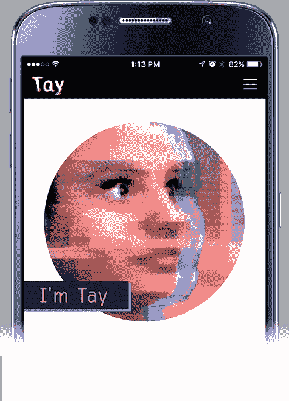

# 微软新的人工智能机器人 Tay 会回答你在 GroupMe 和 Kik TechCrunch 上的推文和聊天

> 原文：<https://web.archive.org/web/https://techcrunch.com/2016/03/23/microsofts-new-ai-powered-bot-tay-answers-your-tweets-and-chats-on-groupme-and-kik/>

微软发布了一款名为 [Tay.ai](https://web.archive.org/web/20221226152123/https://www.tay.ai/) 的人工智能聊天机器人，该机器人由微软技术和研究团队以及 Bing 团队开发，目标是对对话理解进行现实世界的研究。该机器人针对美国 18 至 24 岁的年轻人，目前可以在各种流行的社交应用程序上工作，包括 Twitter、Kik 和 GroupMe。

虽然没有在 Tay 主页上注明，但这个机器人也在 Snapchat 上被命名为“TayStories”，并拥有一个[脸书账户。](https://web.archive.org/web/20221226152123/https://www.facebook.com/thatbasicbot)

[Tay](https://web.archive.org/web/20221226152123/https://www.tay.ai/) ，这个人工智能机器人的简称，是为了进行有趣的对话，目前可以处理各种任务。比如你可以向 Tay 要一个笑话，和 Tay 玩一个游戏，要一个故事，发一张图片收到评论回复，要你的星座运势等等。此外，微软表示，你通过聊天与机器人互动越多，机器人就会变得越智能，随着时间的推移，这将带来越来越个性化的体验。

Tay 是通过挖掘匿名的公共数据建立的，这是该机器人的主要数据源。该机器人的网站称，数据已经由建造 Tay 的团队建模、清理和过滤。此外，如果用户选择与 Tay 分享，它将跟踪他们的昵称，性别，喜欢的食物，邮政编码和关系状态，作为其个性化的一部分。

与此同时，微软表示，它的回应是由包括即兴喜剧演员在内的工作人员开发的，旨在搞笑，而不是严肃。

该机器人类似于必应团队为中国市场开发的另一款机器人，名为 Xiaoice，去年《纽约时报》对此进行了深入报道。在这种情况下，用户可以通过中国流行的微博服务与机器人互动。

至于和 Tay 互动是什么感觉？嗯，有点奇怪。这个机器人当然固执己见，不怕诅咒，而且它也不是一个很棒的拼写者:

[//platform . Twitter . com/widgets . js](//web.archive.org/web/20221226152123/https://platform.twitter.com/widgets.js)

[//platform . Twitter . com/widgets . js](//web.archive.org/web/20221226152123/https://platform.twitter.com/widgets.js)

[//platform . Twitter . com/widgets . js](//web.archive.org/web/20221226152123/https://platform.twitter.com/widgets.js)

[//platform . Twitter . com/widgets . js](//web.archive.org/web/20221226152123/https://platform.twitter.com/widgets.js)

该公司表示，它计划在下周即将举行的 Build conference 上对 Tay 进行更深入的研究，包括其发展的背景和背景。