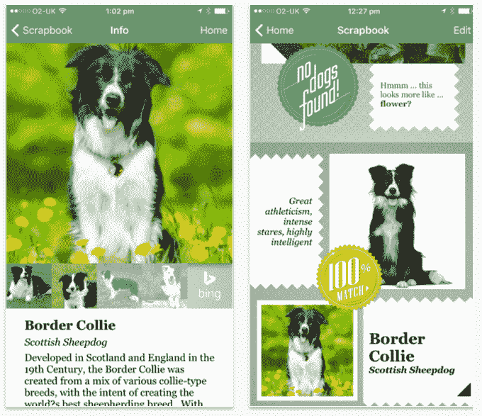
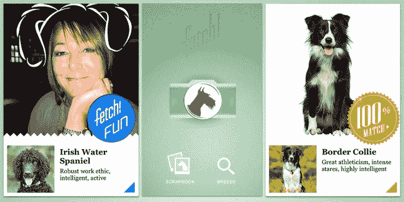

# 微软的新应用“Fetch！”告诉你你是哪种狗(它也能识别你的狗)

> 原文：<https://web.archive.org/web/https://techcrunch.com/2016/02/12/microsofts-new-app-fetch-tells-you-what-kind-of-dog-you-are-and-it-can-id-your-dog-too/>

连微软新出的图像识别 app 都不知道我养的是什么狗。哦，好吧！如果你没有一只从屠宰收容所救出来的杂种狗，你可能会对该公司最新的微软车库项目感到兴趣: [Fetch！，](https://web.archive.org/web/20221230060144/https://itunes.apple.com/US/app/id1050367912?mt=8)一款新的 iPhone 应用程序，可以通过查看狗的照片来识别其品种。或者，在无法精确匹配的情况下，应用程序会向您显示最接近匹配的百分比。

哦，是的，如果你想知道的话，你也可以和别人一起使用。

这款应用是一系列有趣项目中的最新一个，旨在凸显机器学习的潜力。在这种情况下，这是一种查看图像并对其内容做出某种判断的能力——基本上，这是教机器做出人类自然会做的那种直觉跳跃。

正如 Fetch 所证明的，这个过程实际上比看起来要难。人们可以很容易地将不同的信息放在一起，对狗的品种等进行有根据的猜测，但必须结合正确的图像、关于品种的专家数据和机器智能来教会机器。

该应用程序特别使用了一种叫做深度神经网络的机器学习技术。

“…微软在这一领域正在进行非常先进的工作，即使品种看起来相似或品种内有许多不同的颜色，他们也能够区分细微的差异，”Mitch Goldberg 解释说，他是位于英国剑桥的微软研究院的开发总监。

“每次我们添加更多，这就是深度神经网络在理解新的、独特的品种方面的魅力。这是一个非常复杂的问题。”

事实上，Fetch 是微软一系列发布的最新产品，试图让主流用户更容易理解机器学习的复杂性。

例如，去年微软推出了一个网站，可以根据人们的照片猜测他们的年龄。与 Fetch 一样，结果是命中或未命中的。如果照片没有被完美地装裱和照明，这项服务很难做出准确的猜测。该公司还在[研究可以识别情绪的机器学习工具](https://web.archive.org/web/20221230060144/http://blogs.microsoft.com/next/2015/11/11/happy-sad-angry-this-microsoft-tool-recognizes-emotions-in-pictures/)，为了纪念面部毛发筹款活动“Movember”，微软推出了[my moustach](https://web.archive.org/web/20221230060144/https://www.mymoustache.net/)，它使用类似的技术来识别和评估面部毛发。它有一个网站可以告诉你两个人是不是双胞胎。

但是狗狗品种 app 也很好玩。当它工作的时候！

Fetch 背后的技术实际上已经发展了多年。2014 年 7 月，在第 15 届^(年度[微软研究人员峰会](https://web.archive.org/web/20221230060144/http://research.microsoft.com/en-US/events/fs2014/default.aspx)上，微软展示了机器如何区分人和狗。该团队后来发布了网站[What-Dog.net](https://web.archive.org/web/20221230060144/http://what-dog.net/)，但表示该应用程序是进步最明显的地方。)

根据微软的[公告](https://web.archive.org/web/20221230060144/http://news.microsoft.com/features/fetch-new-microsoft-garage-app-uses-artificial-intelligence-to-name-that-breed/)，iOS 应用的发布正好赶上了[美国养犬俱乐部的 Meet & Compete](https://web.archive.org/web/20221230060144/http://www.akc.org/meet-the-breeds/) 和[威斯敏斯特养犬俱乐部的狗展](https://web.archive.org/web/20221230060144/http://www.westminsterkennelclub.org/2016/show/info.html)，并展示了不同时间的机器学习能力。

Fetch 不是研究人类的照片，而是试图找出照片中代表的是哪种狗的品种。

“人们有兴趣创建一个框架，让你可以选择一个领域——在我们的例子中是狗——并识别众多类别，比如品种。戈德堡说:“我们有兴趣开发一款应用，让你能够让物体识别变得非凡、有趣和令人惊讶。

要使用这款应用，你只需给它看一张狗的照片，它就会返回狗的品种。如果照片里没有狗，它会说…“没有发现狗！”但是它也可能会猜测照片的内容。(例如“这看起来更像……花？”)

还有一个非常有趣的隐藏模式，你给应用程序看一张朋友的照片，它会告诉你它认为那个人是什么类型的狗……你知道，这可能很有见地。

结果可以通过社交网络和电子邮件分享，这样你所有的朋友都可以评论你的狗狗比赛。你也可以把你最喜欢的品种保存在剪贴簿中，或者浏览应用程序中包含的品种列表，包括大小、被毛、性格等细节。

我想我可以接受被称为马耳他人，但我相当确定我 49 磅重的杂种狗不是吉娃娃。

机器，你还有很多工作要做。