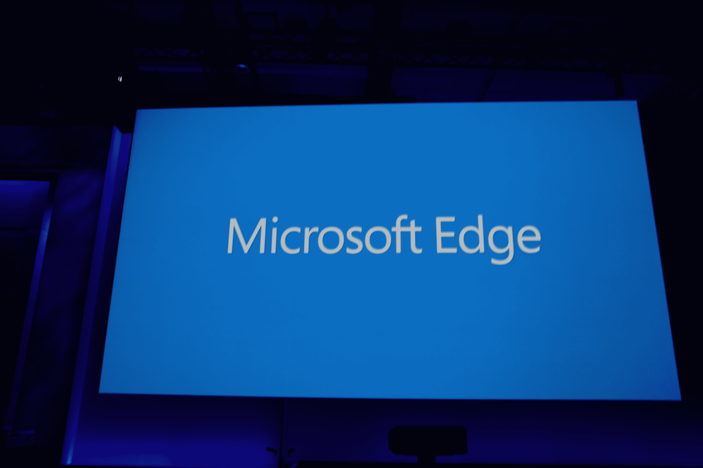
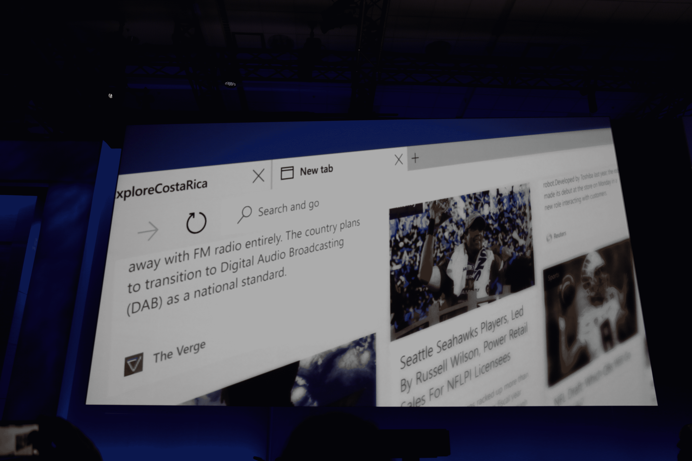
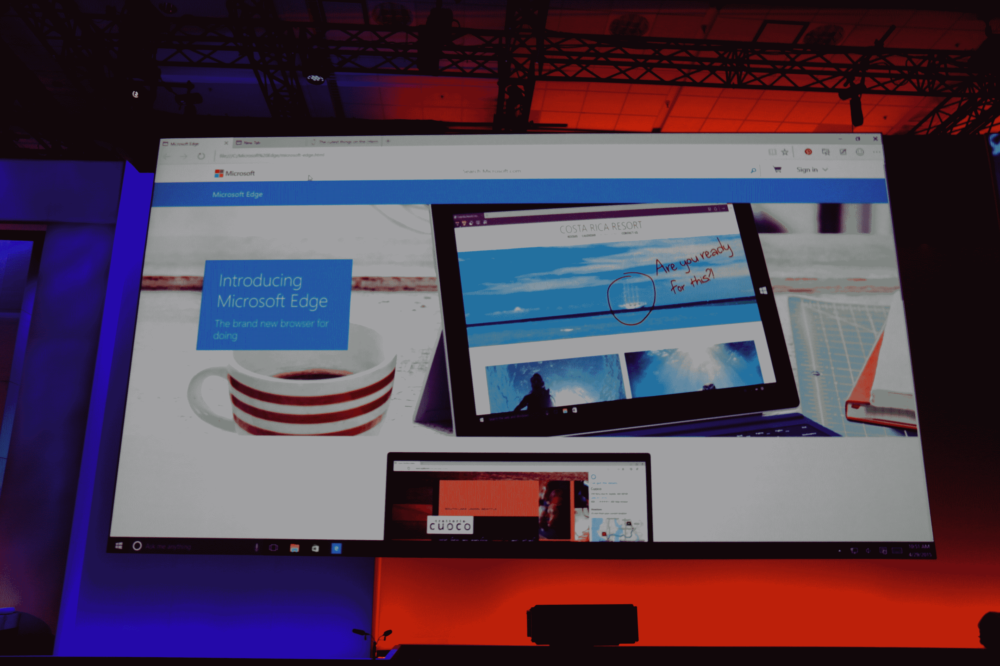
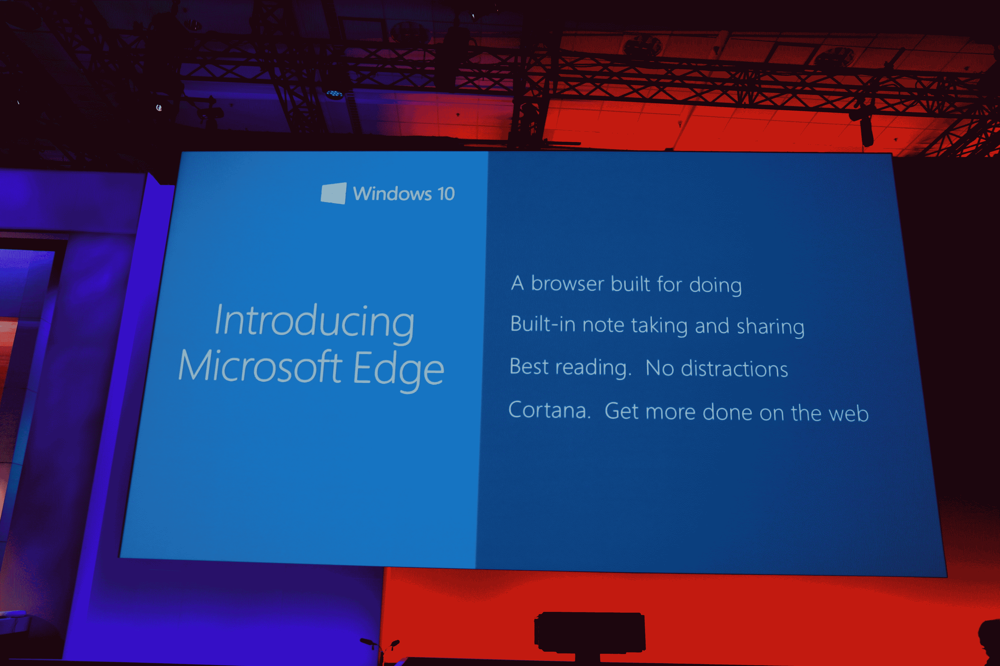

# 微软的新浏览器将被称为微软 Edge 

> 原文：<https://web.archive.org/web/https://techcrunch.com/2015/04/29/microsofts-new-browser-will-be-called-microsoft-edge/>

# 微软的新浏览器将被称为微软边缘

我们知道互联网浏览器[已经死了](https://web.archive.org/web/20230128132341/https://techcrunch.com/2015/03/17/internet-explorer-is-eventually-dead-kinda/)。

我们知道继任者即将到来。

我们只是不知道除了“斯巴达项目”占位符之外的正式名称。

现在我们做到了:微软的新浏览器叫做微软 Edge。

刚刚在该公司的 build 大会上宣布，Edge 将成为 Windows 10 内置的主要/默认浏览器。

关于 Edge 的独特之处，目前还不太清楚，但我们知道的是:

*   它内置了 Cortana 支持。
*   它内置了阅读器、笔记和分享功能。
*   设计注重简约和极简主义。
*   渲染引擎叫做 EdgeHTML。

虽然还没有全尺寸的截图发布，但我们可以从首次亮相的演示屏幕中捕捉到以下内容:

**更新:**这是刚刚发布的“挑逗”风格的视频:

https://www.youtube.com/watch?v=iH1D31YHsgY

