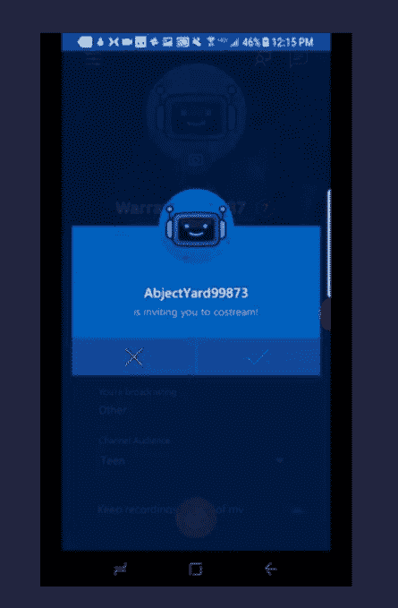
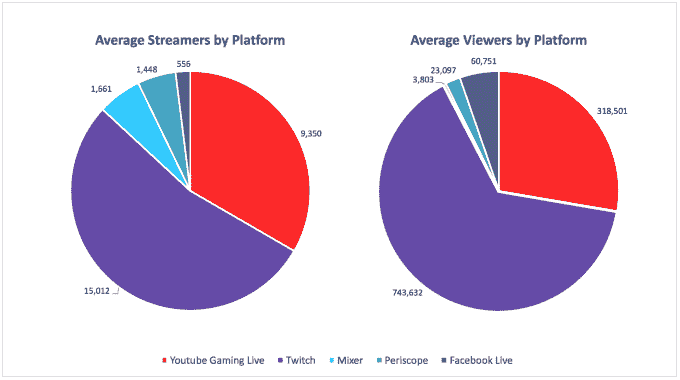

# 微软新的 Mixer Create 应用程序可以让你在手机上玩游戏

> 原文：<https://web.archive.org/web/https://techcrunch.com/2017/08/31/microsofts-new-mixer-create-app-lets-you-live-stream-games-from-your-phone/>

微软的移动游戏流媒体应用 Mixer Create 今天在 iOS 和 Android 上推出测试版，允许游戏玩家直接从手机上播放他们正在玩的游戏。该功能在 Android 上适用于所有游戏，但在 iOS 上受到更多限制。该公司指出，在 iPhone 上，启用了苹果 ReplayKit 功能的精选游戏将可以运行。

这意味着像《星际迷航时间线》、《山羊模拟器》、《现代战争 5:停电》、《T0》和其他《T1》这样的游戏将得到支持。

微软在[的公告](https://web.archive.org/web/20230328033658/https://blog.mixer.com/mixer-create/)中表示，该应用还可以用于共同流媒体，允许多达四个流媒体将他们的流媒体合并成一个单一的观看体验。在新的应用程序中，现在有一个邀请功能，目前只是部分功能。目前，您可以接受或拒绝弹出的联合流邀请，但几个月后，您也可以发送这些联合流邀请。

游戏玩家也可以将该应用用于与游戏无关的目的——比如通过一项功能进行视频登录，让他们随时“直播”，向粉丝发起实时广播。

此外，streamers 在广播时可以在频道的聊天界面上与观众互动，就像在 PC 或 Xbox 上一样。

这也包括使用审核工具。微软建议，一些游戏玩家可能会选择使用 Mixer Create 应用程序进行聊天，同时从他们的计算机或控制台进行流媒体播放。

在竞争对手 Twitch 推出自己的更新流媒体应用程序后不久，该应用程序[包括从移动设备到其频道的直播功能](https://web.archive.org/web/20230328033658/https://techcrunch.com/2017/06/28/twitchs-mobile-app-is-adding-livestreaming-dark-mode-and-more/)。像微软一样，Twitch 也在努力扩展游戏之外的内容，允许其流媒体播放其他内容，包括[个人更新](https://web.archive.org/web/20230328033658/https://techcrunch.com/2016/12/15/twitch-opens-to-vloggers-with-launch-of-irl-mobile-broadcasting-to-come-next-year/)和[其他艺术活动](https://web.archive.org/web/20230328033658/https://techcrunch.com/2015/10/29/twitch-expands-further-into-creative-content-with-the-debut-of-a-new-section-for-artists/)。

尽管微软拥有一些游戏玩家想要的功能，但就覆盖范围而言，它在流媒体市场的影响力仍落后于 Twitch 和 YouTube。根据 Streamlabs 最近的一项研究， Twitch 在流媒体市场的份额要大得多，领先于位居第二的 YouTube。微软、Periscope 和脸书 Live 只有 slivers。

然而，Mixer(去年赢得 TechCrunch Disrupt 的初创公司[，当时它被称为 Beam)仍然是这个市场的一个相对较新的进入者，可能会及时赶上，或者至少增加其份额。](https://web.archive.org/web/20230328033658/https://techcrunch.com/2016/05/11/beam-wins-techcrunch-disrupt-ny-2016/)

Mixer Create 现已在 [Android](https://web.archive.org/web/20230328033658/https://play.google.com/store/apps/details?id=com.microsoft.beambroadcast&hl=en) 和 [iOS 上上线。](https://web.archive.org/web/20230328033658/https://itunes.apple.com/us/app/mixer-create/id1237889246?mt=8)