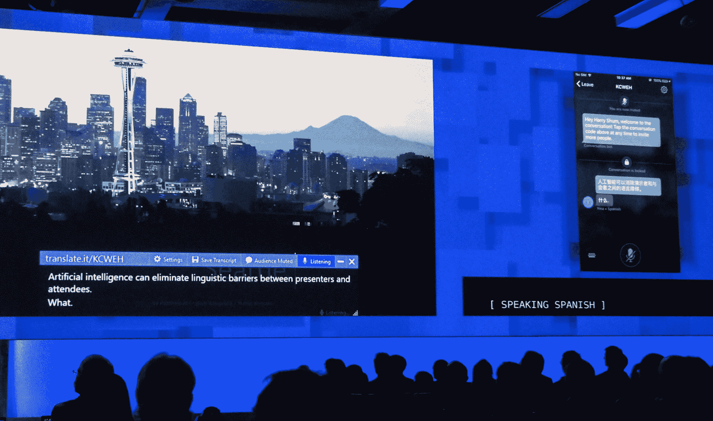

# 微软的演示文稿翻译器实时翻译演示文稿 

> 原文：<https://web.archive.org/web/https://techcrunch.com/2017/05/10/microsofts-presentation-translator-translates-presentations-in-real-time/>

# 微软的演示文稿翻译器实时翻译演示文稿

微软在本周的 Build 大会上展示的很多东西都是直接针对开发者的。但是在关于 Azure 的新闻弹幕中，Visual Studio 和。该公司还展示了针对日常用户的 PowerPoint 新插件的预览版。演示文稿翻译器可以自动提供实时翻译的字幕或翻译实际 PowerPoint 演示文稿的文本，同时仍然保留原始格式。

在目前的版本中，该服务支持阿拉伯语、中文、英语、法语、德语、意大利语、日语、葡萄牙语、俄语和西班牙语。虽然这里的重点是翻译，但是您也可以使用相同的服务为失聪或听力困难的观众添加字幕。

这个项目出自[微软车库](https://web.archive.org/web/20221208004718/https://www.microsoft.com/en-us/garage/)，现在处于封闭预览中，但是你可以在这里注册提前访问[。该插件由微软 Translator live 提供支持，基本上是这些人工智能服务如何缓慢但肯定地进入生产力应用程序的一个例子。](https://web.archive.org/web/20221208004718/http://www.aka.ms/TranslatorPowerPoint)

事实上，PowerPoint 在某种程度上是微软在这一领域努力的温床。有了 [QuickStarter](https://web.archive.org/web/20221208004718/https://support.office.com/en-us/article/Research-a-topic-with-PowerPoint-QuickStarter-4784f273-0b2c-456c-9c89-24e5b977c224) 和 Designer，微软的演示软件已经有了两个工具，可以围绕一个主题自动生成基本的幻灯片，并根据上下文让它们看起来更好。