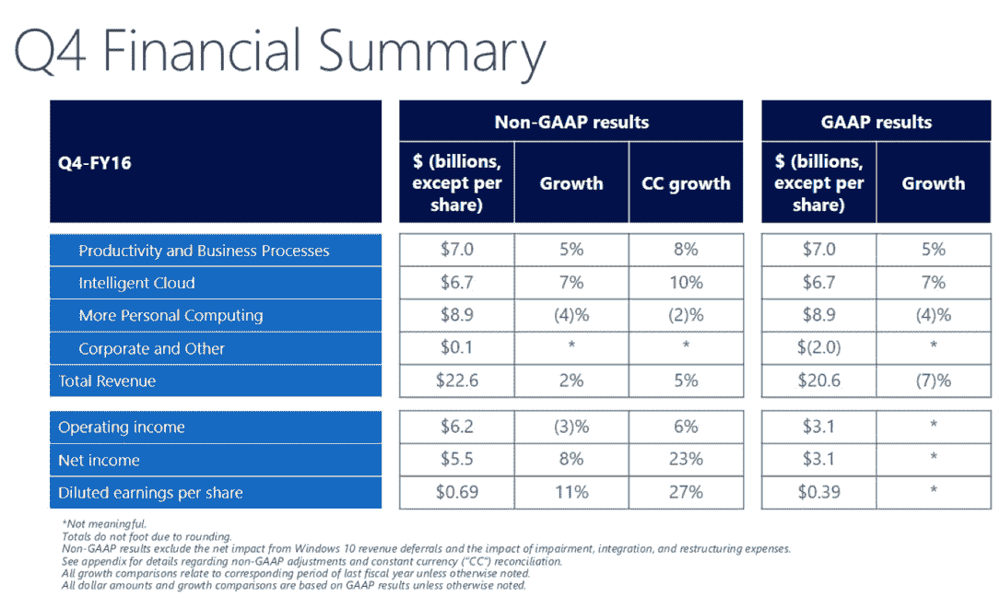
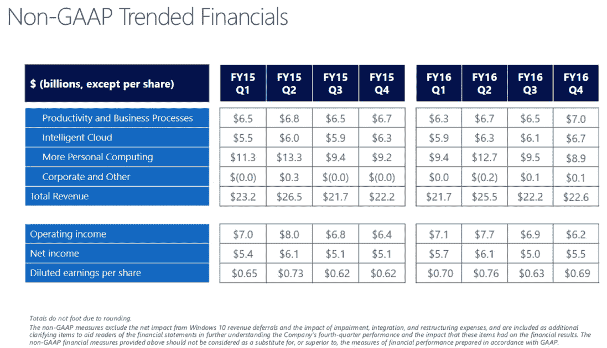

# 微软第四季度收入超过华尔街 226 亿美元，每股收益 0.69 美元 

> 原文：<https://web.archive.org/web/https://techcrunch.com/2016/07/19/microsofts-q4-earnings-beat-with-22-6b-in-revenue-0-69-eps/>

微软今天[报告了 2016 年](https://web.archive.org/web/20221206235121/https://www.microsoft.com/en-us/Investor)[第四财季](https://web.archive.org/web/20221206235121/http://www.microsoft.com/en-us/Investor/earnings/FY-2016-Q4/press-release-webcast)的收益，这是其宣布拟议收购 LinkedIn 后的首份收益报告。该公司的非 GAAP 收入为 226 亿美元(206 亿美元)，非 GAAP 每股利润为 0.69 美元(0.39 美元)，远高于预期。与前几个季度一样，该结果反映了微软云业务的强劲增长。

华尔街[预期](https://web.archive.org/web/20221206235121/http://finance.yahoo.com/quote/MSFT/analysts)该公司报告收入 221.4 亿美元，每股收益 0.58 美元。

收益公布后，该公司的股票立即上涨了 3.5%。

正如微软投资者关系总监扎克·莫克赛(Zack Moxcey)在财报发布后告诉我的那样，本季度的 GAAP 结果仍然反映了微软与其手机业务相关的费用以及 Windows 10 收入延期调整。他还将微软高于预期的收益部分归因于该公司低于预期的税率。

在去年同期，微软的营收为 222 亿美元，但每股收益下降了 0.40 美元，原因是微软收购诺基亚的相关费用为 75 亿美元。如果没有这笔费用，该公司的每股收益将为 0.62 美元。

微软首席执行官塞特亚·纳德拉表示:“过去的一年对于我们自身的转型以及与引领自身数字化转型的客户的合作都至关重要。“微软云看到了显著的客户增长势头，我们已经做好准备在未来一年抓住新的机会。”

与前几个季度一样，分析师将对微软的云收入特别感兴趣。在第三季度的报告中，微软表示，其“智能云”业务的收入已增长至 61 亿美元，增长 3%(不变汇率为 8%)。Azure 收入同比增长 120%，而其服务器产品和云服务收入增长了 5%。

本季度，智能云收入达到 67 亿美元，Azure 收入同比增长 102%。

微软一直表示，预计其商业云业务到 2018 年将达到 200 亿美元。第三季度，该公司报告其运营成本为 94 亿美元。在这份新报告中，这一数字现已达到 121 亿美元，这是微软在财报中突出强调的。Moxcey 告诉我，该公司坚持其到 2018 年达到 200 亿美元运营率的计划。

遗憾的是，微软没有提供其收入数字的地理细分，但 Moxcey 将该公司 Azure 业务的一些增长归因于微软在 Azure 地区的广泛地理足迹。

就智能云而言，Moxcey 还指出，该公司企业移动解决方案的客户群同比增长了一倍(现在有 33，000 名客户)，安装量同比增长了近 2.5 倍。

以下是微软其他业务部门的细分数据:

**生产力和业务流程**(这包括 Office、消费者办公室和 Dynamic 等产品):70 亿美元，而上一季度的收入为 63 亿美元。微软将此归因于其生产力服务的强劲增长，特别是 Office 365 商业收入同比增长 54%，其 Dynamics CRM 付费席位同比增长超过 2.5 倍。

**更多的个人计算**(包括 Windows、设备、游戏和搜索):收入 89 亿美元，上一季度为 127 亿美元。不出所料，手机收入下降了 71%，但该公司来自 Surface 系列的收入继续增长，上个季度增长了 9%(主要受 Surface 4 和 Surface Book 的推动)。

Windows OEM 消费者收入增长了 27%。对于商业市场，它增长了 2%(这听起来很低，但远远好于前几个季度)。由于微软在这一领域的收入很大程度上是由新购买的产品推动的，微软预计免费更新服务的结束不会对下一季度的业绩产生显著影响。

微软还宣布，Xbox Live 现在每月有 4900 万活跃用户，其搜索广告收入增长了 16%，这主要是因为其搜索工具与 Windows 10 的深度整合。在今天的财报电话会议上，微软首席执行官塞特亚·纳德拉还指出，迄今为止，Windows 10 用户已经向 Cortana 提出了 80 亿个问题。

微软全年非 GAAP 收入为 920 亿美元，调整后每股收益为 2.10 美元。该公司的营业收入在非 GAAP 基础上为 279 亿美元。