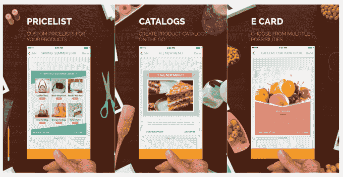

# 微软的 Sprightly 应用程序让你从智能手机上创建专业的设计

> 原文：<https://web.archive.org/web/https://techcrunch.com/2016/06/07/microsofts-sprightly-app-lets-you-create-professional-designs-from-your-smartphone/>

微软正在用其新的应用程序 [Sprightly](https://web.archive.org/web/20221025223325/https://itunes.apple.com/app/apple-store/id1114875964?mt=8) 挑战 Adobe Spark Post 和像 [Canva](https://web.archive.org/web/20221025223325/https://beta.techcrunch.com/2015/10/06/design-platform-canva-scores-15-million-series-a-valued-at-165-million/) 这样的初创公司，该应用程序今天在 iOS 上可用。与其竞争对手类似，该应用程序承诺为小型企业快速创建和设计传单、优惠券、目录、价目表、电子贺卡等内容提供一种简单的方式，并在社交媒体上快速分享这些内容。

Sprightly 是从微软的内部孵化器和 R&D 装备中涌现出来的产品，被称为微软车库。

这款应用于今年早些时候在安卓系统上推出。然而，随着 iOS 的首次亮相，该公司承诺将提供比以前更多的颜色和风格的模板。

该应用程序本身使用起来非常简单——你可以抓拍一张照片或从你的图库中上传一张照片，浏览模板目录选择你需要的一张，并定制你的设计。然后，你可以在社交媒体上分享你的创作，用电子邮件发送，甚至以可打印的 PDF 格式发送。

虽然在概念上与 Adobe Spark 和 Canva 非常相似，但 Sprightly 的核心关注点稍窄。

Adobe 和 Canva 越来越受社交媒体经理的欢迎，他们需要一种快速的方法来创建图形，以便在各种社交媒体平台上使用，并满足他们不同的图像大小要求。当需要专业外观的图形时，这些应用程序也用于中小型企业，但没有聘请专业设计师的相关费用。

Sprightly 也旨在使设计民主化，但特别针对那些在社交媒体上与顾客互动的小型零售商。这就是为什么它的模板包括那些卖家特别需要的东西——比如价目表、目录页、优惠券和制作产品拼贴画的工具等等。

Sprightly 不仅试图解决更轻松的图形创作的移动挑战，还试图为那些将智能手机或移动设备作为主要(如果不是唯一)工作手段的人提供一种工具。这意味着发展中市场是 Sprightly 的目标。

https://www.youtube.com/watch?v = ejcker6 _ YM

例如，在微软的发布会上，该公司提供了一份来自印度海得拉巴的 Fanzart 特许经销商 Sanjana Shah 的证明。(Fanzart 做设计师吊扇。)

沙阿说:“每张图片、每份目录都来自总部，更新需要将近一个月的时间。”。“但现在有了 Sprightly，我可以点击这里展示的所有粉丝的即时照片，制作价格列表，制作相同的目录，并将其发送给客户。这是一个真正伟大的问题解决者。”

微软车库[推出了许多实验应用](https://web.archive.org/web/20221025223325/https://www.microsoft.com/en-us/garage/#garage-workbench)来衡量客户反应，包括 Sprightly。然而，尽管一些应用相当创新——比如[的单词流键盘](https://web.archive.org/web/20221025223325/https://beta.techcrunch.com/2016/04/25/microsofts-word-flow-keyboard-app-lands-on-ios/)引入了一种不同的输入方式——但其他应用似乎是抄袭市场上的其他应用。例如， [News Pro](https://web.archive.org/web/20221025223325/https://www.microsoft.com/en-us/garage/#app-news-pro) ，看起来有点像苹果新闻或 SmartNews，而 plubago[采用了](https://web.archive.org/web/20221025223325/http://thenextweb.com/apps/2016/02/19/microsoft-just-released-its-own-onenote-competitor-for-stylus-lovers/#gref)微软自己的 OneNote。Sprightly 属于后一类，因为它在概念上与设计领域的老牌公司相似。

这并不意味着这款应用不值得一试，但测试竞争对手的应用也是值得的，看看哪个最符合你的需求。

Sprightly 可以在应用商店和 T2 的 Google Play 上免费下载。