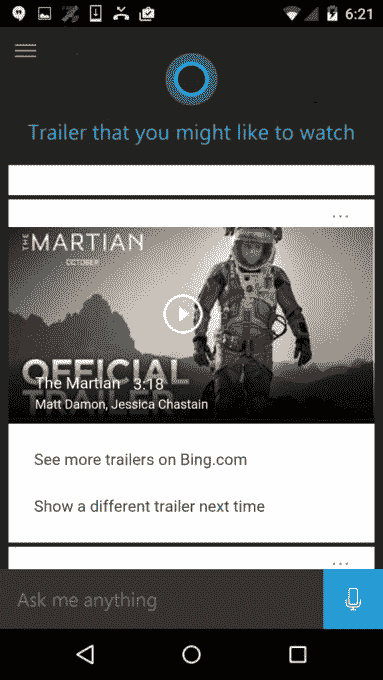
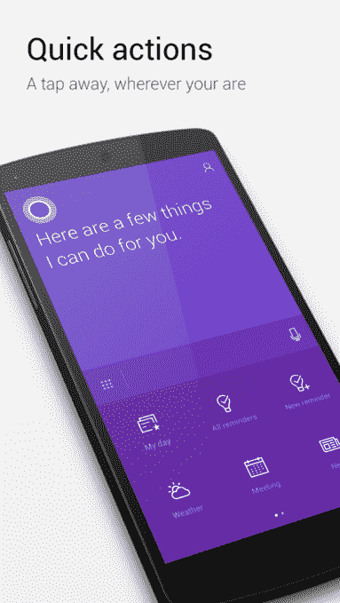
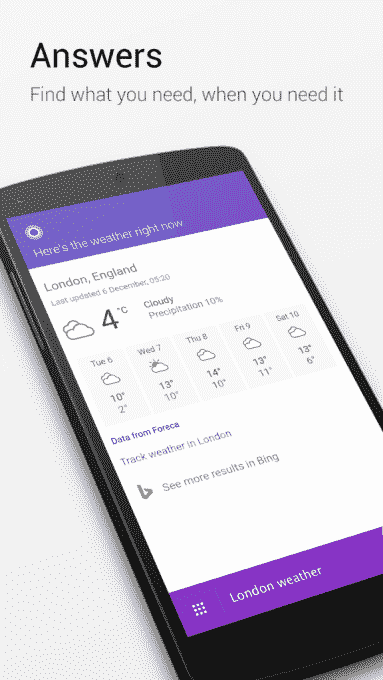

# 微软的虚拟助手 Cortana 在 Android 和 iOS 上得到改进 

> 原文：<https://web.archive.org/web/https://techcrunch.com/2016/12/08/microsofts-virtual-assistant-cortana-gets-a-revamp-on-android-and-ios/>

在虚拟助手 Alexa、Siri、谷歌助手和微软 Cortana 的战斗中，后者在 Windows 10 平台之外并没有取得太大成功——例如，其 iOS 应用在排行榜上排名第 1295 位。为了让其助手具有更广泛的吸引力，微软今天宣布重新设计其智能手机应用程序，目前专注于使其更快更容易地执行任务和获取信息。

这次改造是在 Cortana 应用程序在英国首次亮相的同时宣布的

当 Cortana 去年首次在 iOS 和安卓系统上发布时，它展示了一个黑白的用户界面，看起来和 PC 版没有什么不同。你可以设置提醒，搜索网页，跟踪航班，并执行 Cortana 在 Windows 10 上可以处理的语音搜索等功能。

当然，Cortana 的更大目标是在所有设备上连接你的微软账户，包括你的笔记本、个人兴趣和其他设置。但是 Cortana 也可以像谷歌助手的一个更简单的替代品一样操作，事实上，[本周刚刚在谷歌搜索应用](https://web.archive.org/web/20221025222957/https://beta.techcrunch.com/2016/12/06/google-updates-its-search-app-makes-your-personalized-feed-the-main-screen/)中更新。

Cortana 没有谷歌提供的广泛功能，但它可以跟踪你的未接来电，帮助你管理你的日程安排，提醒你做事情和查找信息。在安卓系统上，你甚至可以通过说“嗨，Cortana”来启动搜索。

*上图:老 Cortana*

在旧版本中，Cortana 的圆形蓝色标志将悬停在主屏幕的主要新闻、天气和其他个人更新(如通勤时间)上方。

要采取特定的操作，例如设置提醒或发送文本，您可以点击搜索框左侧的按钮。

随着 Cortana 的改头换面，更受欢迎的“快速行动”被赋予了更突出的地位。虽然你仍然可以通过在主屏幕上点击来访问它们，但你最常做的事情——如查看你的一天、查看或设置提醒、查看会议和阅读新闻——已经移到了体验的前面。

同样，黑白主题也消失了，取而代之的是非常紫色的*。就改造后的应用程序而言，这是最显著的变化。*

该公司表示，当你向 Cortana 询问信息时，它现在以更简洁的布局呈现，并提供整页的答案，以便于阅读。

此外，在引擎盖下，微软已经进行了速度改进，使应用程序感觉比以前更快。

该更新现已在 Android 上推出，而 iOS 应用程序更新将在未来几周内推出。

https://youtu.be/yzfbGjAgky4