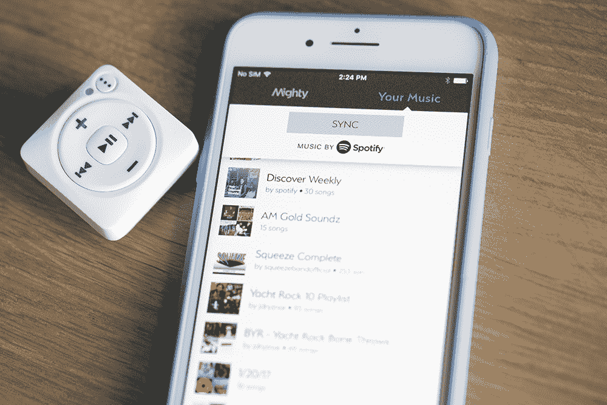
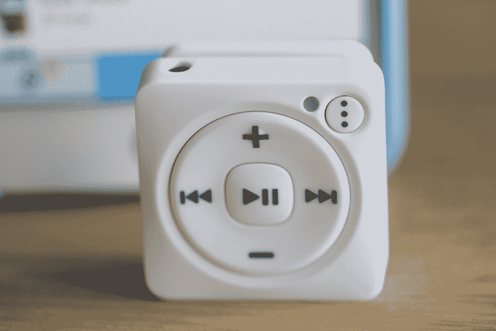

# Mighty 填补了 Spotify 用户的一个 iPod shuffle 大小的漏洞 

> 原文：<https://web.archive.org/web/https://techcrunch.com/2017/08/11/mighty-fills-an-ipod-shuffle-sized-hole-for-spotify-subscribers/>

所有旧的东西都是新的。这就是科技游戏的玩法。产品不断发展，留下了真空，让新的创业公司冲进去填补。对于强大的 T2 T3 来说，MP3 播放器的漫长而缓慢的死亡就提供了这样一个契机。

该公司[去年推出了 Kickstarter](https://web.archive.org/web/20221208042449/https://www.kickstarter.com/projects/51215664/mighty-streaming-music-without-your-phone) ，承诺“不用手机就能播放流媒体音乐”，为 Spotify 一代提供专用音乐硬件的切实好处。这家初创公司建立了足够的兴奋度，在众筹网站上达到了 30 万美元，最近 iPod shuffle 和 nano 的[结束只是进一步增加了消费者的兴趣。](https://web.archive.org/web/20221208042449/https://beta.techcrunch.com/2017/07/27/apple-discontinues-ipod-nano-and-shuffle-and-doubles-ipod-touch-capacities-to-32gb-and-128gb/)

首席执行官安东尼·门德尔森告诉我们，该公司已经接受了媒体将这些设备命名为“Spotify 的 iPod shuffle”尽管许多底层技术有所不同，但基本原理是相同的:一个无屏幕、夹式播放器，可以在旅途中播放音乐。在整个音乐收听市场中，这是一个很小的利基市场，显然苹果没有看到继续生产这些东西的足够价值。

但是有些情况下，手机并不能单独提供服务。健身可能是最大的问题——带着智能手机去跑步是一种痛苦。对于乘坐地铁通勤的用户和经常不得不切换到飞机模式的人来说，也有一个机会。父母对这种设备表示了兴趣，这样他们就不必把手机递给孩子听音乐了，人们也为年迈的父母挑选了一款。

价格一直是 shuffle 成功的另一个关键，Mighty 已经煞费苦心地将第一款播放器的价格控制在 100 美元以下。对于一家全新公司的相对较小的运行来说，说起来容易做起来难，但这款设备(内部称为 M1)的价格为 86 美元——比上次的 Shuffle 贵，但容量更高(8GB)。达到这一价格点需要公司方面的一些组成部分，这里仍有相当数量的问题需要解决，但 first Mighty 将为用户勾选大多数重要的框。

## 很小，但是…

勇士是一个不难看的球员。它有点四四方方，很容易让人想起 shuffle——毕竟它的外形非常有限。这家初创公司的工业设计领导来自三星，并采取了必要的预防措施，以避免过于接近苹果的设计语言。

结果是一个类似的圆形按钮阵列，播放/暂停位于中央。圆圈显示音量和曲目前进选项，但奇怪的是，还没有快进或快退。对于音乐播放器来说，这是一个相当大的盲点，但显然允许它的 Spotify API 造成了相当大的滞后。Mendelson 告诉我，该公司正在进行修复，但没有提供时间表。

最重要的是，这是一个专门设计的按钮，用于循环播放列表，这是目前从 Spotify 输入音乐的主要方法。作为一种在没有屏幕的情况下播放音乐的方法，播放列表当然是有意义的。否则一切都是一场大赌博。还有一个机器人声音，让你在播放前知道每个播放列表的名称。

该播放器由塑料复合材料制成。感觉有点廉价——前面提到的削减成本措施之一。Mendelson 告诉我，该公司正在考虑为下一轮建造一个铝模型，但目前的模型仍然相当坚固。它可以承受快速浸泡的水，并可能在几次跌落到下面粗糙的混凝土上后幸存下来。

背面还有一个大夹子，上面有耳机插孔。该设备将连接到蓝牙耳机，但排除硬连线选项在一个以成本为主要卖点的设备上没有太大意义。

## 溪流队

显然，Spotify 对 Mighty 的 Kickstarter 印象深刻，因此决定与这家初创公司密切合作。对 Spotify 来说，它意味着一个专门用于其服务的硬件，而不必投资任何研发。对 Mighty 来说，它意味着一个象征性的认可印章，以及产品包装上的文字印章。

就实际集成而言，设置需要将一堆帐户绑定在一起。Mighty 有自己的应用程序，需要与 Spotify 应用程序相关联。用户也可以将它直接绑定到脸书，以便更快地建立账户。与 Spotify 直接整合会很好，但流媒体服务并没有为此做好准备。相反，用户通过强大的应用程序拖放内容。

这意味着有很多来回切换——你在 Spotify 上制作播放列表，然后通过 Mighty 导入它们。这看起来有点像一种变通方法，但除非 Spotify 最终更全面地拥抱这种技术，否则这是一种必要的方法。至少，它完成了任务。

Mighty 完全接受 Spotify SDK 意味着离线流媒体正是该服务想要的方式。内置 WiFi 意味着设备会定期连接到 Spotify 的服务器，确保与设备关联的帐户仍处于活动状态(一个帐户最多可以关联三个离线设备)。如果它 30 天没有登录，系统会在音乐上加上一个声音水印，告诉你要同步它，并假设在这个过程中破坏了聆听体验。

## 超越一步

对该公司来说，这是很好的第一步。如果自从流媒体征服了音乐产业后，你的生活中有一个混乱的空洞，这应该可以很好地填补它。但该产品仍有很大的发展空间，从某些方面来说，第一款产品有点仓促。在我们的谈话中，Mendelson 告诉我，该公司努力成为“第一个上市公司”

对于一款本质上是对过去产品的流媒体更新的设备来说，这种措辞很奇怪，但 Mighty 显然不是唯一一家考虑这一想法的公司。在 Pebble 公司内爆并随后被 Fitbit 吞并之前，它曾与 Core 有过暧昧关系。如果[支持 LTE 的 Apple Watch 传言](https://web.archive.org/web/20221208042449/https://beta.techcrunch.com/2017/08/04/the-next-apple-watch-reportedly-wont-need-an-iphone-for-data/)被证明是真的，这可能会通过播放给寻求手机以外的音乐伴奏的跑步者来切入 Mighty 的一个重要领域。

Mighty 显然已经超越了最初的版本。Mendelson 已经预览了该公司正在研究的一些东西，以改进这第一代产品，并在不可避免的 M2 设备中提供。

第一款设备的一些关键特性包括:

*   快进/快退
*   随机播放(另一个明显的遗漏，考虑到所有的 iPod comparisons
    都支持拖放非播放列表内容，即通过专辑或文件夹拖动歌曲
*   能够将产品用作非音乐内容的存储设备

对于 M2 来说，我们可以预期以下几种情况的组合

*   铝背衬和夹子(正面仍为塑料，用于蓝牙传输)
*   完全防水
*   新增的 GPS 和加速度计用于健身功能，包括将音乐与跑步速度同步。

你可能会预计这种型号大约一年后上市，价格会比现在的版本高。随着 Mighty 继续致力于改进该设备的功能，它很可能会与其前身共存。这些设备的市场究竟有多大还有待观察，但就目前情况来看，Mighty 在填补 iPod shuffle 及其同类产品留下的空白方面做得非常令人钦佩。