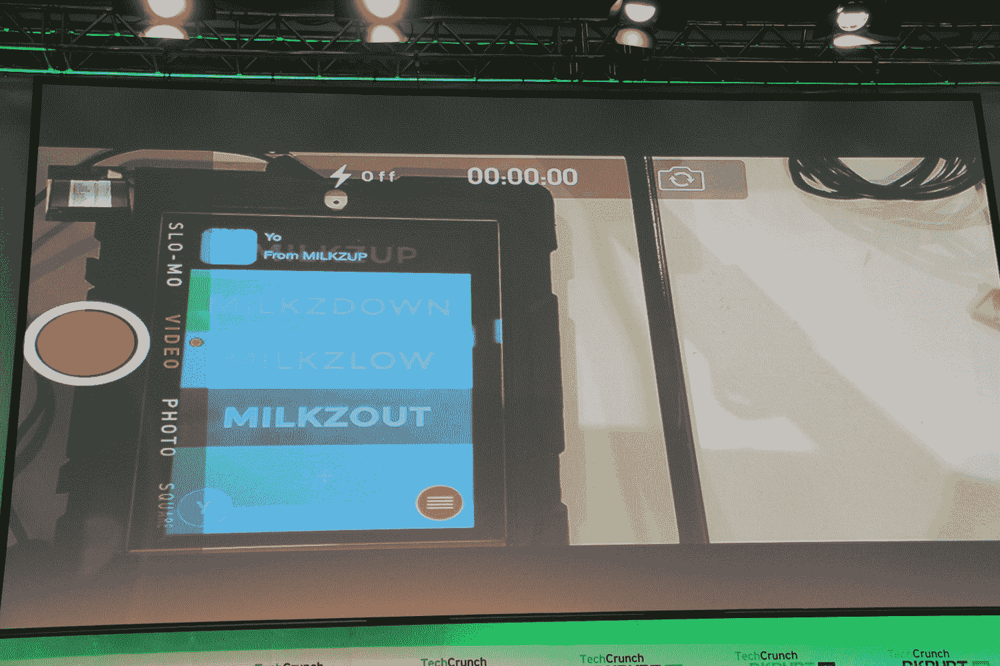

# MilkzUpBottle 是你没有牛奶的时候用的 

> 原文：<https://web.archive.org/web/https://techcrunch.com/2014/10/20/milkzupbottle-is-yo-for-when-youre-out-of-milk/>

# 牛奶巧克力是当你没有牛奶的时候用的

我不擅长做大人。如果我足够幸运，冰箱里有牛奶放在我的麦片里，它通常会变坏。

幸运的是，昨天扰乱欧盟黑客马拉松的一名黑客可以告诉你关于你的牛奶情况你需要知道的一切。它被称为 MilkzupBottle，是一个塑料瓶、USB 连接器、led 灯和基本网络摄像头的组合。

创造者大卫·特纳说，通用电气公司正在开发 USB/Wifi 连接冰箱的原型，这将允许你插入智能容器(也许是类似于古怪的鸡蛋看护器的东西)，这样冰箱里的物品就可以与你和你家里的其他人交流。

理论上，这种牛奶盒可以插入一个智能冰箱，每天观察两次牛奶水平。因为门关上时冰箱会变暗(据推测)，所以 MilkzupBottle 需要一个相应的 LED 灯，以便网络摄像头可以读取液位。

在相应的应用程序上，你会看到四个不同选项(Milkzup，Milkzdown，Milkzlow，Milkzout)中的一个高亮显示，让你知道牛奶是怎么回事。

特纳希望将这个项目开源，看看其他人会用它做什么。

你可以点击查看更多[。](https://web.archive.org/web/20221007033442/http://milkzup.moonfruit.com/home/4586976777)