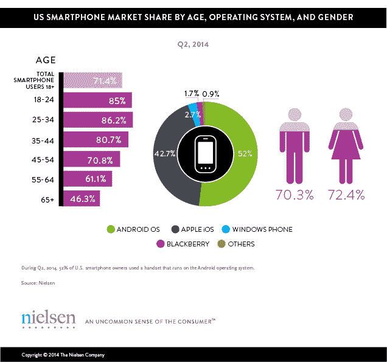

# 千禧一代是最大的智能手机拥有者群体，其采用率仍在增长 

> 原文：<https://web.archive.org/web/https://techcrunch.com/2014/09/05/millennials-are-the-largest-group-of-smartphone-owners-and-adoption-is-still-growing/>

尼尔森在今天发布的一份报告中表示，千禧一代是美国最大的一代人之一，与婴儿潮一代一样，也是最大的智能手机拥有者群体。他们对这些设备的采用仍在增加:到今年第二季度，18 至 24 岁的人中有 85%拥有智能手机，25 至 34 岁的人中有 86%拥有智能手机。

这比去年同期分别增长了 77%和 80%。

还值得指出的是，在苹果下周发布 iPhone 6 的前夕，这款智能手机更有可能是一款安卓手机。尼尔森指出，超过一半(52%)的美国智能手机运行安卓系统，苹果 iOS 占 42.7%的份额，其他操作系统(Windows Phone、黑莓等)。)补上剩下的。

但是，虽然它没有公布选择安卓而不是 iPhone 的千禧一代的具体人数，但今年来自 comScore 的[早些时候的研究](https://web.archive.org/web/20221209173831/http://www.mediapost.com/publications/article/218908/mobile-centric-millennials-still-favor-facebook-a.html)公布了这一数字。同样，[发现](https://web.archive.org/web/20221209173831/http://www.comscore.com/Insights/Presentations_and_Whitepapers/2014/Marketing-to-Millennials-5-Things-Every-Marketer-Should-Know)安卓占据主导地位，半数千禧一代使用安卓，44%使用 iPhone。虽然两份报告都没有猜测为什么会这样，但选择使用 Android 往往更多的是关于手机本身的成本，而不是决定与特定的硬件制造商或软件系统保持一致。就价格而言，Android 手机进一步延伸到低端市场，这使得它们被更广泛地采用——不仅在美国，而且在全球范围内。

但是，无论千禧一代是选择一个移动平台还是另一个，我们长期以来一直听到他们对自己的设备上瘾的报道。还记得今年早些时候的报道吗，千禧一代认为他们的智能手机比除臭剂更重要？[甚至他们的汽车](https://web.archive.org/web/20221209173831/http://www.forbes.com/sites/michelinemaynard/2014/01/24/millenials-in-2014-take-my-car-not-my-phone/)？

千禧一代是重度移动用户，每周花 14.5 个小时打电话、聊天、发短信或使用社交媒体。对于那些设计下一代移动应用程序的人来说，或者甚至只是试图调整他们当前的在线产品以适应这个移动优先的人群，这些指标很重要。事实上，在尼尔森今年 7 月的智能手机应用报告[中，该公司发现 25 岁至 44 岁的人(包括千禧一代到 X 世代的人)每月使用最多的应用程序，平均为 29 个。](https://web.archive.org/web/20221209173831/http://www.nielsen.com/us/en/insights/news/2014/smartphones-so-many-apps--so-much-time.html)

但是 18 岁到 24 岁年龄段的人花在手机上的时间最多。这个群体平均每月使用手机 37 小时 6 分钟，主要用于社交网络应用、娱乐和通讯工具。

难怪我的 iPhone 文件夹里有 10 页厚的信息应用程序。(是为了研究！)但现在的问题是，在成功实现移动飞跃之前，移动平台本身能否发展出像现任脸书在网络上所能做到的那样庞大的服务。毕竟，那些成功建立稳固移动业务的公司似乎经常被脸书抢购一空(例如 Instagram、Whatsapp)。Snapchat(可能对整个 iCloud hack 事件感到高兴——应该用 Snapchat！)，是一个明显的例外。