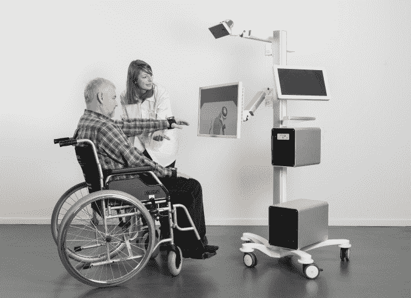

# “神经虚拟现实平台”制造商 MindMaze 以 1B 估值 1 亿美元融资

> 原文：<https://web.archive.org/web/https://techcrunch.com/2016/02/17/mindmaze-maker-of-a-neural-virtual-reality-platform-raises-100m-at-a-1b-valuation/>

随着消费者和企业开始关注下一代计算在我们当前的智能手机时代之后可能采取的形式，在这些概念的前沿发展的初创公司正在吸引投资者的一些主要关注。MindMaze 正在开发硬件和软件平台，通过利用计算机视觉、神经科学、人工智能和触觉的进步来创造“人类”虚拟现实体验。该公司已经筹集了 1 亿美元的融资，投前估值为 10 亿美元。

这笔资金与此同时，另一家致力于围绕虚拟和增强现实的全新生态系统的创业公司——[Magic Leap](https://web.archive.org/web/20230304021213/http://www.magicleap.com/)——[也筹集了大笔资金](https://web.archive.org/web/20230304021213/https://techcrunch.com/2016/02/02/ar-startup-magic-leap-raises-793-5m-series-c-at-4-5b-valuation-led-by-alibaba/)。(我猜，当你在建立新的生态系统时，你需要筹集大笔资金！)

MindMaze 的首席执行官兼创始人 Tej Tadi 表示，MindMaze 的目标不仅是为 mind maze 自己的服务开发硬件和软件，而且还开发可能在一系列其他设备和服务上推动 VR 体验的技术。

“这有点像 Intel Inside 的模式，”Tadi 在一次采访中向我解释道。“我们希望所有的 VR 都由我们来驱动。如果你有一个神奇的飞跃或其他设备，这都没有关系。无论是什么，他们都会希望使用我们的芯片组。”这也意味着大量的专利——这是资金将会投入的一个领域。

有趣的是，这笔资金并非来自硅谷的中坚力量，而是来自一家战略支持者和几家家族理财室。它由 Hinduja 集团领导，这是一家大型跨国企业集团，不仅帮助产品分销，还帮助制造。Hinduja Group 也是 MindMaze 之前(也是唯一一次)1000 万美元种子融资的牵头方。

“MindMaze 的下一代人机界面已经在医疗保健、游戏中证明了自己，它在交通、国防和各种类型媒体中的应用潜力现在已经准备好进行真正的探索，”Hinduja 集团的一位发言人说。“我们很高兴能够帮助 MindMaze 巩固其成就，同时看到当前和未来的合作伙伴都实现了他们的共同愿景。”

我应该注意到，这并不是说 MindMaze 没有和前面提到的坚定者交谈。塔迪指出，它已经与硅谷的风投和策略师进行了沟通，要么加入本轮谈判，要么投资战略合作伙伴关系，以帮助明迷宫更好地发展业务。他既不会确认也不会否认高通或英特尔是否参与了这些对话。

除此之外，该公司还有一系列令人印象深刻的顾问和董事会成员，包括来自美敦力、百特、HBO、斯坦福大学、加州大学旧金山分校、布朗脑科学研究所、怀斯生物技术中心和 EPFL 的高管。

如果你是一个虚拟现实发烧友，你可能会因为不知道 MindMaze 是谁而被原谅。该公司成立于 2012 年，总部位于洛桑(碰巧是 T2 有趣的计算机图形学研究和创业的温床)，由前学者塔迪(Tadi)领导。塔迪最初研究电子工程，后来扩展到计算机图形学、人工智能和神经科学，这是他特别创业的完美结合。迄今为止，该公司基本上一直在雷达下运行。

但这并不意味着它一直缺乏活动，甚至对自己到底在做什么保持沉默，众所周知，其他人(比如从事虚拟现实和增强现实新技术工作的 Magic Leap)也采取这种方式。

MindMaze 通过开发企业级产品，特别是医疗保健行业的产品，开创了自己的业务。一个应用是帮助遭受脑损伤(如中风或其他事故)的病人重新训练他们的身体重新工作。

MindMaze 到底在做什么？在一个人的大脑、一个人的身体和虚拟现实场景中正在经历的事情之间建立更强的联系，以及三者如何更好地合作。

“这是一个帮助患者改善生活质量的强大市场需求，”Tadi 说，他补充说，就当地医院实际用于患者治疗的内容而言，这是一个几乎没有创新的领域。

这不是蒸汽器皿。他说，MindMaze 已经在欧洲和其他地方的几所顶级大学医院部署了一些设备，包括可穿戴设备和用于重启大脑受损部分的培训软件，还有几个设备正在进行第二阶段的部署。部分资金将用于未来合同的融资以及与客户合作的服务中心。

他说，下一阶段是将此转化为消费者体验，他认为可以采取游戏、教育和健身应用的形式。

他指出，在后者中，有很大的增长空间，因为如此多的量化自我应用和可穿戴设备专注于物理诊断，而不是从认知的角度来看一个人做得如何——我们都知道在身体活动方面，精神对物质的作用有多大。他表示，目标是在今年晚些时候推出首款消费耳机。

该公司还在确保其知识产权井然有序。部分资金将用于填写专利申请。Tadi 说，已经有 6 个申请了，还有 10 个正在申请中。“我们的专利组合将继续增长，”他说。

资金将投向的其他领域是招聘。目前，MindMaze 在欧洲和旧金山共有 55 名员工，目前大部分在洛桑。