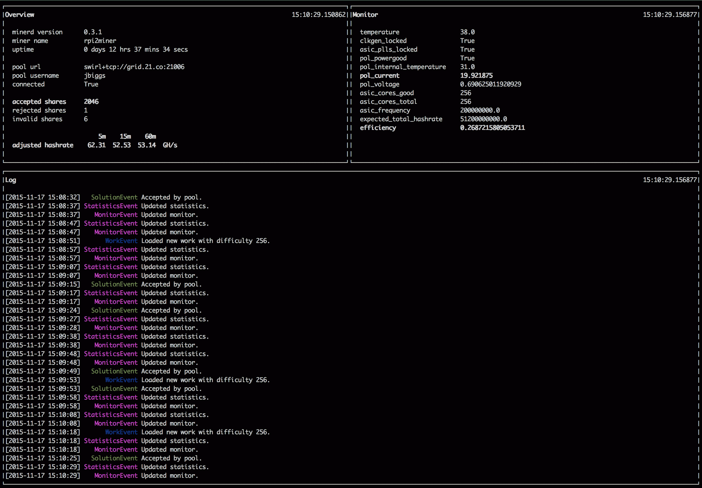
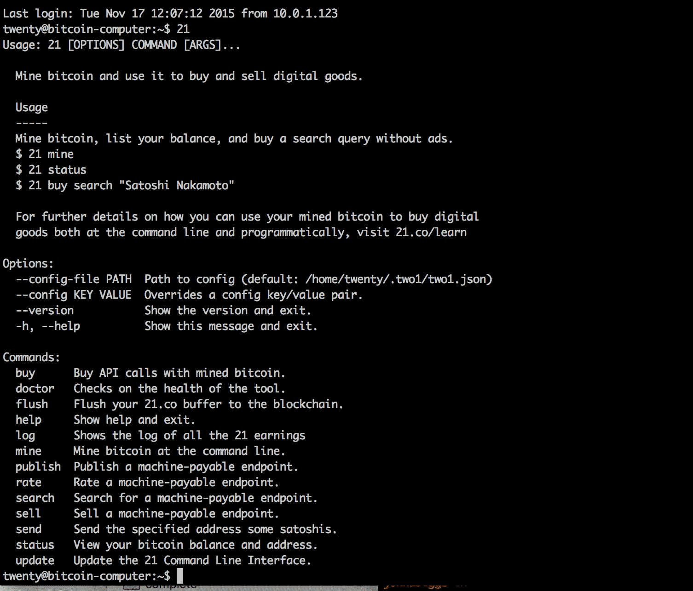

# 使用 21 台比特币计算机进行挖掘(和学习)

> 原文：<https://web.archive.org/web/https://techcrunch.com/2015/11/18/mining-and-learning-with-the-21-bitcoin-computer/>

# 用 21 比特币计算机挖掘(和学习)

几天前一笔 400 美元的费用打到我的信用卡上，亚马逊通知我我的[21.co 比特币电脑](https://web.archive.org/web/20221206095551/http://www.amazon.com/gp/product/B014RD021C?camp=1789&creative=9325&creativeASIN=B014RD021C&linkCode=as2&linkId=K36ZRXOEXVD5LYXL&redirect=true&ref_=as_li_tl&tag=21inccorsit-20)已经在路上了。

本质上是一个树莓 Pi，连接着一个定制的[比特币](//web.archive.org/web/20221206095551/https://beta.techcrunch.com/tag/bitcoin%E2%80%9D)-采矿 ASIC 和一个散热器，这台计算机是现代记忆中最有趣的 MVP 之一。虽然你可以很容易地自己重建它，但事实是 21 正在建造并以几百美元的价格出售这些系统，这证明了 BTC 系统在未来的广泛应用。

值得吗？首先，我怀疑这台每秒 50 千兆哈希的机器能否赚回购买和运行它的成本。第二，它非常酷，但我怀疑这不是我们都在寻找的比特币机器人。也就是说，我认为这是一个有趣的概念证明。

21 计算机[本质上是先前制造的树莓 Pi 矿工](https://web.archive.org/web/20221206095551/https://beta.techcrunch.com/2013/08/13/how-to-build-a-raspberry-pi-based-bitcoin-mining-rig/)的版本。我已经在我的办公桌下运行类似的东西大约两年了，这是一个有趣的经历。见鬼，你可以花 60 美元买下这个庞然大物，给你的卧室供暖，同时每周赚点钱。但人们说，你不会为了财富而挖掘比特币。你挖掘它来支持网络。

21 世纪的最终目标是将类似比特币系统的东西植入每部手机和电脑。这一举措将真正改变区块链的加工方式，并可能给整个生态系统带来一些有趣的变化。然而，就其现状而言，这台电脑类似于婴儿的第一台比特币矿工，一个即插即用的设备，可以访问和理解，是一个进入采矿而不会发疯的好方法。

这款设备的真正设计目的是为基于比特币的活动提供一个测试平台，如销售签名的数字商品，出租比特币系统时间的能力，以及在商业网站上接受比特币。核心应用程序名为 21，它从命令行运行。键入“21 mine”激活比特币矿工，而其他命令激活各种功能。你也可以启动一个服务器来执行基本的比特币功能。例如，21 通过短信系统提供一种[比特币，该系统使用 Twilio 发送支付。你也可以使用这个服务器通过比特币](https://web.archive.org/web/20221206095551/https://21.co/learn/bitcoin-sms-contact/#step-4-set-up-the-client-who-will-pay-to-sms-you)出售[数字文件。](https://web.archive.org/web/20221206095551/https://21.co/learn/sell-or-license-any-file-for-bitcoin/)

那么为什么要运行这个而不是一个测试平台呢？用一位 Reddit 用户 [Tequila13、](https://web.archive.org/web/20221206095551/https://www.reddit.com/user/tequila13)的话来说，“未来的愿景是，每部手机都将有一个采矿芯片，人们出于好心将为采矿芯片付费，并为了更大的利益而亏本采矿。未来，数百万人将购买电池寿命更低的手机，因为他们相信比特币。”虽然这有点乌托邦，但这是真的:如果数百万这样的迷你矿工为比特币网络提供动力，那将是一个有趣得多的世界:比特币将移动得更快，更有保证，利率将在理想情况下保持稳定，区块链将成为金融界不可忽视的力量。简而言之，这是金钱的互联网，就像早期的互联网服务器一样，它现在似乎非常有限——直到突然有人在浏览器中建立了谷歌文档的金融等价物。

21 比特币计算机是一个实验平台。这是一个聪明的做法，对公司来说是一个很好的 MVP，也是开始比特币的一个很好的方式。你可以很容易地自己重新创建它，但如果没有他们提供的特定软件和服务器堆栈，我怀疑你会有同样的开箱即用的满意度。当我建造我的第一个采矿机时，花了几天时间来解决零件和软件问题。要运行这个矿工，我只需输入“21 mine ”,然后我就开始运行加密货币的未来。仅此一项，可能就值 400 美元。

