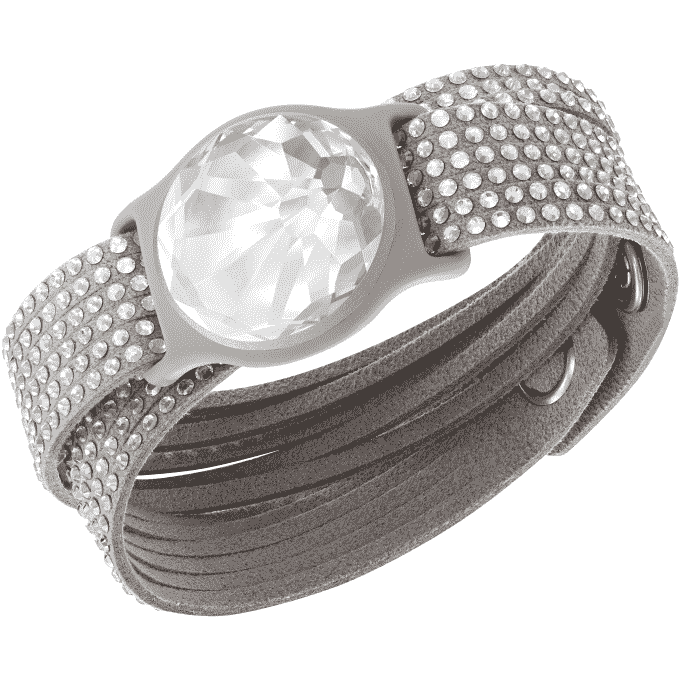
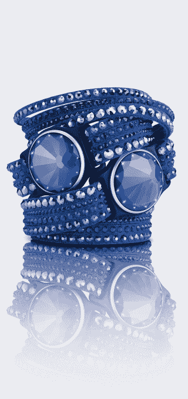

# Misfit 首次推出新的“施华洛世奇闪耀”可穿戴产品系列，其中包括水晶珠宝、太阳能充电

> 原文：<https://web.archive.org/web/https://techcrunch.com/2015/01/05/misfit-debuts-a-new-swarovski-shine-wearables-collection-featuring-crystal-jewelry-solar-charging/>

“互联”产品(包括智能家居产品及其旗舰可穿戴设备 Misfit Shine)的制造商 Misfit 今天与施华洛世奇合作，推出了一个新的产品线，专注于为其可穿戴产品系列带来更时尚的感觉。被称为[的施华洛世奇闪亮系列](https://web.archive.org/web/20230310223749/http://store.misfit.com/collections/swarovski-shine?__hstc=32400481.6219f8bd69a0dd8b48add96cc1a0024c.1420468431014.1420468431014.1420468431014.1&__hssc=32400481.2.1420468431014&__hsfp=492180937#swarovski_shine)，将施华洛世奇的水晶珠宝和 Misfit 的活动和睡眠跟踪技术结合在两个新的可穿戴产品和九个配件中，由两家公司联合设计。

值得注意的是，这两款可穿戴设备中的一款也是太阳能驱动的——这是第一款用于 Misfit 和一般活动/睡眠追踪器的设备。

这两款可穿戴设备都是防水的——其中一款是带有水晶面的透明施华洛世奇 Shine，另一款是紫罗兰色施华洛世奇 Shine，它使用了一项专利技术，允许设备在不需要电池的情况下自行供电。以前，Misfit 的所有小而圆的发光设备都带有一个小工具，让你可以相当容易地打开背面，更换为可穿戴设备供电的内置电池，它可以作为手表、项链佩戴，或通过磁性夹子连接到你的衣服上。

但通常当电池耗尽时，不得不记得订购更多电池，然后花时间更换电池的麻烦是*只是*不够方便，以至于可穿戴设备被塞进抽屉，最终被遗忘。施华洛世奇紫罗兰光泽可以改变这种行为模式，因为保持充电的唯一要求是暴露在阳光下——如果你整天戴着它，或者带着它跑步，这并不太困难。该公司表示，led 或卤素照明也将为该设备充电。

与其他 Shine 设备一样，新系列包括许多配件，可将健身追踪器变成迷人的珠宝，包括吊坠、表带和手镯。它还能够与不适合的移动应用程序同步，以记录您的活动、睡眠和食物/体重记录。

通过检查施华洛世奇闪亮表面发出的光晕，新的闪耀也可以作为手表使用。然而，使用我以前的 Shine 设备的经验发现，将它们用作手表有点麻烦——有时我会点击它们来查看灯光，但它们没有反应。最后，拿出我的智能手机变得更容易了。

施华洛世奇 Shine 设备和配件将于今年 2 月在 Misfit 的网站 Swarovski 以及美国、香港和中国的各个零售点出售。这些物品将分为三套出售，每套包括两个配件，价格从 169.99 美元到 249.99 美元不等。配件单个从 69 美元到 149 美元不等。你现在就可以在网上[预订三月份发货的](https://web.archive.org/web/20230310223749/http://store.misfit.com/collections/swarovski-shine?__hstc=32400481.6219f8bd69a0dd8b48add96cc1a0024c.1420468431014.1420468431014.1420468431014.1&__hssc=32400481.2.1420468431014&__hsfp=492180937#swarovski_shine)。

尽管有些古怪，但 Misfit Shine 一直是我最喜欢的可穿戴设备之一，因为它是我实际上会穿的东西。它看起来更像珠宝——特别是当夹在标签上或戴在脖子上时——而不是一些笨重的塑料运动手表。施华洛世奇 Shine 现在使产品线更加高端，可以选择购买可穿戴设备，甚至可以搭配您的礼服或工作服。

该公司告诉我们，在上市一年多一点的时间里，它现在已经在全球 51 个国家和超过 21，000 家商店销售。它在第四季度的出货量超过了 100 万部，但拒绝提供迄今为止的出货量或收入。最近几周，Misfit 一直在扩展“可穿戴设备”之外的领域——甚至从公司名称中去掉了这个词——因为它扩展到了智能家居产品，如 Beddit 睡眠监视器。这一趋势将在 2015 年继续，因为该公司表示，现在它专注于推出“身体和家庭最引人注目的用例。”