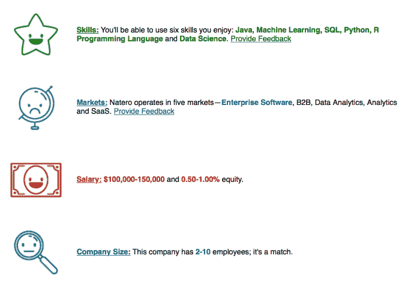

# 麻省理工学院的校友推出了 Beansprock，这是一个基于人工智能的求职平台，用于寻找你的最佳雇主 

> 原文：<https://web.archive.org/web/https://techcrunch.com/2015/02/04/mit-alums-launch-beansprock-an-ai-based-job-platform-for-finding-your-best-employer/>

当我们想到就业，我们会想到工作。我们有工作公告板、工作搜索和工作列表，然而当我们换工作时，我们大多数人真正关心的是我们新工作的背景。谁将是我们的同事？公司会怎么样？它有多大？我们的角色是什么？

为了回答这些问题，卡梅伦·利维和达斯汀·史密斯今天推出了[beans rock](https://web.archive.org/web/20221206151901/https://www.beansprock.com/)，这是一个基于机器学习的求职平台，他们希望将求职转变为公司求职。利维解释说:“这个想法不仅仅是去找一个你会喜欢的角色，而是去找那些解决你会喜欢的问题的公司。”。

要做到这一点，你需要在 Beansprock 上填写一份关于你技能的简短问卷，指出哪些技能是你的强项，哪些技能是你希望在下一份工作中用到的。然后，该公司会根据你的意愿频繁地向你发送经过策划的电子邮件，开始为你匹配可能感兴趣的公司。

Beansprock 发送给用户的精选电子邮件示例

这些邮件旨在向你展示的不仅仅是你拥有哪些可能对公司有用的技能，还有公司的背景，比如它的规模。随着时间的推移，该公司打算加入更多因素，如公司的自由程度(例如，一些公司屏蔽某些网站)以及公司的文化。通过该产品的移动网络界面，用户可以在各种技能和软因素上滑动，教 Beansprock 你喜欢什么，不喜欢什么。

如今，前端界面非常简单，但正是幕后的技术将 Beansprock 与其他求职公告板和简历服务区分开来。该团队面临两个挑战。首先，他们如何识别你的技能和特定职位之间的匹配，而不像竞争对手那样求助于关键词搜索。第二，他们应该如何为用户排列相关的工作。

首席技术官史密斯毕业于麻省理工学院媒体实验室，他开发了一个所有职位和技能的分层知识地图，以确定正确的匹配。这种映射让他们的软件知道某些编程语言如 JavaScript 更可能与前端工程相关联，而其他语言如 Go 更可能与后端工程相关联。

了解用户的技能以及这些技能如何转化为实际职位，Beansprock 就能够预测哪些工作是匹配的，哪些不是。史密斯认为，“有了这个结构，我们就可以对技能本身进行推理。如果我们知道有人知道前端编程技能，那才是真正的高水平技能，”产品可以对用户的能力做出假设。

对比赛进行排名成为下一个挑战。大多数求职公告板只是提供了一些分类机制，比如受欢迎程度或薪水。史密斯和利维希望允许每个用户在不同的因素上有自己的权重，因为每个人在工作方面都有不同的偏好。

通过在线刷卡并通过他们的比赛电子邮件提供反馈，Beansprock 能够了解其用户的价值观。史密斯认为这是至关重要的。“我们的建议最独特的一点是，我们不只是给出一个排名列表，而是给出具体的原因。我们的用户可以就这些具体原因向我们提供反馈，他们对推荐有很大的控制权。”

史密斯和利维在麻省理工学院时通过一个共同的朋友联系在一起，当时史密斯在媒体实验室，利维是斯隆管理学院的学生。最初，他们开发了一个以职业指导为中心的产品。“我们注意到，我们的同学和本科生一样不清楚自己想做什么，”利维说。然而，用户一直专注于产品的一个特性，他们后来决定将这个特性扩展到这个版本的 Beansprock 中。

他们希望通过增加以雇主为中心的功能来赚钱，这将允许招聘经理寻找可能对他们感兴趣的员工。“如果你是一家寻找软件开发人员的公司，你不只是想在技能上匹配，你还要寻找文化契合度。Levy 说:“既然用户告诉 Beansprock 他们在找什么，我们就能帮助雇主找到人。”希望货币化实际上有助于改善每个人的产品，因为更多的信息将意味着更好的匹配。

Beansprock 从 [E14 Fund](https://web.archive.org/web/20221206151901/http://e14fund.com/) 获得了少量种子资金，这是一家投资基金，目标是麻省理工学院媒体实验室出来的学生。创始人希望随着雇主功能的推出，最早在今年开始创收。

如今，该产品主要集中在旧金山、波士顿和纽约市的科技行业，在这些地方，特定技能对匹配至关重要。该公司每天处理数万份招聘信息。随着时间的推移，创始人希望扩大他们的搜索范围，以包括美国各地更多的非技术性工作。

随着美国就业的反弹，越来越多的工人将开始从衰退期间的工作岗位转向更符合他们职业目标的新工作。通过 Beansprock，他们不仅可以更轻松地解析招聘信息，还可以解析他们喜欢为哪种雇主工作。