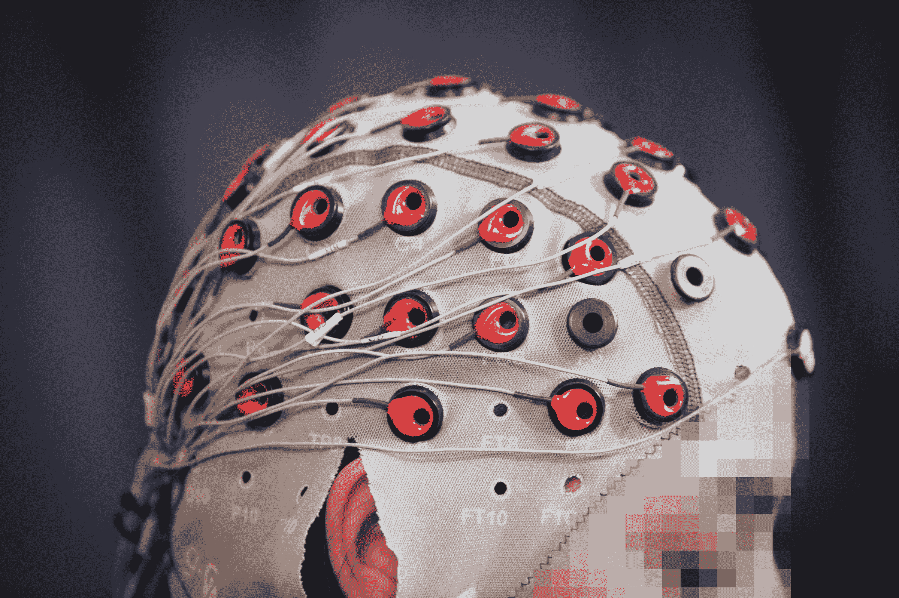

# 麻省理工学院设计了一个机器人，当人类发现错误时，它可以自我纠正

> 原文：<https://web.archive.org/web/https://techcrunch.com/2017/03/06/mit-csail-mistake-robot/>

在麻省理工学院 CSAIL 部门的一个新视频中，来自 [Rethink](https://web.archive.org/web/20221207210422/https://beta.techcrunch.com/2017/02/07/rethink-robotics-makes-its-workplace-bots-easier-to-train-and-redeploy/) 的一个傻笑的工业机器人拿起喷漆罐和线轴，将它们扔进贴有正确标签的垃圾箱。机器人犹豫了一会儿，然后意外地做出了错误的选择，只是自我纠正并把油漆罐扔在了它应该在的地方。[修正](https://web.archive.org/web/20221207210422/http://news.mit.edu/2017/brain-controlled-robots-0306)来自[一个脑电图帽](https://web.archive.org/web/20221207210422/https://en.wikipedia.org/wiki/Electroencephalography)的观察者，他只是注意到有什么不对劲。

“当你给用户戴上脑电图帽时，它会使用 48 个传感器来测量信号，”CSAIL 主任 Daniela Rus 告诉 TechCrunch。“大多数信号都很难解读。很吵。但其中一个信号比其他信号更容易被发现。”

这种信号被称为“错误潜力”，当一个人注意到一些错误时，大脑中发出的强烈反应。它很强，很突然，而且相对容易被机器检测到并从脑电波的杂音中分辨出来，这使得它成为 CSAIL 系统的理想候选。

[https://web.archive.org/web/20221207210422if_/https://www.youtube.com/embed/Zd9WhJPa2Ok?feature=oembed](https://web.archive.org/web/20221207210422if_/https://www.youtube.com/embed/Zd9WhJPa2Ok?feature=oembed)

视频

“潜在错误是一种非常自然的反应，”Rus 补充道。“这与我们今天使用的范式完全不同，我们今天使用的范式是要求人类用机器人的语言给机器人编程。我们试图让机器人适应人类的语言，而不是让人类适应机器人的语言。”

视频中描述的场景是一个简单的装配线模型，其中机器人正在执行主要任务，由人类监督，人类可以超越运动，而不必编码纠正或点击大红色按钮。

CSAIL 的研究科学家斯蒂芬妮·吉尔解释说:“我们希望进行双向交流。“能够读取人类的 EG 信号，并将其用作机器人的控制信号，将对机器人的选择产生影响。机器人是否做出正确的选择将对人类的反应产生影响。这是人类或机器人之间自然的双向交流或对话。”

在该团队在一篇附带的研究论文中描述的早期阶段，这种交互只在二元区分下进行(油漆与电线)。它也只能实时运行(大约 10 到 30 毫秒)，但即将到来的迭代可以利用一种学习形式，为错误赋予更多意义，并为未来的选择纠正它们。

该团队还在研究其他潜在的应用，包括为那些无法用语言交流的人进行互动，以及其他旨在自主操作的技术，但仍然需要一定程度的人类互动来帮助避免潜在的危险。

CSAIL 博士候选人约瑟夫·德尔普雷托说:“你可以想象这种技术被用于人类担任监督角色的地方，观察机器人的工作并检测它们在哪里出错。或者可能被用于自动驾驶汽车，汽车可以完成大部分工作，但人类仍然可以控制并让它知道它什么时候做错了。”