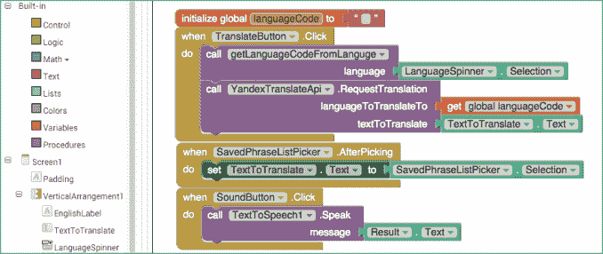
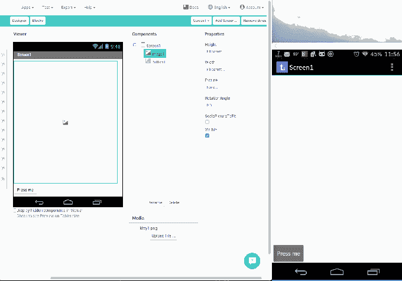

# 麻省理工学院的分支机构 Thunkable 希望它的拖放式应用程序生成器也能赚大钱

> 原文：<https://web.archive.org/web/https://techcrunch.com/2016/03/05/mit-spin-out-thunkable-hopes-its-drag-and-drop-app-builder-can-be-a-money-spinner-too/>

Y Combinator 2016 年冬季批次中的一家初创公司担心，吸引大量用户是一项挑战，比平均水平低一点。由两人组成的强大的创始人团队来自一个更舒适的位置，他们已经培育了一个超过 400 万人的社区——这要归功于他们大约五年前在麻省理工学院帮助开发的拖放式应用构建器界面。这是两人现在打算建立业务的核心技术。

虽然他们还没有将数百万用户锁定在他们的新工具上，但他们在推出免费应用程序生成器大约一个月后，已经有大约 5 万人注册了。一条清晰的道路来鼓励更多的老用户——并带来新用户。

那么为什么现在出现了最初 MIT 项目的分叉呢？麻省理工学院的应用发明者的成功意味着它已经超出了学术界提供给它的资源，Thunkable 的联合创始人阿伦·塞加尔(首席执行官)和李伟华(首席技术官)说。

因此，他们决定以新的名字寻求核心技术的商业化，在麻省理工学院开源代码的基础上构建新的功能，他们希望这些功能也能支持他们的盈利意图。(需要说明的是，Thunkable 的代码不会是开源的，尽管他们说他们确实希望在未来接受社区贡献。)

虽然 MIT App Inventor 的最初目标是教育工作者和学生，提供一个免费的学习工具来降低编程的门槛，但两人表示，该软件的成功——目前已被用于制作约 1300 万个应用程序，并获得了 430 万注册用户——要求脱离学术环境。

“App Inventor 最初的目标基本上是做一个教人编程的工具。因此，我们在麻省理工学院的实验室发明了许多拖放编程工具——我们与 Scratch、Lego Mindstorms 等工具合作。“从那以后，它开始增长，相当多。首先主要是在教育方面，然后是教育以外的很多方面。”

当 App Inventor 的月活跃用户达到 30 万左右时，该团队决定通过调查用户来了解他们是谁以及他们使用它的目的。结果令人惊讶:他们发现大多数人(超过 50%)实际上不是教育工作者——这一认识让他们开始考虑将教育资源转化为业务的潜力。

Saigal 说，事实上，他们发现各种各样的人都在使用该软件开发各种各样的应用程序——从想要开发一个应用程序来控制自己家中联网的 LED 灯的个人，到使用该软件为销售团队整合应用程序的企业。

麻省理工学院的团队也收到了越来越多来自 App Inventor 用户的功能请求。但是没有资源来满足所有的请求。因此，需求和增长潜力都很明显。

“我们看到了这个巨大的范围，实际上我们的大多数用户都不在教育领域。我们的用户开始给我们发信息‘嘿，你能做这个吗？’，‘你能造出来吗？’—显而易见的事情，货币化或添加谷歌地图或类似功能的能力。这些功能从来不在 App Inventor 的范围之内，”Saigal 说。

> 它已经发展成为面向非程序员的最大的应用创建工具。

“就在那时，我们意识到 A)我们没有尽全力支持用户，B)这已经远远超出了我们最初的想象…它已经发展成为面向非程序员的最大应用程序创建工具。”

当然，其他应用构建工具也已经存在，包括像[商业应用](https://web.archive.org/web/20230323015512/https://techcrunch.com/2015/12/23/after-500000-apps-built-bizness-apps-launches-apex-a-new-white-label-app-builder/)和[应用](https://web.archive.org/web/20230323015512/https://techcrunch.com/2014/05/22/appgyver-launches-composer-a-drag-and-drop-tool-for-building-html5-apps/)。还有一种外包途径是公司雇佣外部开发人员或开发工作室为他们开发应用程序。不过，后一种选择可能会很昂贵。两人认为，虽然现有的应用构建器对非开发者来说并不总是那么容易获得；可能仍然需要一定程度的编码知识。

李说，Thunkable 的主张是，任何会用电脑的人都可以开发一个应用——简单地把它用来简化编程过程的代码块组合在一起。

“我们是任何人的工具，任何人都想建立应用程序——从非开发人员到高技能开发人员，他们想更快更容易地做一些事情，”Saigal 补充道。

“我们的工具有两个部分，”他解释道。“第一部分是设计者，基本上就是你可以拖放应用程序的用户界面。所以，如果你说，嘿，这是我的屏幕，我想要一个按钮，一个文本字段，这些传感器和一张图片，很好。

然后第二部分是积木语言。这是我们小组发明的一种编程语言——这种编程语言意味着，如果你点击一个按钮，你必须拖动“当按钮点击”块。所以有一种编程语言，但归根结底，它是为那些不一定知道如何编码但有逻辑感的人准备的。”

【YouTube = https://www . YouTube . com/watch？v=LSdryUBwUOo&w=640&h=480]

他补充道:“这与(编码)是同一个概念，但它对英语更友好，比用 Java 或其他任何语言编写更有逻辑性，也更简单明了。”。

“在老式的(编程语言)中，你需要打字输入。在我们的块语言中，你已经在构建它了——你可以看到它，你可以使用它。这就是使用块编程语言的好处，”李补充道。“而且它没有语法错误。基本上你只需要把这些积木拼在一起。你不用担心错别字。”

“如果这些模块组合在一起，它就可以编译、构建和运行。如果它们不匹配，就无法工作，”Saigal 补充道。“你可以拖放块，或者你可以输入单词，如果你开始输入单词，块就存在了。如果你不确定要做什么，你键入“按钮”点击“当按钮。点击”块将弹出。所以你可以通过思想来思考，而这些积木几乎会自己填满。”

Saigal 声称，与竞争对手的应用程序构建者相比，另一个优势是用 Thunkable 的软件构建的应用程序完全是原生的，而不是 web 应用程序。因此可以离线工作，并能够利用特定的移动硬件功能，如 GPS 和 NFC。虽然 Thunkable 确实为那些想要更多结构的人提供了一些模板，但它不仅限于构建模板应用程序——不像一些竞争对手。

在 Thunkable 上构建应用也不需要下载 SDK。该软件在浏览器中运行，并包括旨在吸引广泛用户群的其他功能，如在用户的 Android 手机上现场测试应用程序的能力。

“我们有一个实时开发功能，你可以把你的手机连接到你的浏览器，当你开发的时候，你可以看到你的应用在你的手机上实时运行，”Saigal 说。“这是人们喜欢的事情之一，因为作为一名新的开发人员，你会寻求即时的满足。”

鉴于 Thunkable 的出发点是一个建立在自由软件基础上的强大社区，两人表示计划在可预见的未来继续提供免费版本(Thunkable 目前完全免费)。货币化将通过免费增值路线实现，在基本免费版本的基础上建立分层定价模式。他们表示，他们可能会对某些额外功能向用户收费，根据用户是个人、中小企业还是大型企业而定不同的价格等级。

Thunkable 不仅仅是一个新名字的 App Inventor 他们也已经给平台增加了一些新功能。新增内容包括额外的示例应用程序和模板；支持谷歌地图；并启用 Android 的材料设计功能(他们再次表示，麻省理工学院团队从来没有资源来支持)。

“当你来到这个网站时，你会发现它的用户界面有了明显的改进。按钮，配色方案，所有我们改进的东西。此外，我们增加的几个最大的功能可能是，在麻省理工学院，我们不支持任何新的 Android 设计，”Saigal 说。

“Thunkable 支持材料设计和新的用户界面、连锁反应等。对于我们的用户来说，这是一个巨大的升级。转移你的项目非常简单，他们会说‘哇，我的应用看起来更好了，不需要额外的努力’。”

该团队还提供了更多的支持——回复“每一封电子邮件……我们在网上的每一次聊天”(目前是免费的)。“这是我们提供的最大的东西之一——真正的人类支持，来解决你的问题，”他补充道。

Thunkable 未来可能开始收取月订阅费的功能类型可能是基于该平台构建的应用程序的货币化功能，可能每月向个人收取 5 至 10 美元。直到更高级的企业选项(附带更高的月订阅费)，例如企业客户能够拥有一个应用程序的白标版本，允许他们托管自己的数据，并包括对特定企业软件的支持。

就打开货币化开关的时间框架而言，他们表示将是“明年的某个时候”。他们补充说，尽管目前的首要任务是打造产品和增加用户。

保持应用程序发明人社区的存在对于扩大业务规模至关重要，因为仅两个专注的麻省理工学院员工就能维持 400 万用户群。麻省理工学院是如何用这么少的员工支持这么多的用户的？李说，社区超级用户在论坛上提供了很多帮助和支持。

由于拥有强大的客户支持是 Thunkable 主张的一个关键要点，因此如果他们能够培养一个强大的、吸引他们的社区，那么在不需要雇用大量支持人员的情况下扩大业务规模将更容易实现。

麻省理工的 App Inventor 会怎么样？目前还不完全清楚，但看起来该项目的开发可能会在未来结束，由 Thunkable 接过接力棒。

到目前为止，这家初创公司已经从 YC 获得了 12 万美元的种子资金，联合创始人估计这笔资金将帮助他们度过今年剩下的时间——他们表示，在现阶段他们不急于筹集新一轮资金。

除了利用这笔资金雇佣更多员工来帮助扩大业务规模，他们还致力于开发该产品的 iOS 版本——目前仅支持开发 Android 应用。据 Saigal 称，自从去年 12 月苹果开放其编程语言 Swift[以来，iOS 版本已经成为可能。鉴于麻省理工学院有限的资源，这在以前也是不可能的。](https://web.archive.org/web/20230323015512/https://techcrunch.com/2015/12/03/apples-swift-programming-language-is-now-open-source/)

“人们多年来一直要求 iOS 版本，我们终于投入了时间和资源，”他说，并补充说，希望在今年年底前准备好早期版本，明年这个时候推出完整版本。

李表示，除了增加 iOS，Thunkable 的长期目标是发展该工具，使其支持协作应用开发——就像谷歌文档一样，允许多人轻松地一起处理文档。

“这是我们的长期战略，”他说。“如何制作一个工具来支持或授权给我们的用户，让人们能够协作地构建工具。

“我认为这将是(年轻人)学习编码或仅仅通过激发想法——将他们的想法转化为移动应用程序——的一个真正强大的激励。或者甚至是其他我们还不知道的东西。”

