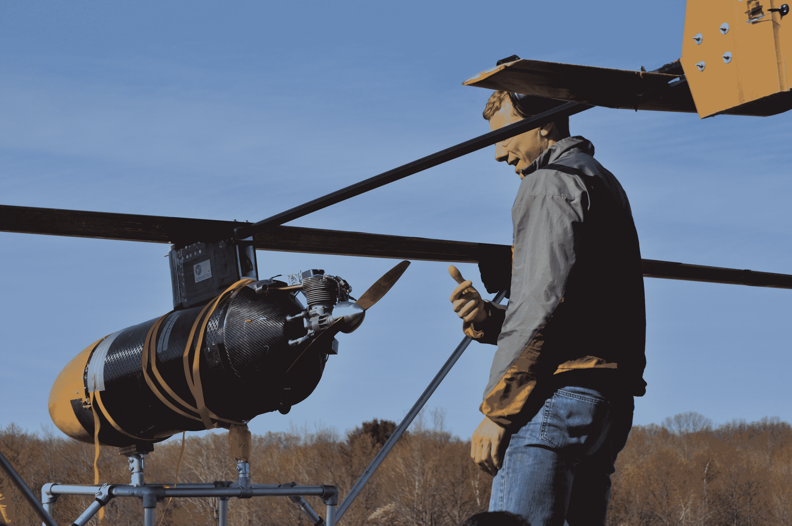

# 麻省理工学院的气体动力无人机一次可以在空中停留五天 

> 原文：<https://web.archive.org/web/https://techcrunch.com/2017/06/27/mits-gas-powered-drone-is-able-to-stay-in-the-air-for-five-days-at-a-time/>

上个月，一队麻省理工学院的工程师从一辆小型汽车后面发射了丛林鹰鸮 T2。这是这架 24 英尺宽的无人机的第一次飞行，该团队认为，它能够在一箱汽油的情况下在空中停留五天。

该飞行器旨在应对美国空军提出的挑战。这些团队被要求设计一种由太阳能驱动的无人机，能够长时间停留在空中。这个想法是设计一种车辆，可以帮助向受自然灾害或其他紧急情况影响的地区提供通信。气象气球是传统的选择，但它们随风漂移，通常不会在空中停留足够长的时间来真正发挥作用。

[https://web.archive.org/web/20220929020355if_/https://www.youtube.com/embed/HMu3x5WxpeM?feature=oembed](https://web.archive.org/web/20220929020355if_/https://www.youtube.com/embed/HMu3x5WxpeM?feature=oembed)

视频

麻省理工学院海狸实验室的几个团队着手解决这个问题，很快放弃了太阳能选项。据团队共同负责人 Warren Hoburg 教授称，目前的太阳能技术需要一架更大的无人机，具有更大的面板表面积，再加上一个大而重的电池。由于日照时间缩短，太阳能在冬季和远离赤道的地区也会遇到问题。

他告诉 TechCrunch:“的确，使用汽油比使用太阳能更没有吸引力。“但是建造太阳能飞机将是一个大工程。根据我们选择的设计，我们已经进行了第一次飞行。与现有的其他飞机相比，它很容易制造，而且成本和油耗都很低。我们到达发射地点所花的燃料比飞机飞行三天还要多。”

获胜的团队使用霍伯格设计的基于 Python 的建模工具  [GPkit](https://web.archive.org/web/20220929020355/https://github.com/hoburg/gpkit) 设计了无人机的原型。最终的设计由碳纤维和凯夫拉尔等轻质材料制成，总重量为 55 磅(加上有效载荷和满满一箱汽油，接近 150 磅)。这些部件可以很容易地拆卸并运送到受灾地区，有效载荷的大小非常适合携带一个鞋盒大小的通信设备，该设备由麻省理工学院的林肯实验室设计，该实验室为该项目提供了支持。

除了在灾难发生后为地区提供支持，该团队认为无人机还可以帮助谷歌和脸书等科技公司实现他们长期以来(有一次[最近放弃了](https://web.archive.org/web/20220929020355/https://beta.techcrunch.com/2017/01/11/google-titan/))的梦想，为农村地区提供互联网接入。但仍有许多工作要做，学校正在与联邦航空局合作，以获得允许让无人机在空中飞行整整五天，因为它将在夏季继续测试。

[gallery ids="1508891，1508892，1508893，1508894，1508895，1508896，1508897，1508898，15088900，1508901，1508902，1508903，1508904，1508905，1508905