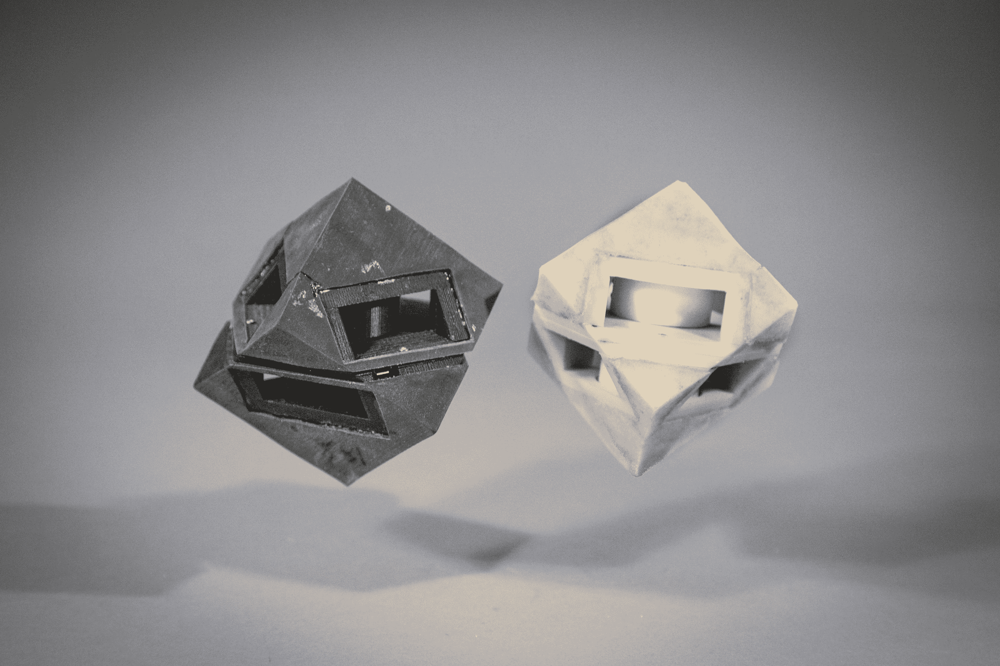

# 麻省理工学院新的 3D 打印减震材料制造弹性无人机 

> 原文：<https://web.archive.org/web/https://techcrunch.com/2016/10/03/mits-new-3d-printed-shock-absorbent-materials-make-for-resilient-drones/>

# 麻省理工学院的新型 3D 打印减震材料有助于制造弹性无人机

【YouTube https://www.youtube.com/watch?v=zrRs4GXxjVA&w=640&h=360]

不是摔倒，而是突然停止——撞击的效果对人和机器人敏感的电子部件有类似的负面影响。麻省理工学院计算机科学和人工智能实验室的一项新研究项目可以帮助减轻突然的物理冲击对人类和机器人的破坏性影响。

麻省理工学院 CSAIL 研究小组设计的新技术允许用户对包括塑料和橡胶在内的软材料制成的部件进行编程，以获得精确的刚度和弹性，根据最终产品的需求赋予其特定的反弹和能量转移质量。

这要归功于 3D 打印，它允许用户指定他们提供的精确尺寸、形状和冲击阻尼量——以前，用户通常不得不使用注射成型等技术来应对现成的减震部件大规模生产，这意味着你基本上必须从预设的选项菜单中进行选择。

鸣谢:杰森·多夫曼，麻省理工学院 CSAIL

通过 3D 打印，麻省理工学院的团队发现，实际上可以将具有不同机械性能的材料纳入他们的设计中，正好在需要改变基础材料吸收性能的地方。这也意味着你可以瞄准特定的部分，不仅保护敏感的设备，还可以通过给机器人更多可预测的运动来使其更容易控制——例如，他们建造的一个通过弹跳移动的立方体机器人显示了更精确的着陆模式，你可以看到有腿的跑步机器人的脚步也将受益于更准确地确定其四肢与地面的接触。

然而，这不是唯一的用例；麻省理工学院 CSAIL 的研究人员提出了送货无人机的可能应用，以使它们在与周围环境接触时更具弹性，甚至用于跑鞋和头盔等帮助人类的技术，这些技术在某些领域需要极度减震，但在其他领域则注重舒适。