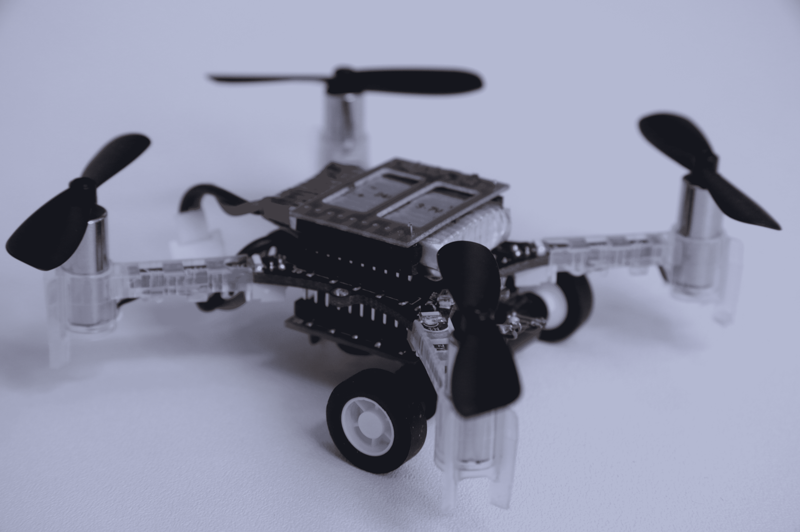

# 麻省理工学院的新型无人机在飞行和驾驶之间切换，实现最佳城市交通 

> 原文：<https://web.archive.org/web/https://techcrunch.com/2017/06/26/mits-new-drones-switch-between-flying-and-driving-for-optimal-urban-transport/>

# 麻省理工学院的新型无人机在飞行和驾驶之间切换，以实现最佳的城市交通

【YouTube https://www.youtube.com/watch?v=s-oFD5X-QtQ&w=680&h=383]

麻省理工学院的计算机科学和人工智能实验室开发了一种新的原型无人机，可以飞行和驾驶，并将确定使用哪种方法来优化电池寿命、速度和效率。这是一个自动城市交通有朝一日可能如何工作的预览，飞行汽车可以在公路和航空之间无缝切换，以相互协调的方式在密集的城市环境中导航。

麻省理工学院开发的系统在一个缩小的城市街区模型中运行，配有传统的道路、建筑和模拟绿地。该原型理论上可以与多达 80 辆汽车有效合作，导航着陆垫，街道，禁飞区和更多没有问题。

CSAIL 的研究人员创造了八架四轴飞行器无人机，它们也可以在地面上用轮子滑行，驾驶时最大行驶距离可达 252 米，或纯飞行 90 米。该团队指出，自然界中的许多动物会在方便和必要的时候在飞行和行走之间转换，包括鸟类和昆虫，并设计了他们的机器人来做同样的事情，通过协商这两种模式来最大限度地延长电池寿命。

鸣谢:亚历克斯·沃勒，麻省理工学院 CSAIL。

飞行汽车是研究人员和私营企业高度感兴趣的领域，因为他们试图找到改善我们在越来越密集的城市环境中出行的方法。然而，主要的限制之一仍然是电池寿命，因为纯飞行比驾驶需要更多的电力，而当前的电池技术不允许在不充电的情况下持续飞行很长时间。混合系统理论上可以缓解交通，同时最大限度地减少对电池技术改进的需求，最终有助于更快地使飞行汽车成为现实。

当谈到我们如何能够让飞行汽车在日常生活中真正有用时，这是我见过的最酷的想法之一。显然，对于一个完整的系统来说，从概念到现实还需要很长时间，但这是一个开始。