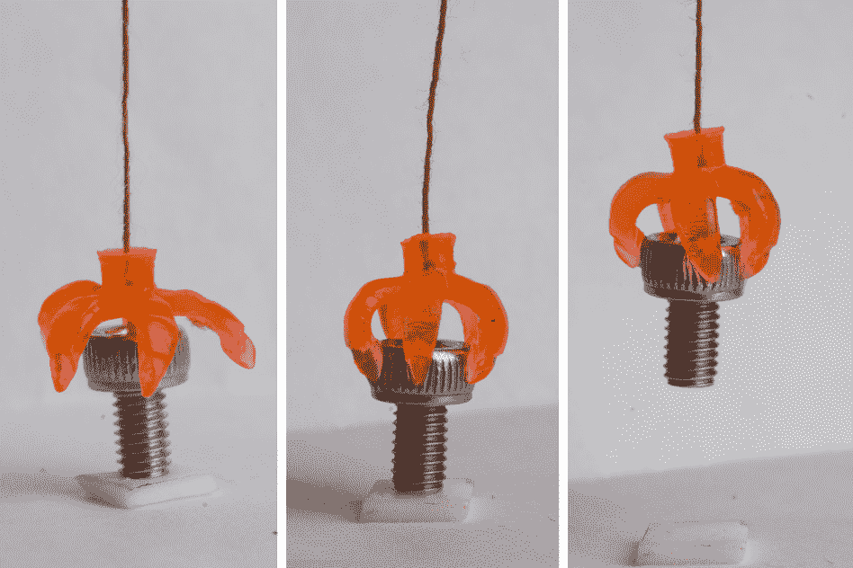
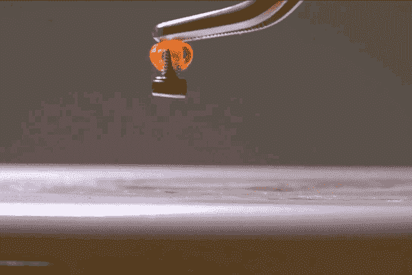

# 麻省理工学院的变形 3D 打印物体可以改善医药和太阳能技术

> 原文：<https://web.archive.org/web/https://techcrunch.com/2016/08/26/mits-shape-shifting-3d-printed-objects-could-improve-medicine-and-solar-power/>

# 麻省理工学院的变形 3D 打印物体可以改善医学和太阳能

 麻省理工学院和[新加坡科技与设计大学](https://web.archive.org/web/20221006194720/https://dmand.sutd.edu.sg/)合作创造了一种新的结构，这种结构可以[“记住”它的原始形状](https://web.archive.org/web/20221006194720/http://news.mit.edu/2016/3-d-printed-structures-remember-shapes-drug-delivery-solar-panel-0826)，即使在变形或弯曲变形后也能恢复到原来的状态。这在一些应用中可能非常有益，比如创造可以休眠的药物，直到它检测到体温的变化，例如发烧，或者建立一个驱动器来改变太阳能电池的角度，以便随着时间的推移更好地捕捉太阳光。

麻省理工学院和 SUTD 的联合研究团队是一个 3D 打印过程，实际上为该过程添加了第四维，因为结构可以随着时间的推移而改变。他们使用形状记忆聚合物作为基础材料，可以保持高温和低温状态。打印过程允许使用投影仪的光将所述高温状态打印到液体树脂上，麻省理工学院表示，这基本上是牙医 3D 打印牙齿或洞填充物的复制品时发生的事情。

麻省理工学院/SUTD 使用的过程和牙科行业使用的过程之间的主要区别是分辨率的不同——它用来聚焦打印过程中使用的光的透镜来自半导体行业，并且操作规模小得多，允许研究人员打印一根人类头发大小的结构。

把东西做得那么小是很重要的，因为你做得越小，材料恢复形状的速度就越快，这在速度上有很大优势。能够在这种规模下可靠地打印将有助于药物更快发挥作用，在感染的第一个迹象或例子出现时释放其活性成分。

在建筑材料方面仍然存在挑战，这些建筑材料可以在比目前可能的温度更低的温度下起反应。目前的范围刚好在人体范围之外，达到该范围将对创建定制药物输送机制非常有帮助。

为了展示这一过程的潜力，其中一个例子是上面 GIF 中的“夹子”,当周围的空气温度上升到 40 摄氏度或更高时，它会关闭它的爪子，抓住放在里面的任何物体。