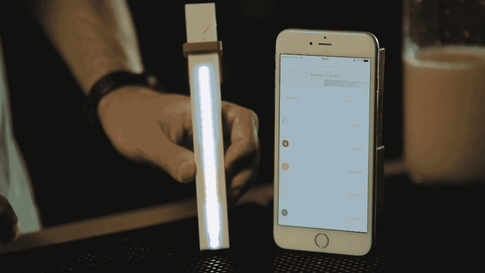

# MixStik 是一种不需要技巧就能调制出美味鸡尾酒的必不可少的调酒工具技术关键

> 原文：<https://web.archive.org/web/https://techcrunch.com/2015/08/20/mixstik-is-an-essential-mixology-tool-to-make-great-cocktails-with-no-skill/>

没有什么比夏天的甜鸡尾酒更好的了。但是，如果你的酒吧技能不符合标准，你的选择就相当有限。直到现在。见见 [MixStik](https://web.archive.org/web/20230129060155/http://mixstik.com/) ，这是一种连接在一起的小木棍，可以在你第一次尝试时帮你制作美味的鸡尾酒。

工作原理是这样的:首先，您需要打开 MixStik，并使用蓝牙将其与您的智能手机连接起来。在那之后，你可以去过夜了。您可以在手机上浏览并选择一种鸡尾酒，它会打开调音台上的指示灯。一旦棍子在你的摇动器或杯子里，你只需要按照手机和棍子上的说明去做。

例如，该应用程序会告诉你，你需要倒柠檬汁、伏特加、君度和蔓越橘汁来做一个大蛋糕。底部的两个指示灯将呈绿色，表示您需要倒柠檬汁来盖住摇动器中的这两个指示灯。然后，白色发光二极管指示您需要在摇壶中放多少伏特加，等等。

MixStik 采用全尺寸 USB 端口为电池充电。你可以把它像一把大 u 盘一样插入电脑的 USB 端口，或者你可以用你的手机充电器。

还有一些漂亮的功能。很容易为您的振动筛设置正确的参数。在设置屏幕中，您可以将标尺置于“标尺”模式，并使用发光二极管测量顶部和底部直径。对于每种鸡尾酒，您可以选择是要调一杯还是两杯。最后，您可以选择家里的酒瓶，看看自己能酿出什么样的鸡尾酒。

但最棒的是，它只需要 39 美元。考虑到一瓶酒的价格，如果您打算经常使用它，感觉并不太贵。我已经试过多次了，使用起来很有趣。任何人都可以调制鸡尾酒。如果你是一个有经验的酒吧招待，你可以学习新的食谱。

现在你可能还记得去年我报道过的另一个混搭设备——B4RM4N[智能摇动器](https://web.archive.org/web/20230129060155/https://www.kickstarter.com/projects/1614456084/b4rm4n-be-a-cocktail-hero)。不幸的是，针对 B4RM4N 的 Kickstarter 活动失败了，因为这款设备太贵了(一台摇动器需要 100 到 150 美元)。MixStik 是 B4RM4N 的第二个版本，后面有同一个团队。这是一款精简、简化、体积更小、价格更合理的设备，肯定会更成功。

MixStik 是一个伟大的创业 pivot 的完美例子，我迫不及待地想知道这个团队将筹集多少资金。Kickstarter 活动将于 9 月 29 日开始，正如你在视频中看到的，我有机会花了一个晚上的时间与两位创始人一起制作和饮用鸡尾酒。如果你想在 Kickstarter 活动开始时收到电子邮件，点击 play 并在该公司的网站上注册。

视频由蒂博·奥斯吉安拍摄&雨果·奥斯吉安，编辑史蒂夫·龙

