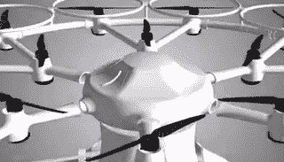
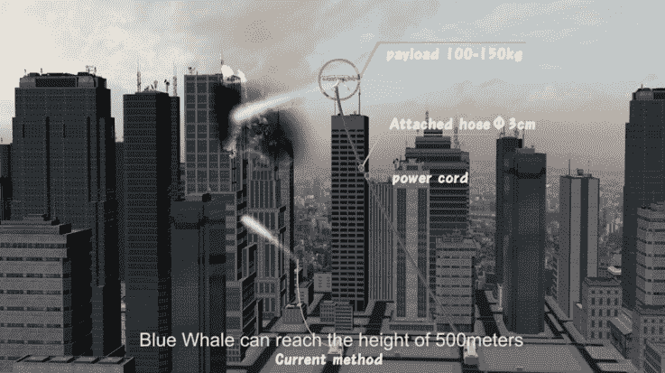
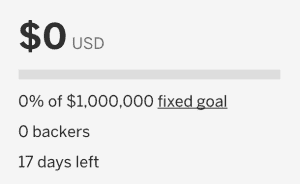
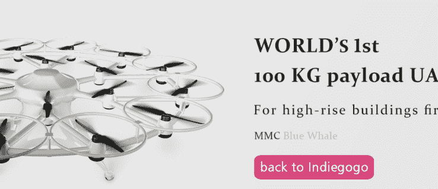
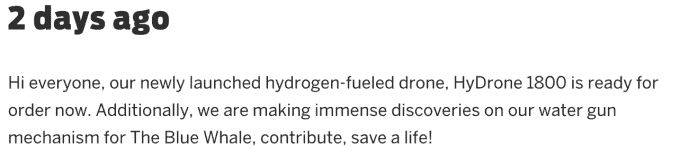
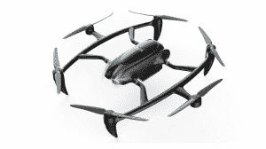

# 消防无人机提醒人们小心众筹活动

> 原文：<https://web.archive.org/web/https://techcrunch.com/2016/04/27/mmc-drones-indiegogo/>

我发现了很可能是有史以来最令人惊讶的众筹活动:为微型多翼飞机航空技术公司(MMC)的世界上第一架消防无人机进行的 [Indiegogo 活动](https://web.archive.org/web/20230327142106/https://www.indiegogo.com/projects/the-world-s-first-firefighting-drone--13#/)。作为无人机和众筹活动的爱好者，我兴奋得差点尿裤子——结果挖得更深一点，发现自己在恐惧中退缩。事实证明，这场活动是一次很好的锻炼，让你知道一点点基本的尽职调查应该如何建议你远离“支持”按钮，逃之夭夭。

蓝鲸有 18 个转子，Indiegogo 活动声称它可以将 220 磅重的东西带到 1500 多英尺的空中。

尤其是如果组织这场运动的人没有注意到一些非常基本的细节。比如物理定律。

## 让物理定律见鬼去吧

斯坦·科斯蒂克，消防无人机项目协调员

我第一次发现 MMC 是在我收到其 [HyDrone](https://web.archive.org/web/20230327142106/http://en.mmcuav.com/news_view.aspx?TypeId=4&Id=457&Fid=t2:4:2) 产品的新闻稿时；一架价值 7 万美元的氢动力无人机，旨在军事应用。有什么不喜欢的？

从那里，我发现 MMC 有一个众筹活动，旨在资助一个更雄心勃勃的项目:一架名为 [MMC 蓝鲸](https://web.archive.org/web/20230327142106/http://en.mmcuav.com/about_complex.aspx?FId=n1:1:1)的消防无人机。据 Indiegogo 视频中的产品协调员斯坦·科斯蒂克(Stan Kostic)称，这位空中救火英雄的“有效载荷可达 100 公斤”。这本身就有点令人困惑。他告诉我，他已经在 MMC 工作了 6 个多月，他的电子邮件签名显示他是海外营销总监，而他的 LinkedIn 根本没有显示 MMC。好奇。

在这一点上，警钟在左，右和中心响起，但我决定深入挖掘。这个项目是用这个视频进行营销的。我看了好几遍，当该公司解释它试图做什么时，我被视频的一部分卡住了:

突然，无人机的有效载荷是 100-150 公斤。好奇。

在这一点上，我做了一点数学计算，因为我发现有些事情不太合理。对于一根直径为 3 厘米的软管，仅软管中的水就重达 175 公斤——甚至超过了该公司视频中引用的调整后的有效载荷 150 公斤。但是，当然，我们在这里谈论的不仅仅是水:无人机还必须提起电源线和软管本身。很明显，我们在这个项目上遇到了问题。

最重要的是，这些都没有考虑到相当大的水压和火灾产生的湍流热空气会使无人机难以控制。说句题外话:这就是为什么大多数高层建筑都有[竖管](https://web.archive.org/web/20230327142106/https://en.wikipedia.org/wiki/Standpipe_(firefighting))和喷水灭火系统…

活动进行了一个月，还有两周多一点的时间……MCC 非常接近实现目标，他们几乎可以嗅到这一点。

我猜我不是唯一一个觉得这场运动很奇怪的人:Indiegogo 运动已经上线几周了，就像一个愚人节玩笑，一直在开，但还没有吸引到一个支持者。

同样值得注意的是，该活动只包括消防无人机的 3D 渲染图和[一堆与该项目无关的视频](https://web.archive.org/web/20230327142106/https://www.indiegogo.com/projects/the-world-s-first-firefighting-drone--13#/gallery)。3D 渲染的问题是你应该特别担心的事情:这种做法不久前在 Kickstarter 上被禁止，原因很好:没有一个工作原型，很难知道你在支持什么，或者一场运动兑现承诺的现实程度如何。

MMC 蓝鲸被列在该公司的网站上，并链接到 Indiegogo 活动。

该公司的众筹活动表明，这种 18 旋翼消防无人机的零售价高达 88，000 美元，交付时间为 3-6 个月。我和其他人一样喜欢一个雄心勃勃的截止日期，但除非该公司自 Indiegogo 活动开始以来取得了巨大的进展，否则满足生产计划的可能性似乎很小。

我联系了 MMC 来质疑我的计算。我没有得到一个真正的答案，但科斯蒂克确实联系了我，并告诉我，尽管消防无人机的概念是真实的，“众筹更多的是一个概念，我用来培训员工如何工作。”这似乎没有多大意义，因为[他们仍在发布更新，试图让人们支持活动](https://web.archive.org/web/20230327142106/https://www.indiegogo.com/projects/the-world-s-first-firefighting-drone--13#/updates)，并在几天前在 Twitter 上宣传该活动:

是啊。挺好奇的。

## 那么，关于那个氢动力无人机？

由于 Indiegogo 活动基本上是一笔勾销，我决定更深入地挖掘该公司的另一款产品，奇怪的是，它也在作为众筹活动的一部分进行推广:

4 月 18 日，MMC 的 Indiegogo 活动发布了一个更新。

海龙是一种看起来很有趣的动物。

看着氢无人机，它看起来像一个绝对的野兽。该公司宣称其标价为 70，000 美元，可以在空中停留 4 小时，航程为 60 英里。

但是，当然，考虑到它的众筹活动看起来有多糟糕，我也对这种说法持保留态度。我要求看一些无人机的视频——据说是“准备订购”——在行动中。

为什么这么好奇？嗯，就像生活中的许多其他事情一样，电池的耐力是限制你保持乐趣的最大因素之一，对于无人机来说，20-30 分钟似乎是可行的。而且，该死的，我*真的*希望氢动力无人机成为一个东西。除此之外…有氢的飞行装置？我看得出你在想:[*可能会出什么问题*？](https://web.archive.org/web/20230327142106/https://en.wikipedia.org/wiki/Hindenburg_disaster#Disaster)。

想象一下，你是一家销售无人机的公司，一次可以在空中停留四个小时。你不必是营销天才，也能想出一些令人信服的方式来讲述这个故事，但令我惊讶的是，MMC 网站上没有一个无人机运行的视频。

当我向该公司询问原因时，我也得到了一个相当虚假的回复。

“关于无人机的实际飞行，我们与当地警方有一些困难，”科斯蒂克说，并没有真正帮助他证明这是一种合法产品。他向我解释说，它的无人机在“商业发射”的同一天被警方没收了。

“官方没收的原因是车辆的大小，”科斯蒂克说。“似乎当地警方认为这是一种责任，”他干巴巴地说，随后透露警方毫不客气地没收了它，没有进一步解释。他说，这架无人机最终被归还，但他说，“警方禁用了它，因为他们不想让我们驾驶它，”然后猜测，中国军队最近的命令可能是这架无人机被捕获和没收的原因。

那好吧。

## 警示故事

我只想说，我的任务是验证这两架无人机是否真的存在和工作，但结果并不确定。我看到了一个拍照手机视频，其中 HyDrone 被允许飞行，但从视频中无法看出它是否真的由氢驱动，或者只是一个电池原型。

所有这些并不是说 MMC 不光明磊落，但我认为可以肯定地说，这个活动是对众筹活动的有益提醒:如果它看起来像是真的…继续做尽职调查，直到你认为值得冒险。