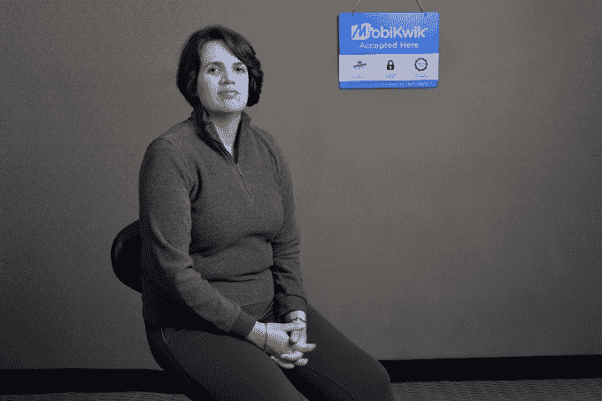

# 印度的 MobiKwik 正在以 1B 的估值筹集新的资金，以对抗支付竞争对手 Paytm 

> 原文：<https://web.archive.org/web/https://techcrunch.com/2017/06/15/mobikwik-raising-100-150-million-at-1-billion-valuation/>

自去年去货币化以来，阿里巴巴和软银的高调投资推动了令人印象深刻的增长故事，你可能会认为 Paytm 已经垄断了印度的支付市场。但至少有一家公司会同意在这一点上有所不同。

印度仅次于 Paytm 的移动支付初创公司 MobiKwik 自信地认为，它可以利用竞争对手对电子商务的关注以及最近进入银行业的机会，实现公平竞争。为了加强自己的实力，专注于支付的 MobiKwik 正在从投资者那里筹集迄今为止最大一笔资金。

联合创始人乌帕萨纳·多久向 TechCrunch 证实，该公司正在谈判融资 1 亿至 1.5 亿美元，这一轮融资将使公司估值超过 10 亿美元，从而使其进入科技独角兽的精英俱乐部。多久拒绝透露她的公司正在洽谈的投资者的名字，只是说他们包括一个主要的战略投资者和一些金融机构。她预计这轮谈判将在未来几个月内结束。该计划是将高达 4500 万美元的资金投入到不断增长的用户和商户基础上，并将其目前的 6 个办事处扩大到 20 多个。

随着阿里巴巴向 Paytm 投入资金，并已持有 Snapdeal 的股份，其主要竞争对手腾讯(腾讯[最近投资了电子商务巨头 Flipkart](https://web.archive.org/web/20230327132834/https://techcrunch.com/2017/04/10/flipkart-1-4-billion/) )将在印度的支付领域分一杯羹。当被问及腾讯是否是 MobiKwik 正在谈判的投资者之一时，多久拒绝以任何方式发表评论。

抛开投资者不谈，这个估值对 MobiKwik 和印度的初创企业本身来说都是值得关注的。这轮融资可能会使 MobiKwik 迄今为止的融资翻一番，目前的融资额刚刚超过 1.25 亿美元。然而，在这场战斗中，它仍将处于劣势。继[获得软银](https://web.archive.org/web/20230327132834/https://www.bloomberg.com/news/articles/2017-05-18/paytm-raises-1-4-billion-from-softbank-to-expand-user-base)14 亿美元的巨额投资和[获得阿里巴巴](https://web.archive.org/web/20230327132834/http://www.reuters.com/article/us-paytm-alibaba-investment-idUSKBN16A12I)领投的 2 亿美元融资后，Paytm 已经成为印度市值第二高的私营科技公司，仅次于 Flipkart，估值为 70 亿美元。

Paytm 及其母公司 One97 已经从投资者那里筹集了超过 25 亿美元。这推动了其业务进入电子商务领域——阿里巴巴在这一领域的影响力很大——进一步推进了其移动支付战略，并通过一个尚未启动的项目将业务扩展到数字银行业务，该项目从中国和阿里巴巴大量借款。

> MobiKwik 的联合创始人乌帕萨纳多久

理论上，其业务的统计数据令人印象深刻。去年 11 月，₹500 和₹1,000 的纸币(占货币总量的 85%)退出流通，这给了 Paytm 一个巨大的推动。紧接着，流量增长了 435%，下载量增长了 200%，总交易量增长了 250%。该公司以 1 . 77 亿移动钱包用户结束了这一年——高于一年前的 1 . 22 亿——并在二月底突破了 2 亿大关。

不过，多久对其中一些数字有异议。她指出，根据谷歌 Play 商店的说法，Paytm 在安卓——印度占压倒性优势的移动操作系统——T2 上的下载量尚未超过 1 亿次，她声称这让她“很难想象”它拥有它所声称的近 2.5 亿注册用户。

但除了书面索赔，她认为她的公司可以利用进军其他垂直行业的机会，让 Paytm“忙得不可开交”

“它在推进银行和电子商务服务的同时，却在拒绝支付，”她在接受 TechCrunch 采访时表示。“必须做出一些让步，不可能在 10 个不同的垂直领域做到公平。”

作为她的论点的一个例子，她引用了 Ola Money 的例子，这是一项支付服务，[印度打车巨头 Ola 在 2015 年末分拆成一项独立业务](https://web.archive.org/web/20230327132834/https://techcrunch.com/2015/11/12/ola-ubers-big-rival-in-india-gives-its-payment-service-a-standalone-app/)。

“我没有看到很多地方接受 Ola 资金，”她说，并补充说，电子商务公司也必须优先考虑他们的重点。“无论是亚马逊，甚至是 Flipkart，他们的明确重点将是他们平台上的支付。在印度，很多人都尝试过，认为付款是最简单的事情。”

MobiKwik 呢？

该公司还声称已经赶上了去货币化的浪潮。多久表示，其注册用户群从 2500 万跃升至 5500 万，而其商户群从去货币化前的 25 万增至 150 万，下载量增长了 5 倍。MobiKwik 的宏伟目标是保持这一增长，并在下一年达到 1 亿用户和 1000 万商家。

“我们的支付网关业务经历了疯狂的增长——去货币化对我们来说非常棒，所有业务数量至少增长了 3 倍，”多久说。“就数量而言，我们无法想象我们会在哪里。现在，我们的净收入是盈利的——如果除去商家收购成本——并且正在走向盈利之路。”

MobiKwik 的联合创始人说，实现盈利的最后动力将来自今年晚些时候推出的金融服务。她说，这些服务将与 MobiKwik 现有的业务直接相关，例如贷款、保险和投资，以及合作伙伴。一个这样的例子是与国有电信运营商 BSNL 宣布的一项协议，通过一个联合品牌的钱包应用程序为其 9500 万客户提供基本的金融服务。

目前，该服务每年处理 20 亿美元的 GMV——这是交易的总价值——但它的目标是在今年年底达到 100 亿美元。

多久对 2017 年以后的未来持乐观态度，指出数字支付目前仅占印度消费者每年约 1.5 万亿美元支出的 15%。她说，这一数字在未来两年内可能会达到 60-70 %,显然她决心确保 Paytm 不是这一繁荣的唯一受益者。