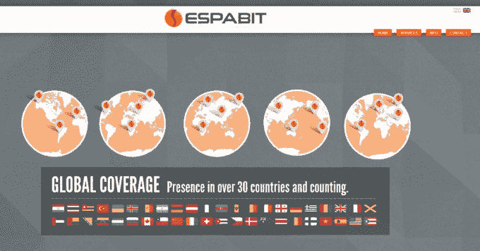

# 移动广告公司发现提供伪装成 Google Play 应用的恶意软件 

> 原文：<https://web.archive.org/web/https://techcrunch.com/2014/12/12/mobile-ad-firms-spotted-serving-up-malware-posing-as-google-play-apps/>

恶意软件的创造者在历史上找到了创造性的方法来通过 PC 网络分发他们的恶意软件，现在他们已经将注意力转向了移动设备。例如，在 2013 年，有几起引人注目的案件，安全公司如[帕洛阿尔托网络](https://web.archive.org/web/20221207150659/http://researchcenter.paloaltonetworks.com/2013/08/mobile-devices-new-malware-and-new-vectors/)和 [Lookout](https://web.archive.org/web/20221207150659/https://blog.lookout.com/blog/2013/04/19/the-bearer-of-badnews-malware-google-play/) 发现恶意软件是如何通过流氓移动广告网络传播到 Android 设备的。今天，[安全公司 Avast 发现](https://web.archive.org/web/20221207150659/https://blog.avast.com/2014/12/12/mobile-advertising-firms-spread-malware-by-posing-as-official-google-play-apps/)另一批广告公司向移动设备分发恶意软件——但这一次，广告将用户引向伪装成“真正的”Google Play 应用程序的恶意软件。

这三家广告公司的服务器每天总共有大约 185，000 次浏览，与 Lookout 发现的“BadNews”恶意软件相比，这可能是一个较小规模的恶意软件分发工作，该恶意软件的下载量[在 200 万到 900 万次](https://web.archive.org/web/20221207150659/https://blog.lookout.com/blog/2013/04/19/the-bearer-of-badnews-malware-google-play/)之间(假设 Lookout 跟踪的恶意软件应用下载量在该范围的高端)。)然而，它可能比帕洛阿尔托发现的 Dplug 恶意软件更大。去年夏天，该公司在一篇博客文章中详细介绍了该恶意软件的方法[,这篇文章被许多科技媒体转载，当时该公司只收集了七份样本](https://web.archive.org/web/20221207150659/http://researchcenter.paloaltonetworks.com/2013/08/mobile-devices-new-malware-and-new-vectors/),其中大部分在亚洲。

每天 185，000 的浏览量在总体情况下并不算多，当然，每个收到恶意广告的人都不会成为受害者。尽管如此，Avast 跟踪的访问量最大的恶意子域在上个季度有大约 400，000 次浏览，很可能大量的访问者都受到了恶意软件的影响。因此，这可能是一个相当大的分发量——对恶意软件作者来说是一个不错的发薪日，即使它与世界上的 Android 用户数量相比很小。

托管和分发恶意软件的三家公司伪装成合法的移动广告网络，Espabit.com(西班牙)、Playmob.es(伦敦)和 MobileCashOut.com(阿姆斯特丹)。其中，Espabit 似乎是最大的，每天有 150，000 次浏览。它也是在过去几个月里吸引了 40 万次浏览的子域名。

Avast 研究员 Filip Chytry 解释说，应用程序用户通过应用程序中显示的广告被引导到色情网站。这些网站随后会显示恶意软件应用程序的下载。

有趣的是，这些应用程序实际上并不托管在 Google Play 上，但用户看到的页面上的所有内容都让他们看起来像是托管在 Google Play 上。该网站看起来就像一个 Google Play 应用程序下载页面，使用相同的配色方案、导航、布局等。可以点击绿色的“下载”按钮，在用户的设备上安装流氓应用程序。该应用实际上不在 Google Play 上的唯一提示来自地址栏中显示的域。例如，它可能不是“play.google.com/…”，而是“apps.espabit.com/…”

大多数应用程序链接都指向色情或虚假应用程序，但因为它们实际上并不在 Google Play 上托管，恶意软件作者设计了看起来像官方的页面，解释如何配置你的手机以允许安装它们。

用户被告知如何进入他们的设置，以便做出改变，允许他们安装来自“未知来源”的应用程序——这意味着任何不是 Google Play 的应用程序。

虽然你可能认为保护自己就像不要设置那样简单，但许多 Android 用户已经关闭了这个功能，以便安装合法的应用程序——比如亚马逊的应用程序。

例如，就在昨天，有消息称[谷歌已经从 Google Play 的搜索结果中删除了亚马逊的主要购物应用，此前亚马逊做出了一些改变，在其应用](https://web.archive.org/web/20221207150659/https://beta.techcrunch.com/2014/12/11/google-removes-amazons-app-listing-from-google-play-search-following-addition-of-appstore-instant-video-integrations/?ncid=rss)中引入了应用商店，并与即时视频服务进行了其他整合。谷歌并不在乎竞争，而是强迫亚马逊向 Google Play 提交一个没有应用商店部分的新应用。但亚马逊早期的应用程序，以及其独立的亚马逊应用商店应用程序，仍然可以在 Google Play 之外下载——用户只需进入他们的设置，允许来自“未知来源”的应用程序啊哦。

鉴于许多 Android 用户将选择禁用这一安全设置，以便从他们的 Android 手机或平板电脑上访问更好版本的亚马逊应用程序或浏览亚马逊应用商店，这使他们有可能在未来遇到类似的恶意软件，自己也成为受害者。他们甚至不需要在手机上配置任何东西，只需落入社交工程的圈套。

Avast 遇到的应用程序通过发送高级短信为创作者创造收入，同时还窃取用户的个人信息。Avast 指出，每条优质短信只需 0.25 美元，每周发送三次。被盗的金额故意很小——人们不太可能注意到他们当月的电话账单是否多了 3 美元。然而，在这一年中，每个受害者的损失是 36 美元。将这个数字乘以受害者人数——想想过去一个季度仅一款应用就有 40 万潜在受害者——你就会看到数百万美元的收入。

包括美国、英国和巴西在内的许多移动运营商都屏蔽了付费短信，因此这里的用户不太担心这个问题。但是 Android 的全球足迹是巨大的，所以即使受害者代表了 Android 总安装基数中的一小部分，当这样的事情发生时，仍然可能有相当多的人受到影响。