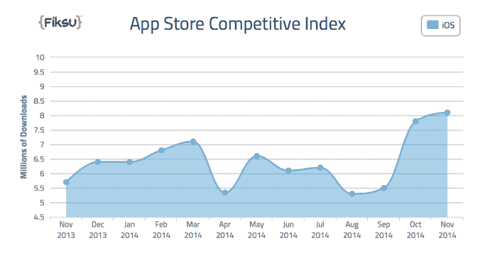
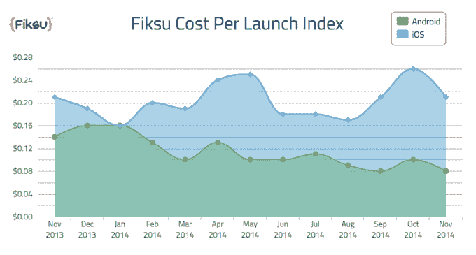

# 11 月移动应用下载量创历史新高

> 原文：<https://web.archive.org/web/https://techcrunch.com/2014/12/30/mobile-app-download-volumes-hit-record-high-in-november/>

根据移动营销人员今天早上发布的一份新报告，在美国感恩节假期期间，由于工作和其他责任的影响，消费者下载应用程序的数量创下纪录。该公司表示，其“应用商店竞争指数”(App Store Competitive Index)跟踪了前 200 名免费 iOS 应用的平均日下载量，上个月达到 810 万次下载，特别是受到新 iPhone 购买和感恩节假期活动增加的推动。与去年相比，11 月份应用下载量增长了 42%。

Fiksu 首席执行官 Micah Adler 表示，他预计这一趋势将持续到 12 月份的假期，甚至延续到 1 月份。

11 月下载量的增加也有助于降低获取用户所需的成本——这是任何移动应用业务增长的关键部分。11 月份，每忠实用户成本指数下降 27%，至 1.58 美元，同比下降 12%，因为新用户正忙于加载最近购买的 iPhones，其中包括最喜欢和推荐的应用程序，特别是在假期。

因为这些下载被认为是“有机的”——意味着用户是自己下载应用程序，而不是因为广告或其他营销活动——所以与这些营销活动相关的成本下降了。但它们肯定会在本月和下个月(圣诞节假期后)卷土重来，因为移动公司传统上为成为新移动设备上首批安装的应用而进行更激烈的竞争，这些应用通常作为节日礼物收到。

此外，获得忠诚用户的成本下降，因为从整体趋势来看，移动设备上的忠诚用户似乎在增长。

Fiksu 的数据支持了分析公司 Localytics 的早期发现，该公司今年早些时候表示，用户在移动应用上花费的时间总体上呈上升趋势。今年 9 月，该公司发现，总体而言，人们越来越喜欢应用程序，使用它们的时间比去年增长了 21%。Localytics 说，事实上，人们花在应用程序上的时间太多了，现在已经超过了花在桌面网站上的时间。

更频繁的应用程序启动也会增加应用程序的使用时间。Fiksu 表示，它认为这一趋势将持续下去。应用内时间增加了 21%，打开应用的频率从一年前的 9.4 次增加到每月 11.5 次。

最近，我们在 Snapchat 等热门应用上看到了这种趋势，尽管出现了糟糕的公关，如被称为“Snappening”的黑客，用户的私人照片被公开曝光，但[继续看到增长，包括使用和用户参与](https://web.archive.org/web/20230308171446/https://techcrunch.com/2014/12/23/the-snappening-had-no-impact-on-snapchat-growth-usage-or-engagement/?ncid=rss&utm_source=feedburner&utm_medium=feed&utm_campaign=sfgplus&%3Fncid=sfgplus)。

最后，在 11 月，与推动移动用户参与相关的成本——或 Fiksu 的每次启动成本指数——也有所下降，在 iOS 上降至 0.21 美元，较 10 月下降 20%，在 Android 上下降 16%。

更多信息请点击查看 Fiksu 的完整报告[。](https://web.archive.org/web/20230308171446/https://www.fiksu.com/resources/fiksu-indexes#analysis)