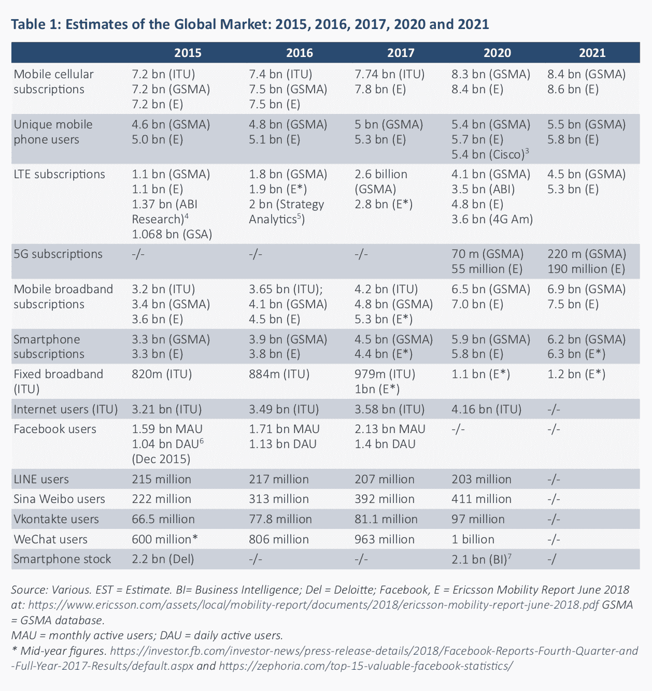
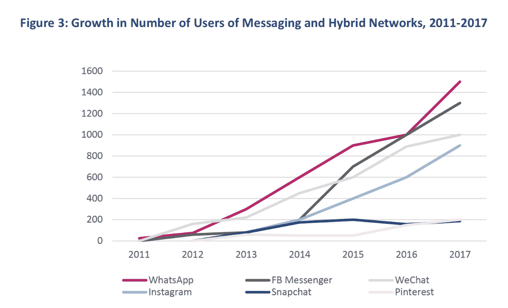

# ITU TechCrunch 表示，到 2018 年底，移动宽带用户将达到 44 亿

> 原文：<https://web.archive.org/web/https://techcrunch.com/2018/09/11/mobile-broadband-users-will-hit-4-4b-by-the-end-of-2018-says-itu/>

由于智能手机和无线网络的推动以及降低最不发达市场服务成本的努力，全球能够上网和不能上网的人之间的差距继续缩小。

根据国际电信联盟今天发布的一份新报告，到今年年底，全球将有 44 亿移动宽带用户，比三年前最后一次测量数据[增加了 11 亿。](https://web.archive.org/web/20221208073239/https://techcrunch.com/2015/11/30/itu-3-2b-people-now-online-globally-mobile-broadband-overtakes-home-internet-use/)

以下是移动和固定宽带使用在过去三年中的发展概况，以及未来三年的发展前景:

在这些数字背后，有一些有趣的趋势正在发生。

虽然固定宽带服务确实在持续增长——我们现在已经接近 10 亿固定宽带用户——但就全球互联网接入而言，移动无疑是游戏的名字。

现在有不少于 25 个国家的移动宽带用户渗透率(每 100 名居民的数量)超过 100%——这意味着平均而言，人们拥有不止一部设备，或者更有可能拥有不止一部 SIM 卡——因为国际电联指出，从 2015 年到今天，移动电话存量实际上*减少了 1 亿部*至 21 亿部。事实上，在一些国家，多 SIM 卡使用案例已经真正扎根。在中国澳门，每 100 人中有不到 322 个移动宽带用户。

与此同时，冰岛已经取代韩国成为全球互联网使用率最高的国家，包括固定电话和移动电话。国际电联称，其 98.2%的人口上网，科威特以 98%的比例位居第二。

不变的一点是，将偏远地区的人们联系起来仍然是一个挑战。虽然现在世界上几乎有一半的人口使用互联网，但大多数都在城市和其他人口密集的地区。这意味着，尽管部署服务的成本一直在下降，但建设覆盖未来 15 亿人的基础设施将花费 4500 亿美元。国际电联表示，通常情况下，更成熟的经济体在连接方面的投资占 GDP 的比例高于发展中国家，通常超过 3%，而约为 1%。

这是一个挑战，但也是一个机遇:我们也看到[公司和国家](https://web.archive.org/web/20221208073239/https://www.ft.com/content/ff7941a0-b02d-11e8-99ca-68cf89602132)之间为了在发展中市场的进程中发挥主导作用而展开的激烈竞争。(有趣的是，我的印象是，中国目前处于强势地位，为市政当局提供融资，帮助它们在非洲国家赢得业务。)

国际电联还表示，在计算不同技术对经济的影响时，它首次将人工智能作为一个新元素加入，此外还有五项现有的技术发展:宽带、数据中心、云、大数据和物联网。“人工智能是推动经济和工业活动范式转变的下一个主要通用技术，”报告作者指出。“人工智能的影响正在渗透到生活的方方面面。”

通信方面的另一大力量仍然是高端的消息服务。这些继续推动着采用，也正在取代电信公司提供的传统通信服务。脸书是 Messenger、Instagram 和 WhatsApp 的所有者，在全球四大即时通讯服务中占据了三个席位，微信位列第二。

国际电联报告中的另一个值得注意的统计数据是性别差距的状况，这一差距实际上正在扩大。就使用数字服务而言，2013 年为 11%，2016 年为 11.6%。报告称，女性使用互联网的可能性平均比男性低 26%。它没有提供 2018 年的数字，鉴于我们已经看到的所有改善性别平等的努力，看看这是如何发展的将是有趣的。