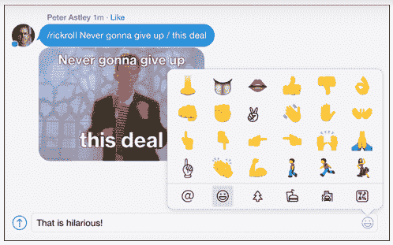

# 移动第一的文字处理应用 Quip 增加了聊天室，让它更像 Slack 

> 原文：<https://web.archive.org/web/https://techcrunch.com/2015/04/21/mobile-first-word-processing-app-quip-adds-chat-rooms-making-it-more-like-slack/>

像 Slack、Hipchat、Yammer 和 Asana 这样的产品已经慢慢地打破了企业通信的世界，为员工提供了新的、更容易使用的、坦率地说更有趣的平台来相互交谈并一起处理文档。

现在，另一家创业公司也想参与进来。前脸书首席技术官布雷特·泰勒(Bret Taylor)联合创建的首个移动“文字处理器”应用程序 Quip 让人们可以彼此创建和协作文档，该应用程序在推进社交功能方面又向前迈进了一步。它正在增加聊天室，这是人们在应用程序中相互交流的一种新方式。

聊天室就像它们听起来的那样:一个单独的信息传递渠道，用户仍然可以将信息链接到 Quip 文档以及许多其他服务，还有表情符号、gif 和自定义 memes。

你会问，什么是自定义模因？

添加聊天室是该应用程序更大的重新设计的一部分，该应用程序今天也将推出，具有其他几个新功能。首先，该应用程序现在通过算法对你的文档和对话进行排序，让你最活跃的文档和对话位于顶部。(在我看来，这是一个非常受脸书影响的特征。)

而且，它还增加了一些东西，如果你对我们这个[过度通知](https://web.archive.org/web/20230204224419/https://twitter.com/ryanlawler/status/588594491776307203)的时代感到厌倦，这可能会让你松一口气:用户现在可以决定他们希望收到的消息、文档编辑、注释、直接回复等通知。

泰勒告诉我，Quip [于 2013 年首次开业](https://web.archive.org/web/20230204224419/https://techcrunch.com/2013/07/30/quip-mobile-word-processor/)，现在有超过 10，000 家企业和“数百万个人”使用它的服务。

这并不是该公司第一次涉足聊天服务——用泰勒的话来说，它一直有一种方法让用户除了文档之外还能与他人交流，“而不用忍受来回发送电子邮件附件的过程”。除此之外，去年[还增加了一个“喜欢”按钮](https://web.archive.org/web/20230204224419/https://techcrunch.com/2014/03/20/quip-the-word-processing-app-from-ex-fb-cto-bret-taylor-gets-more-social-with-like-button-comments-and-page-themes/)(同样是向脸书致敬，这也是 Quip 的客户之一)。

但值得注意的是，增加独立的聊天室使 Quip 成为一个更加社会化的工具，Taylor 说，“团队可以创建不依附于文档的持续讨论。”

与 Slack 不同，聊天室中的对话可以通过整合 Twitter、Zendesk、Stripe、GitHub 和 JIRA 等第三方服务的通知来定制，以及天气或公共交通通知等其他更新，它们支持 gif 和表情符号等其他功能，它们仍然可以直接链接到 Quip 文档。

“虽然你以前可以在 Quip 中进行对话，但这个功能使团队能够真正使 Quip 成为一个交流中心，我们认为与文档的深度集成是独特的，非常有价值的，”Taylor 说。

Quip 增强应用程序的对话功能可能还有另一个原因:竞争。

泰勒不愿评论 Quip 的用户中有多少人已经将这项服务与 Slack 或其他合作平台整合在一起。(值得注意的是，Slack 目前没有提供将 Quip 直接集成到 Slack 的功能，而 Quip [提供了一种通过 Zapier 将 Slack 消息集成到 Quip](https://web.archive.org/web/20230204224419/https://quip.com/blog/integrations) 的方法。)

他也不会在 Quip 上说任何关于订婚的事情。“我们测量一些稍微不寻常的东西，比如每个团队中‘文档编辑’的数量，”他说，“但是我们现在不会公开发布这些数据。”

但是考虑到粘性信息在其他业务中的表现——Slack、WhatsApp、Messenger 和许多其他公司都是重要的例子——当 Quip 继续发展时，看到它增强这一功能也就不足为奇了。

根据 Taylor 的说法，这也只是让文档创建的核心功能更有用的问题。

“Quip chat 的价值在于它与您团队的文档和电子表格深度集成。他说:“你可以开始谈论一个设计，然后和你的团队一起点击一个按钮，开始一个设计文档。“沟通一直是 Quip 体验的基石，这款产品代表了我们产品战略的自然演变。我们希望 Quip 成为您所有最重要的对话和内容的中心。

目前，聊天室是免费使用的，但泰勒说，计划将限制免费用户的可搜索信息档案。泰勒表示，其他“有趣”的功能“在我们的测试中非常受欢迎”，如自定义迷因和斜杠命令，将保持免费。

如果你认为这种不紧不慢的方法是唯一的出路，这里有一个反驳:到目前为止，Quip 只从 Benchmark 的彼得·芬顿、尤里·米尔纳、马克·贝尼奥夫和其他天使投资人那里筹集了一轮资金[，1500 万美元](https://web.archive.org/web/20230204224419/http://allthingsd.com/20130730/with-15m-from-benchmark-former-facebook-cto-bret-taylors-quip-aims-to-take-productivity-mobile/)。“我们现在不需要钱，也不积极寻求新的一轮，”泰勒说。