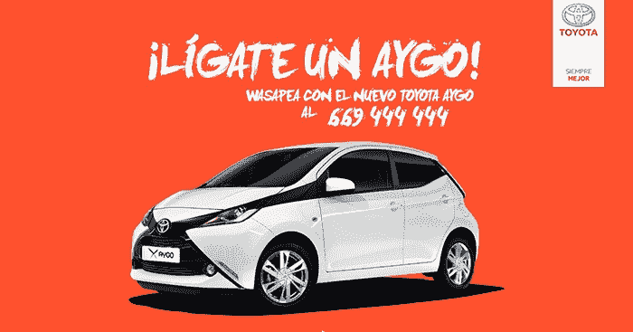
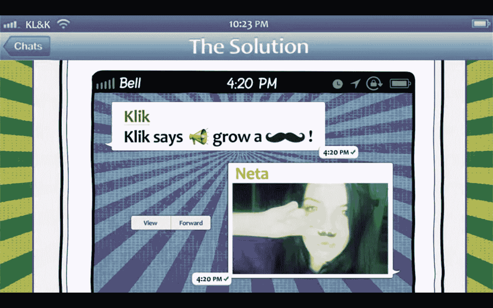
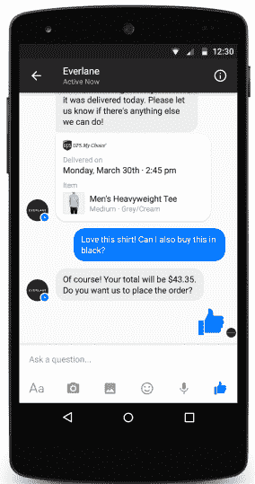
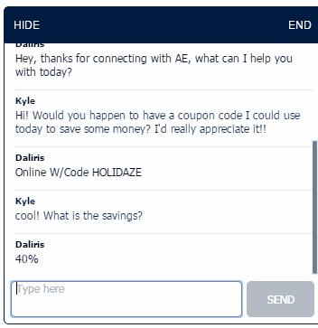
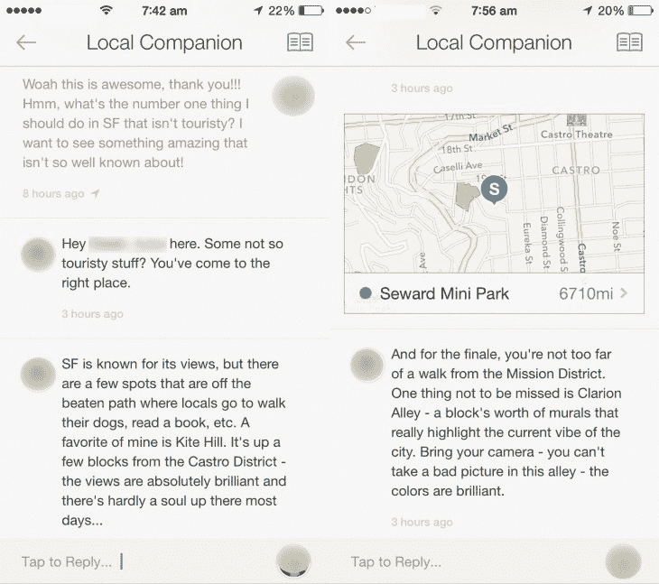

# 面向营销人员的移动信息 101 

> 原文：<https://web.archive.org/web/https://techcrunch.com/2015/10/27/mobile-messaging-for-marketers-101/>

哈里森·施撰稿人

哈里森·施是

[Frankly](https://web.archive.org/web/20221208142103/http://franklyinc.com/)

.

More posts by this contributor

如果你是一名消费品牌营销人员，你无疑会考虑开展营销活动或在移动通讯应用上展示自己。

毕竟，每个消费者都越来越多地使用手机短信作为他们进入手机的[门户](https://web.archive.org/web/20221208142103/https://beta.techcrunch.com/gallery/best-of-meeker/slide/10/)。它有粘性，适合重复会话，拥有其他应用平均最高的[保持率和参与度](https://web.archive.org/web/20221208142103/http://yahoodevelopers.tumblr.com/post/114492418503/messaging-apps-the-new-face-of-retail-banking)。

因此，如果你是一个重视社区和品牌忠诚度的品牌，那就加入这个信息游戏吧。我发现了两种使用手机短信作为营销工具的方法。

首先是在 WhatsApp、微信和 Snapchat 等纯移动通讯应用上进行营销。根据玛丽·米克尔的数据，全球最常用的应用程序中，纯即时通讯软件占了十分之六。

第二种通过移动信息接触受众的方式是通过内部聊天，即品牌拥有自己的移动应用程序并集成信息功能。粉丝之间的对话，以及公司和客户之间的对话，都发生在“自有财产”上。

请记住，与社交媒体营销相比，这还处于相对早期的阶段，所以我们仍在评估中，我们很想知道随着品牌变得更有创意以及移动追踪的改善，哪些方法是最有效的。

## 纯粹的 Messenger 应用程序:好的和坏的

像社交媒体一样，纯粹的信使应用拥有巨大的——几乎是全球性的——影响力。

WhatsApp 号称拥有 7 亿用户，在欧洲和拉丁美洲部分地区的渗透率超过 80%。KakaoTalk 拥有朝鲜 97%的领土。日本的这一比例为 50-60%。微信在中国有 5 亿用户。Snapchat 拥有 1 亿*日活跃用户*。

对于那些希望在非正式、亲密的环境中与顾客直接联系的品牌来说，这是一个大规模实现这一目标的好方法。

但是它也有明显的缺点。

品牌受到纯即时通讯应用的支配，它们提供的功能和工具将长期吸引并留住消费者——就像品牌[依赖脸书留住用户的能力](https://web.archive.org/web/20221208142103/https://beta.techcrunch.com/2015/07/30/the-argument-for-investing-in-true-fan-engagement/)。

纯玩法也会限制营销工具的使用。例如，WhatsApp 的广播列表功能将每个广播列表限制为 256 个用户，当一个品牌想要大量接触用户时，会造成额外的开销。

离开一个纯粹的信使可能比你想象的更难。当一个品牌花时间在一个平台上建立受众，然后发现另一个纯粹的信使有更好的营销功能，他们必须重新开始才能转换。

最后，伟大的活动是被*跟踪的*活动，而纯粹的信使提供的分析非常有限。就像在社交媒体网站上一样，你通常只能看到虚荣心指标，比如“浏览量”

## 内部聊天:移动信息营销的最新方式

内部聊天是指在品牌的移动应用程序中添加消息功能。该品牌邀请其观众下载自己的应用程序并在其上聊天，而不是在 WhatsApp 这样的第三方应用程序上。

与纯粹的信使营销相比，这种“拥有的”聊天作为一种营销工具相对较新，当然与社交媒体营销相比也是如此。

一些领先品牌已经在其移动应用程序中引入了聊天功能，我们开始了解用户的反应以及品牌如何将信息融入营销和销售工作。

有趣的是，你可以将手机短信不仅仅作为一种促销工具:你可以增加和改变你品牌的产品或服务的性质。你可以让你的核心服务更具接触性，你可以用聊天作为伴侣来改善你的店内体验，你可以让其他同行和粉丝成为体验的一部分——等等。

与粉丝建立长期关系的潜力也更大。用户将应用程序下载到他们的手机上，这是一项高投入的活动。活动结束后，你的关系并没有结束，推送通知让你一次又一次地吸引用户。

更好的是，他们的参与甚至可以通过与*其他*用户的联系和聊天来维持，而不仅仅是你。内部聊天导致社区建设；他们不仅和你联系，超级粉丝还可以和其他超级粉丝联系。

一旦你的应用程序上有了派对，你就可以更轻松、更可控地开展营销活动。这样可以更好地瞄准目标。内部聊天还可以更好地洞察关键用户的行为、偏好、兴趣和情绪。

## 品牌如何利用手机短信进行营销

以下是一些品牌如何利用纯游戏平台和内部聊天来吸引用户的例子。

**WhatsApp:丰田**

宝洁、赫尔曼蛋黄酱、绝对伏特加和丰田等品牌已经尝试过基于 WhatsApp 的营销活动。下面我们来仔细看看平台上的两个活动。

丰田西班牙[在 WhatsApp 上建立了一个有趣的“调情比赛”活动](https://web.archive.org/web/20221208142103/http://interactivadigital.com/2015/02/04/ligateunaygo)来推动其新车丰田 Aygo 的发布。[据移动营销杂志](https://web.archive.org/web/20221208142103/http://mobilemarketingmagazine.com/going-ott-messaging-apps-stats-roundup/)报道，西班牙 iOS 系统上 99%的 messenger 应用程序用户都安装了 WhatsApp。该活动鼓励用户通过向 Toyota Spain 发送私人消息，用他们最好的俏皮话、模因、图片、音频消息和视频来“吸引”新的 Toyota Aygo 汽车(有机会赢得他们自己的一辆车，获胜者将在情人节宣布)。

丰田仍然必须依靠他们在社交媒体上的影响力，才能首先为 WhatsApp 活动带来流量。潜在粉丝从脸书和其他促销活动中听说了丰田 WhatsApp 的号码。

**WhatsApp: Klik**

丰田营销活动是一对一的营销，在某种意义上说，一个用户和丰田之间有直接的沟通渠道，但多个用户不能相互交流。

如果聊天变得更加社交化会发生什么？

以色列巧克力公司 Klik 使用 WhatsApp 联系青少年朋友群体。朋友们可以将 Klik 添加到他们的群聊中，一起玩 Klik 说的游戏。克里克说就像西蒙说的，克里克发出命令，朋友发回照片。这里有一个简短的[视频案例研究](https://web.archive.org/web/20221208142103/https://www.youtube.com/watch?v=Bcxm753Zjcg)，看看用户参与度实际上是什么样的。

超过 2000 名青少年将 Klik 添加到他们的 WhatsApp 聊天中，其中 91%的人完成了 Klik 说游戏。移动通讯的高参与度也影响到了脸书，Klik 脸书页面的参与度增长了 51%。

**Snapchat:塔可钟**

Snapchat 拥有 [1 亿](https://web.archive.org/web/20221208142103/http://expandedramblings.com/index.php/snapchat-statistics/) [*每日*](https://web.archive.org/web/20221208142103/http://expandedramblings.com/index.php/snapchat-statistics/) [活跃用户](https://web.archive.org/web/20221208142103/http://expandedramblings.com/index.php/snapchat-statistics/)和[11%的美国青少年](https://web.archive.org/web/20221208142103/http://www.ibtimes.com/11-teens-say-they-use-snapchat-more-facebook-1875226)称他们使用 Snapchat 的次数超过脸书。

各行各业的消费品牌都利用 Snapchat 来吸引青少年。短暂性让他们发送短暂的奖励和独家内容，增加了推动参与的时间。

塔可钟使用该应用程序宣布新的发布、促销和菜单项目。该公司前数字营销主管 Nicholas Tran 表示，用户“[疯狂参与](https://web.archive.org/web/20221208142103/http://www.adweek.com/news/technology/snapchats-crazy-engaged-users-cant-resist-message-taco-bell-159677)”，80%的用户打开该品牌的快照，90%的用户观看完整的视频，即使一个片段只有 5 分钟。

现任塔可钟数字创新副总裁的特蕾西·利伯曼(Tressie Lieberman)解释了这种方法背后的基本原理:“这一切都是为了把他们当作私人朋友，而不是消费者。”利伯曼女士，我们完全同意。

**Kik:搞笑还是去死**

Kik 是一个规模较小的美国消费者信息平台，让品牌创建聊天机器人。华尔街日报称之为聊天。

威尔·法瑞尔和其他人创办了一个数字喜剧团体“滑稽还是死亡”，它使用 Kik 的付费推广聊天功能向其联系人发送视频剪辑。他们报告说，聊天平台上的参与度远远高于社交媒体，Kik 视频的打开率为 10%，而脸书和 Twitter 上的帖子打开率为 0.5%。

**LINE@:将货币化引入信息传递**

除了营销计划，品牌还可以通过手机短信直接将用户货币化。

在亚洲，LINE 是日本、泰国和台湾等国家的头号聊天应用，拥有大约 2 亿用户；用户已经可以使用 [LinePay](https://web.archive.org/web/20221208142103/https://beta.techcrunch.com/2014/12/16/line-pay-finally-rolling-out/) 支付在线和应用内购物。2015 年 2 月，他们推出了 [LINE@ app](https://web.archive.org/web/20221208142103/https://beta.techcrunch.com/2015/02/12/line-at/) ，允许品牌使用一对一的消息和品牌页面(类似脸书页面，但功能更多)与粉丝和客户联系。

品牌可以创建他们自己的品牌公告页面，在那里他们可以及时发布丰富的内容、优惠券、竞赛、投票和基于图像的链接消息。此外，品牌可以利用 LINE 的支付服务、移动转账和里程奖励计划。

LINE 也在推动实体零售商的线上到线下战略，以获得新的切入点。这类似于拥有 5 亿用户的中国主导聊天应用[微信](https://web.archive.org/web/20221208142103/http://www.wechat.com/)于 2014 年 9 月推出的[移动商店平台](https://web.archive.org/web/20221208142103/http://technode.com/2014/05/29/wechat-launches-mobile-store-platform/)。

Facebook Messenger:零售商 Everlane 和 Zulily

一个需要关注货币化进展的平台是 [Facebook Messenger](https://web.archive.org/web/20221208142103/https://www.messenger.com/platform?_rdr) ，这是一个消息平台，由于脸书大力推动用户在移动设备上下载 Facebook Messenger 应用程序，它提供了大量的用户。2014 年 4 月，Facebook Messenger [覆盖了](https://web.archive.org/web/20221208142103/http://expandedramblings.com/index.php/how-many-people-use-chat-apps/)超过 8 亿人。

2015 年春天，脸书为品牌内置了客服功能，类似于微信或 LINE@客服聊天对话。用户将能够从零售品牌获得一对一的客户支持，并在理想情况下开始使用消息平台购买商品。

在 F8 开发者大会上，[脸书展示了 Messenger 与在线零售商 Everlane 和 Zulily](https://web.archive.org/web/20221208142103/http://www.forbes.com/sites/ryanmac/2015/03/25/facebook-goes-all-in-on-e-commerce-by-bringing-businesses-onto-messenger/) 的整合。他们可以在结账流程中使用 Messenger 服务，向客户提供运输方面的更新，让他们修改订单或让他们购买另一件后续商品。

我们将关注这一领域，看看移动通讯商务如何在美国平台上发展。

**美国之鹰的内部聊天**

青少年服装品牌 American Eagle 利用聊天直接推动服装销售，并为他们的产品征求评论。

这发生在他们的移动应用程序中，展示他们的产品并提供折扣。用户可以利用实时聊天功能与 American Eagle 的销售助理交谈。该品牌报告称，青少年向销售助理寻求购物建议，并将这种体验视为与朋友的非正式造型会议。

聊天的反应非常积极，也产生了商业影响:[51%的对话](https://web.archive.org/web/20221208142103/http://www.mobilemarketer.com/cms/news/messaging/21102.preview)与销售有关。

美国之鹰改变了他们的服务，当他们把聊天放入他们的应用程序时。当然，他们改变了它的一个小角落——这是一个巨大的连锁店，移动销售只是面对面零售的一小部分——但如果进展顺利，这个实验可能会导致品牌运营和服务客户的方式发生更大的转变。

**Airbnb 的内部聊天**

Airbnb 智能地整合了应用内聊天，提供了一个名为“本地伴侣”的[礼宾信息服务](https://web.archive.org/web/20221208142103/http://thenextweb.com/apps/2014/05/31/airbnb-testing-new-feature-lets-ask-locals-destination/)，目前仍处于测试阶段。这种点对点聊天为 Airbnb 用户提供了出色的服务，并建立了社区。

当 Airbnb 的客户在旧金山预订住宿时，他们可以使用 Local Companion 与住在旧金山的人聊天，并要求个性化的即时旅行建议。他们可能会传递一个提示，在海斯谷检查 Smitten 冰淇淋。这种点对点聊天功能不仅增加了服务的价值，还改变了 Airbnb 品牌的主观感受。这种互动带来了温暖的、个人的联系和归属感。

为了近距离接触顾客，提高服务质量，加强粉丝群体，品牌可以在营销组合中引入手机短信。品牌可以在一个流行的消息应用程序上运行测试营销活动，或者通过创建一个具有聊天功能的专用品牌移动应用程序来致力于移动消息。不管怎样，这是一个值得观看的空间。