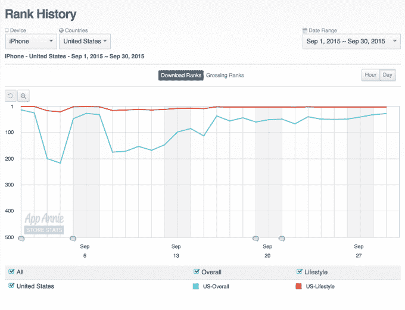

# 移动储蓄应用 Ibotta 获得 4000 万美元 

> 原文：<https://web.archive.org/web/https://techcrunch.com/2015/09/30/mobile-savings-app-ibotta-scores-40-million/>

移动购物应用 [Ibotta](https://web.archive.org/web/20221208025611/https://ibotta.com/) 开始时是一种在杂货店购物时不用剪优惠券的替代省钱方式，现在已经获得 4000 万美元的 C 轮融资，以继续扩大业务规模。作为为日常消费者打造实用和有用产品的证明，Ibotta 迄今已有超过 1000 万次下载，用户群共节省了 4000 万美元的奖励。

这轮融资由硅图形和网景公司的创始人、Ibotta 董事会成员吉姆·克拉克牵头。额外的资金使伊博塔迄今为止的筹资总额达到 7300 万美元。

该应用最初在专门的优惠券人群中流行起来，他们经常利用它提供的节省来增加他们从其他纸质和数字优惠券中获得的节省。但伊博塔的真正优势在于，它让购物者可以获得现金返还——而不是积分或信用——而不必从当地报纸和其他传单中拿出剪刀和剪贴优惠券。通过将“优惠券剪辑”转移到手机上，Ibotta 在一个报纸订阅量正在下降的世界里是有意义的。

相反，Ibotta 用户通过点击应用程序中列出的商品，与该公司合作的品牌进行互动，从而节省开支。然后，他们以某种方式与品牌互动——回答一个小问题，了解一个事实，观看视频，参加测验，在社交媒体上分享一些东西，等等。根据交易的不同，这些项目的节省往往从 0.25 美元到 1 美元以上不等。应用程序中的一个新功能让你可以创建一个购物清单，然后让 Ibotta 为你找到匹配的交易。

购物结束后，用户扫描条形码并上传收据照片，以验证他们的购买。我发现使用 Ibotta 可能有点耗时，这有时会让我不想使用它。但可以说，该应用程序比物理切割优惠券更耗时。此外，由于您可以在逛完商店后提取存款，因此与纸质优惠券相比，Ibotta 更加灵活。

虽然 Ibotta 的主要关注点是杂货(CPG)优惠券，但该应用程序今天在美国超过 500，000 家商店提供优惠，包括药店、沃尔玛、塔吉特、百思买、7-Eleven 等。Ibotta 创始人兼首席执行官 Bryan Leach 表示，这相当于 1000 个不同的品牌在该平台上做广告。

此外，他告诉我们 Ibotta 的用户也相当活跃。“用户现在每月打开和使用该应用程序 25 次，这是美国任何移动应用程序中频率最高的之一，”他指出。另外，平均会话长度现在超过 4 分钟。

Ibotta 经常是 iTunes 应用商店上排名前 20 的生活方式应用程序，目前在该类别中排名第 3，总排名第 28——对于移动储蓄工具来说，这是一个非常不错的表现。

但伊博塔并非没有竞争对手。去年秋天，Groupon 以 Groupon Snap 进入这一领域，其他公司也迎合移动用户，包括 Favado、Shopmium、SavingStar、Checkout 51、Coupons.com、SmartSource 等等。

这位首席执行官说，在年底之前，Ibotta 计划推出一个更新版本的应用程序，使内容个性化，并提供更好的用户体验。

利奇补充说，这笔资金将用于扩大 Ibotta 的用户群和扩大其团队，现在有 105 人，主要是在该公司的丹佛总部。伊博塔还专注于新的业务领域，包括媒体业务和“ [Ibottalytics](https://web.archive.org/web/20221208025611/https://ibotta.com/ibottalytics) ”，一种提供消费者洞察和市场快照的分析服务。