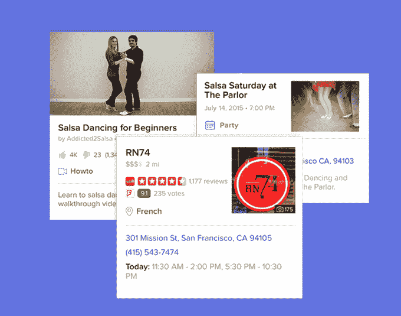
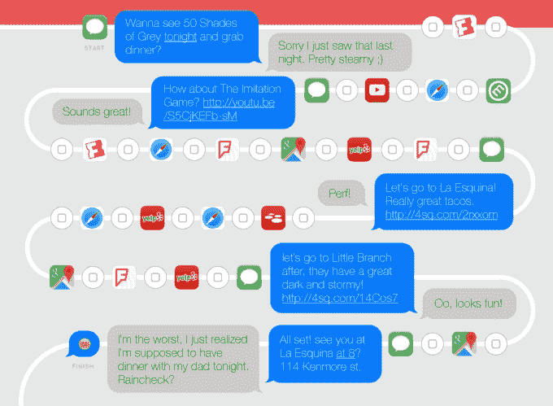
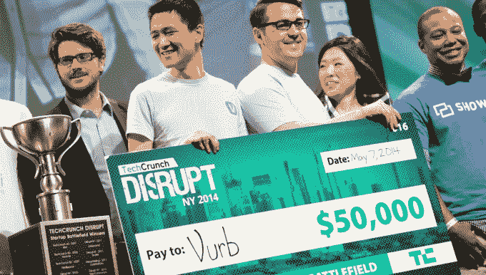
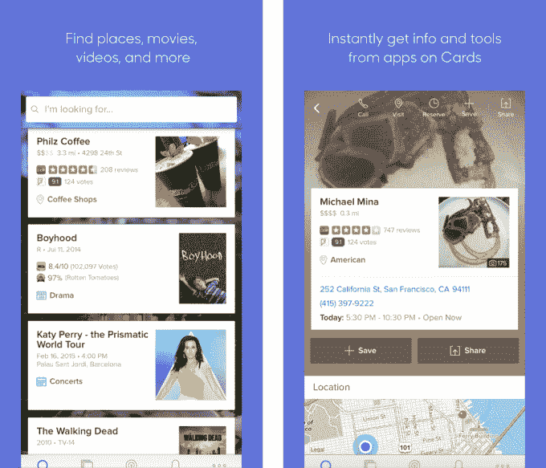
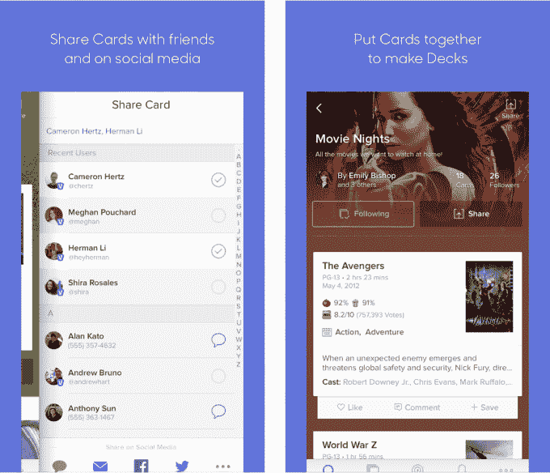
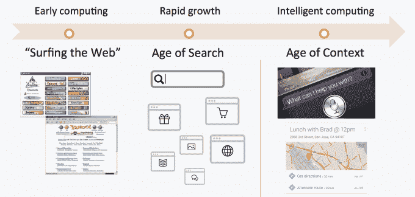

# Vurb 疯狂到足以对抗 Google 

> 原文：<https://web.archive.org/web/https://techcrunch.com/2015/02/26/mobile-search-david-vs-googliath/>

谷歌搜索不是为移动设备打造的。这一切都是关于网页列表，但小屏幕被应用程序所统治。这就是为什么如果谷歌今天推出，它可能会看起来很像[Vurb…它今天推出](https://web.archive.org/web/20221206123820/http://vurb.com/)。

Vurb 是一个[移动搜索引擎](https://web.archive.org/web/20221206123820/https://medium.com/@blo/why-mobile-search-needs-to-change-339801b1e22b)，它从 Yelp 和烂番茄等合作应用中提取信息，并把你链接到优步和谷歌地图等应用。它不是让你点击链接，而是将关键内容和上下文建议拼凑成可保存、可分享、可操作的卡片。你可以计划一整个晚餐和电影之夜，而不用打字或回到你的主屏幕。

在搜索领域挑战谷歌是勇敢还是妄想，只有时间能证明，但 Vurb 肯定是我最近见过的最大胆的初创公司之一。由于投资者喜欢大的高风险赌注，Vurb 有 1000 万美元的火力红点风险投资和一些一线天使投资人。

令人鼓舞的是，Vurb 在西方体现了一种中国已经在展示的趋势:移动的未来在于将应用生态系统中的分散功能整合到一个集中的中心。

## 移动门户

在网络上，谷歌的渠道模式运行良好。一切都是一个提供多种功能的可索引网站，谷歌可以使用 PageRank 将你带到正确的网站。它可以显示一个链接列表，让你打开多个浏览器标签，你可以快速切换，甚至同时显示。多任务很容易。它搜索信息，你汇总答案。

手机不一样。信息被困在孤立的、单一用途的应用程序和围墙花园中，PageRank 也无法理解。一切都在被分解。拥挤的商店里的应用程序发现一片混乱。打开多个标签页是一件苦差事，在它们之间切换也是如此，因为你一次只能查看一个。多任务处理很笨拙。

你需要做的所有应用切换，就是在分散的、未捆绑的移动应用中计划一个夜晚

这也是 Vurb 要为你汇总答案的原因。

它在东方有一些强有力的榜样。正如 Andreessen Horowitz 的合伙人 Benedict Evans 详述的那样，中国的应用程序微信(社交)和百度地图(位置)通过“将多种服务捆绑到一个应用程序中”而蓬勃发展。

埃文斯解释说，“这改变了聚合层”，从手机的主屏幕启动器变成了一个单一的多用途应用程序。这让用户不用去发现、下载和打开他们需要的信息。

Vurb 希望成为移动门户。在大分拆之后，雅虎和美国在线重生，让应用领域回归秩序。

## 从 0 到 100 真快

Vurb 成为谷歌搜索合法挑战者始于 2011 年。到 2013 年，[已经从 Charles River Ventures、CrunchFund(由 TechCrunch 的创始人创办)、Atlas Venture 和 DCVC，以及像麦克斯·拉夫琴(PayPal)、德鲁休斯顿(Dropbox)和海军拉维康德(AngelList)这样的天使投资人那里筹集了大约 200 万美元。](https://web.archive.org/web/20221206123820/https://www.crunchbase.com/organization/vurb)[当 Vurb 从隐身](https://web.archive.org/web/20221206123820/https://beta.techcrunch.com/2014/05/05/vurb/)中出来的时候，它在 [TechCrunch Disrupt NY Startup 战地 2014](https://web.archive.org/web/20221206123820/https://beta.techcrunch.com/2014/05/07/and-the-winner-of-techcrunch-disrupt-ny-2014-is-vurb/) 中拿了大奖。这种影响力帮助它[在](https://web.archive.org/web/20221206123820/https://beta.techcrunch.com/2014/08/07/the-rebundling/)[红点](https://web.archive.org/web/20221206123820/https://www.crunchbase.com/organization/redpoint-ventures)的带领下又筹集了 800 万美元。

从那以后，Vurb 一直在测试和吸纳其候补名单中的用户。为了继续专注于移动领域，这家初创公司放弃了其全功能网络版。“移动搜索是完全开放的，因为一切都被应用程序所吸引，”Vurb 创始人 Bobby Lo 告诉我。他的目标变成了确定“我们如何围绕查找、规划和共享信息创造一种更具凝聚力的移动体验？”

Vurb 团队，包括首席执行官 Bobby Lo(左二)庆祝他们在 TechCrunch Disrupt 战地 2014 上的胜利

谷歌有自己的搜索修复计划，但它必须背上所有历史性的设计包袱。因此，它没有完全重新设计搜索，而是专注于通过 [Google Now](https://web.archive.org/web/20221206123820/http://insidesearch.blogspot.com/2015/01/google-app-update-get-now-cards-from.html) 和[开始索引移动应用](https://web.archive.org/web/20221206123820/http://googlewebmastercentral.blogspot.com/2013/10/indexing-apps-just-like-websites.html)来增加上下文建议。从其他谷歌产品如 Gmail 和 Calendar 中提取不变的事实和可操作的信息，现在效果很好。

但是 Google Now 是由编辑驱动的，所以它的员工需要时间来学习如何提供关于网络长尾的内容。它也没有解决保存和共享搜索。在家搜索感觉像是一种自然的个人体验，但在移动中，搜索需要社交化。

## 为所有人解锁移动搜索

今天， [Vurb 向美国、加拿大和英国开放其 iOS 应用](https://web.archive.org/web/20221206123820/https://itunes.apple.com/us/app/vurb-find-plan-and-do/id959127584?mt=8)，明确支持地点(餐厅、地标、商店)、电影、电视、视频和音乐的搜索。活动和购物是它计划很快攻击的另外两个垂直市场。一款安卓应用正在开发中。

这里有一个你可以用 Vurb 做什么的演练。

在主屏幕上，你可以搜索 Vurb 的所有垂直领域，或者滑动鼠标开始浏览某个特定领域。假设你搜索了一部电影，比如《五十度灰》。在搜索结果中，你会看到 IMDB、烂番茄和 MetaCritic 试图警告你这部电影很糟糕。无论如何，你都会得到一个完整的丰富的媒体卡，上面有关于电影的细节，放映时间，最近的新闻，演员和工作人员，视频预告片，评论，以及在其他应用程序中深度链接到电影页面的选项。

点击 showtimes，你可以进入 Fandango 购买不冷不热的 S&M 嬉戏的门票。一旦 Vurb 知道你要去哪家剧院，它就可以根据上下文提供附近餐馆的建议，从花里胡哨的小酒馆到墙上的洞。每个餐馆的 Vurb 卡可以显示评论，通过 OpenTable 预订的选项，以及优步和 Lyft 的深度链接，可以立即叫你搭车，并预先将餐馆作为目的地。你很快就会大嚼春药了。

一路走来，你遇到的任何一张牌都可以保存到一个“副牌”中，供以后参考，每张牌或副牌都可以快速地与他人分享。向左滑动会显示一个朋友选择器，它可以提供卡片或卡片组的移动网络链接，以及它的内嵌图像，所以 Vurb 也可以帮助没有它的应用程序的人。轻点你的另一半，他们会让你听到更好的电影或更时髦的餐厅

收件人甚至可以喜欢或评论发送给他们的计划，以帮助最终确定一个晚上的城镇。给朋友们拍几张电影，开几家餐馆，这样你就能度过一个美好的夜晚。Vurb 希望人们会关注朋友、时尚引领者和有影响力的人，并查看他们公布的推荐。从理论上讲，有人可以成为一个明星搜索者，创造热点的流行甲板。

## 语境时代

Lo 表示，Vurb“与传统的 10 个蓝色链接的搜索非常不同。”他知道这仍然是一个很长的镜头，但很高兴采取了围栏摆动。他说“风投不想要 3 倍的回报。他们想要 100 倍的回报，否则这是一项失败的投资。”

要归还这笔钱，Vurb 有很多机会。随着搜索结果而来的是赞助位置的选项。随着开发者向脸书等平台上的应用安装广告投入大量资金，Vurb 可以收费为他们提供不同任务的建议。

Vurb 的一个缺点是，从 AOL 到微信到 Snapchat Discover 的其他门户都是建立在消息传递之上的，这是你每天都要做很多次的事情。Vurb 是建立在搜索之上的，这种活动并不常见。这将使下载 Vurb 的人更难记住坚持使用它，而不是回到谷歌。Vurb 将会艰难地爬上主屏幕。

Vurb 做了很多。这听起来可能不错，但它会让应用程序感觉臃肿或混乱。搜索是我们最根深蒂固的行为模式之一。我们受过扫描蓝色链接的训练。即使变化是不可避免的，它也可能是缓慢获得动力的。

Lo 总结说，在进化到搜索我们去哪里寻找信息之前，互联网始于通过门户网站浏览网页以浏览信息的时代。现在 [Vurb](https://web.archive.org/web/20221206123820/https://itunes.apple.com/us/app/vurb-find-plan-and-do/id959127584?mt=8) 想要催化下一个阶段，信息来到你身边的语境时代。