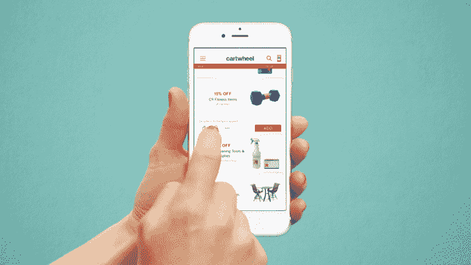

# 感恩节和黑色星期五移动购物创纪录 

> 原文：<https://web.archive.org/web/https://techcrunch.com/2016/11/25/mobile-shopping-hits-record-numbers-over-thanksgiving-and-black-friday/>

黑色星期五才刚刚开始，但根据今天早上第三方报告和主要零售商的报告，与几年前相比，移动流量和销售额已经打破了记录。除了昨天的感恩节销售报告显示来自移动设备的收入达到创纪录的 7.71 亿美元之外，包括亚马逊、沃尔玛和塔吉特在内的顶级零售商现在也发布了数字，表明移动设备对他们的在线销售产生了相当大的影响。

据亚马逊称，感恩节现在已经成为该零售商在美国网站上最繁忙的移动购物日之一。该公司报告称，感恩节的移动订单已经超过了去年的感恩节和 2015 年网络星期一。

尽管许多美国消费者刚刚开始在亚马逊网站上购买黑色星期五的商品，但该公司表示，就订购的商品而言，它有望击败去年的销售假期，Alexa 设备，如 Echo Dot、Fire TV Stick 和 Alexa Voice Remote 都是迄今为止最畅销的产品。

与此同时，竞争对手沃尔玛今天早上[报道](https://web.archive.org/web/20221225115144/http://news.walmart.com/2016/11/25/walmart-delivers-deals-availability-and-simplicity-on-black-friday)感恩节再次成为其今年最大的购物日之一。昨晚 6 点，它开始了黑色星期五的促销活动。沃尔玛称，从那以后，它已经发现其网站超过 70%的流量是由移动端驱动的。

同样值得注意的是，今年，沃尔玛借鉴了亚马逊的做法，本月早些时候[宣布将首次为移动应用用户提供独家交易。11 月 10 日，那些已经下载了沃尔玛移动应用程序的人可以提前选择黑色星期五交易，包括电子产品，如打折电视、Xbox One 和平板电脑等。不过，该公司尚未详细说明这对其应用销售的影响。](https://web.archive.org/web/20221225115144/http://news.walmart.com/2016/11/10/walmart-unveils-black-friday-2016-plans-great-deals-more-availability)

塔吉特百货公司(Target)也将于周五在亮相，展示其迄今为止在移动领域取得的成功。这家零售商度过了一个破纪录的感恩节，2015 年的客流量和销售额都超过了网络星期一。与此相关的是，移动流量今年也有所上升，移动销售额占该零售商周四在线总销售额的 60%以上。

像亚马逊和沃尔玛一样，Target 今年也通过其 Cartwheel savings 应用程序向客户提供预售交易来吸引人们使用其应用程序，这导致了该应用程序新用户有史以来最大的购物日。

Target 继续推动目前拥有 3000 万用户的 Cartwheel，为应用程序用户在黑色星期五和网络星期一在店内使用其移动伴侣购物时提供额外的 15%的折扣。

Ebay 还报告了移动购物的激增，指出今年感恩节移动购物占桌面购物总额的比例从去年的 35%上升到 38%。

*更新:Adobe 的数字(上)在美国东部时间上午 11 点更新，最终数字已经发布；美国东部时间上午 11:15 用易贝移动数据更新。*