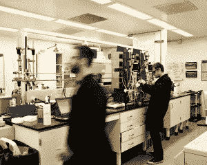

# Modern Meadow 筹集了 4000 万美元在没有牲畜的情况下种植皮革 

> 原文：<https://web.archive.org/web/https://techcrunch.com/2016/06/28/modern-meadow-raises-40-million-to-grow-leather-without-livestock/>

布鲁克林的一家名为 [Modern Meadow](https://web.archive.org/web/20230208034910/http://modernmeadow.com/) 的初创公司已经筹集了 4000 万美元，成为全球时装和配饰、箱包、体育用品、室内装潢和家具制造商的顶级皮革来源。

现代牧场在实验室和铸造厂“生物制造”皮革，而不是饲养动物来屠宰它们，并在物理和化学的密集过程中剥下它们的皮。

Modern Meadow 首席执行官兼联合创始人安朵斯·福加斯解释说,[生物制造](https://web.archive.org/web/20230208034910/http://www.modernmeadow.com/our-technology/)涉及细胞的设计，以生产和组装胶原蛋白和其他蛋白质，生产出与传统皮革“生物学上相同”的皮革。

他认为，生物制造对环境有益。他说，“我们正在制造一种没有毛发、肉和脂肪的材料。因此，你在皮革贸易中看到的石灰和毒性被消除了。”

[Modern Meadow 的首席创意官苏珊娜·李](https://web.archive.org/web/20230208034910/http://www.modernmeadow.com/about-us/)说，该公司的工艺可以生产出符合设计师规格的皮革，并充满了理想的特性，如一定的柔韧性、弹性、薄度或厚度。

她指出，一旦生产出来，皮革可以送到制革厂进行额外的染色。

李嘉诚的股权投资工具 Horizons Ventures 和 Iconiq Capital 领导了 Modern Meadow 的 B 轮融资，其他投资者包括 ARTIS 风险投资公司、淡马锡、Breakout Ventures、红天鹅风险投资公司、Collaborative Fund 和 Nest Labs 的发明者、设计师和创始人托尼·法德尔。

迄今为止，这笔资金使 Modern Meadow 的资本总额达到了 5350 万美元。

Modern Meadow 正在实验室中使用合成生物学来生产皮革，而不是用牲畜来生产。

Forgacs 表示，该公司打算利用这笔资金超越研发阶段，进入“扩大规模”阶段，这将包括扩展其在纽约的实验室和设计工作室，建立其第一家铸造厂或工厂，以及继续招聘员工。

Horizons Ventures 的巴特·斯旺森(Bart Swanson)表示，他的公司增加了对 Modern Meadow 的投资，部分原因是该公司在竞争激烈的市场中成功吸引了技术人才，并使他们的技术足够先进，可以生产出有前途的皮革样品。

去年 9 月，Modern Meadow 成功挖走了杜邦的幕僚长，让首席科技官戴夫·威廉姆森(Dave Williamson)担任他们的 CTO。

“现在我们可以坐在那里玩这些材料，我们可以想象从实验室进入全面生产，”斯旺森说。“不是理论上的。”

投资者和公司高管承认，Modern Meadow 仍然面临的一个主要挑战是，让它的生物制造皮革不仅是一个有吸引力的选择，而且是大众市场负担得起的选择。

斯旺森将 Modern Meadow 的雄心与早期创新和投资浪潮中最成功的清洁技术公司相提并论。“我们花了很长时间来摆脱对石油和碳燃料的完全依赖，现在可再生能源、LED 照明和电动汽车有了牵引力，”斯旺森说。

根据 [Research and Markets](https://web.archive.org/web/20230208034910/http://www.researchandmarkets.com/reports/2523208/global_luggage_and_leather_goods_industry) 的预测，到 2018 年，全球皮革制品——包括箱包、服装和配饰——的销售额预计将达到 912 亿美元。

Forgacs 说，Modern Meadow 希望在这个巨大的皮革市场中赢得一个材料份额，甚至通过提供一种有吸引力的替代现有的天然和合成选择来扩大市场。

*更正&澄清:现代牧场设计了组装胶原蛋白的细胞。*