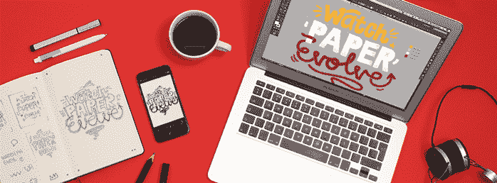

# Moleskine 智能笔记本将您的草图转换为 Adobe 友好的矢量文件 

> 原文：<https://web.archive.org/web/https://techcrunch.com/2014/11/20/moleskine-smart-notebook-svg-from-sketches/>

# Moleskine 智能笔记本将您的草图转换为 Adobe 友好的矢量文件

【YouTube https://www.youtube.com/watch?v=KYdu_mrVjEM&w=698&h=393]

数字工具可能有一天会完全取代传统的创意媒体，但我们肯定还没有到那一步，Moleskine 通过其软件搭售在新旧之间做得很好。今天，一个新的合作伙伴带来了对 Adobe 创意软件的 sketchbooks 支持，让你通过 Moleskine 智能笔记本应用程序和 Adobe Creative Cloud 将你的草图转化为完全可操作的向量。

与该服务配合使用的笔记本包括印在页面角落的特殊对齐指示器，以帮助该应用程序更好地将草图转化为可用的向量，没有扭曲或歪斜的角度，无论你是否可以用 iPhone 的摄像头完美地迎面捕捉。产生的矢量将提供这两者。jpg 和。svg 输出，用于 Adobe Photoshop 或 Adobe Illustrator。

诚然，如今有很多不同的数字素描选择，包括 Galaxy Note 4 等自带手写笔的智能手机，以及 Wacom 的 Bamboo line 等手写笔配件，可用于 iPhones 和 iPads。但是 Moleskine 笔记本有着显著的优势——除了给艺术家们提供一个很好的触觉体验。例如，它不需要电池供电，不需要数据连接，也不需要超过 33 美元的投资。

作为一个喜欢素描的人来说，这看起来是一个很好的工具，也是一个长期以来似乎遥不可及的梦想。如果 app 真的能出好。svg 文件，对于现代艺术家或设计师来说，它可能是一个真正不可或缺的工具。