# 隐形眼镜——DSLR 杀手？

> 原文：<https://web.archive.org/web/https://techcrunch.com/2018/03/30/moment-lenses-the-dslr-killer-a-review/>

我带着一辆佳能 DSLR 和两部 primes，一部 35mm f1.4 和一部 85mm f1.2(昵称为“胖小子”)。换镜头很麻烦，在某些环境下也不理想，比如西贡街头市场，挤满了小贩、游客和小偷。

去年带着这个相机包走遍了六个国家后，我把我的 iPhone 升级到了 X，希望取代 DSLR 作为旅行相机。尽管我们的主编称赞了 iPhone X 的摄像头，但这对我来说还不够。我需要更多的创造性控制，不想依赖移动软件。

谷歌搜索“最佳 iPhone 镜头”的前几个结果将我带到了 Moment，这是一家由 2014 年 Kickstarter 基金创立的公司，自那以来已经发展成为一家备受尊敬的智能手机镜头制造商。

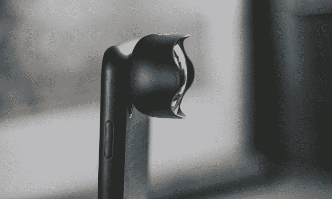

Moment 最近发布了他们四个镜头的新版本:超级鱼(鱼眼)，广角，远程人像和微距。此次更新包括一个新的连接接口，其中镜头直径略大，以提供更安全的连接到 Moment 智能手机外壳。他们的广角镜头也获得了玻璃升级到多元素非球面设计，以实现边缘到边缘的清晰度。

价格从 89.99 美元到 99.99 美元不等，外加 29.99 美元的 Moment 智能手机保护套——你需要它来连接你的镜头。

### 五金器具

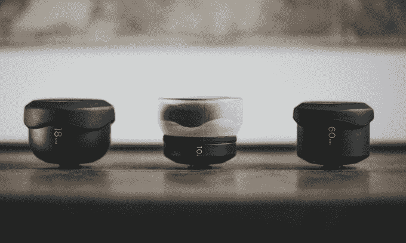

这些镜头不是廉价的塑料制成的，是在某个昏暗的工厂里大量生产的。它们是由航空级金属和 4K 电影镜头中使用的高端玻璃手工制作的沉重的小块。

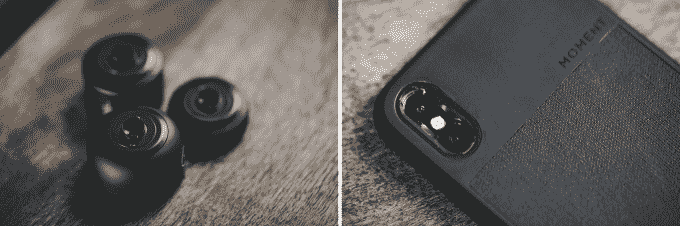 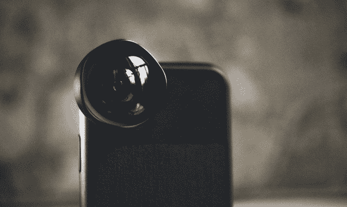

它们使用扭转和锁定系统安装在力矩箱上。抓拍非常简单，我粗略地摇了摇手机，以确保镜头是安全的——是的。

在最近一次去离尼加拉瓜海岸几英里的偏远小岛小玉米的旅行中，我选择不要超级鱼镜头(这不是我真正的审美)，并带上了另外三个镜头。

虽然我已经计划广泛使用镜头，但这一周大部分时间都是在吊床上打盹和吃龙虾玉米卷，就像一个人在遥远的热带岛屿上一样。然而，我确实花了几个下午来测试它们。

### 新型广角镜头

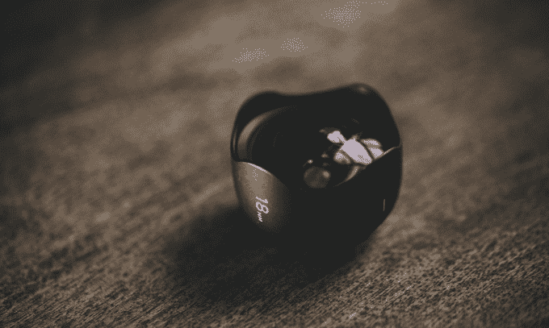

到目前为止，这是我最喜欢的三个。产生的图像清晰、动态，没有太多的边缘失真。

L: iPhone X 镜头，R:瞬间广角镜头

[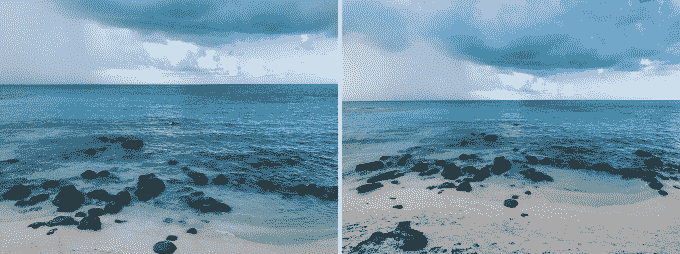](https://web.archive.org/web/20230213024158/https://techcrunch.com/wp-content/uploads/2018/03/new_moment_lens_wide_compare2.jpg)

L: iPhone X 镜头，R:瞬间广角镜头

它非常适合拍摄风景和城市景观，但我可能会把它用作日常镜头；它给肖像增添了个性和某种怪癖。

### 新型微距镜头

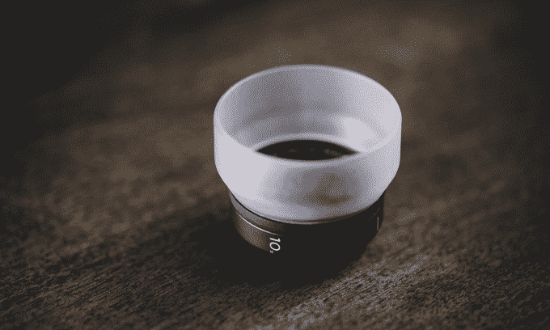

使用微距镜头，我能够捕捉到最微小的细节，从芙蓉花的花丝到花瓣的脉络。可拆卸的扩散罩使光线变得柔和，因此白色不会被吹散。

L: iPhone X 镜头，R:瞬间微距镜头

[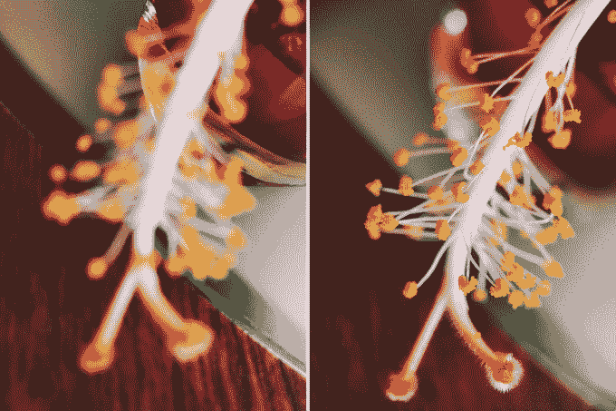](https://web.archive.org/web/20230213024158/https://techcrunch.com/wp-content/uploads/2018/03/new_-momen_lens_macro_compare_sample.jpg)

L: iPhone X 镜头，R:瞬间微距镜头

图像质量几乎与我的佳能微距镜头不相上下，而佳能微距镜头的价格恰好是它的 9 倍。在下面的伦敦地图上，街道名称中的字母大约有 1 毫米高。

[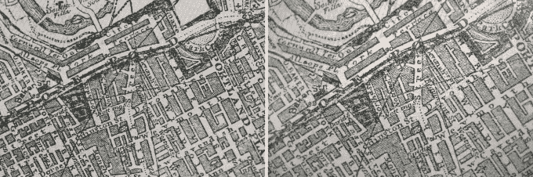](https://web.archive.org/web/20230213024158/https://techcrunch.com/wp-content/uploads/2018/03/new_moment_lens_macro_compare_sample3.jpg)

l:佳能 EF 100mm f2.8 微距，R: Moment 微距镜头(由于拍照时轻微倾斜，左上角模糊)

微距镜头有一个缺点:你必须靠近拍摄对象，非常近(不到一英寸)。

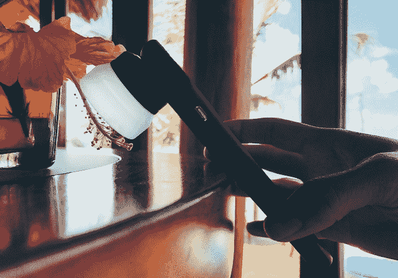

我不建议在黑寡妇或响尾蛇身上使用这个镜头。

### 新型远程人像镜头

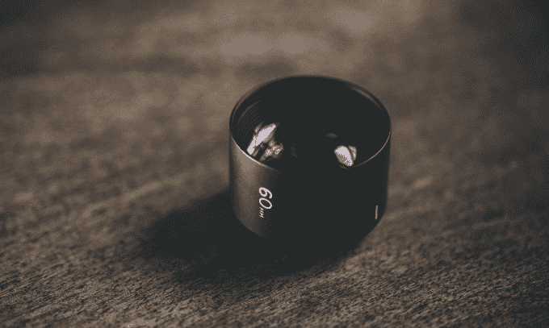

作为人像镜头，我很失望。我在海滨附近的几个地方给萨姆拍了照片，但没有一张让我感到兴奋。散景几乎不明显，我很确定我可以再靠近几步来达到类似的效果。

L: iPhone X 镜头，R: Moment Tele 人像镜头

写完这篇评论的初稿，我决定再试试镜头，然后再做仓促的评估。我错了；再靠近几步也达不到类似的效果。当近距离观看 iPhone X 的半宽镜头时，我已经忘记了失真；然而，差别是微妙的。

[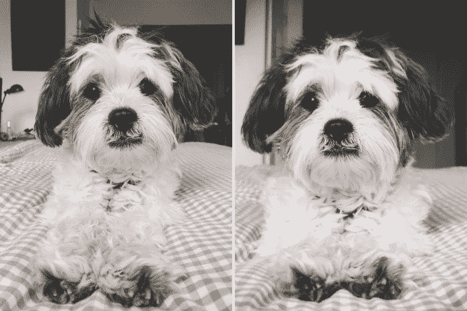](https://web.archive.org/web/20230213024158/https://techcrunch.com/wp-content/uploads/2018/03/new_moment_lens_tele_portrait_sample.jpg)

L: iPhone X 镜头(apprx。一英尺远)，R: Moment Tele 人像镜头(apprx。两英尺远)

实际上，在布鲁克林的一个下雨的早晨测试后，我开始喜欢上了这个镜头。虽然 60 毫米的焦距让你无需借助数码变焦就能更接近拍摄对象，但模糊的边缘增添了类似于胶片相机的怀旧元素。

 

iPhone X 内置长焦镜头，所以我快速对比了一下。

[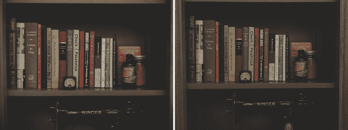](https://web.archive.org/web/20230213024158/https://techcrunch.com/wp-content/uploads/2018/03/new_moment_lens_tele_portrait_sample31.jpg)

L: iPhone X 长焦镜头，R: Moment 长焦人像镜头

有一个微弱的，微弱的区别。如果你使用的是 iPhone X，并且对柔和的边缘感到不安，请跳过这个镜头。在没有内置长焦镜头的智能手机上，这将是我摆脱无菌智能手机拍照的第二选择。

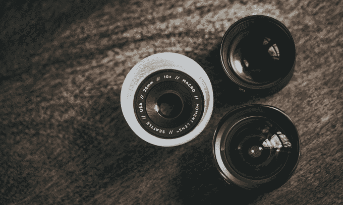

瞬间镜头为手机摄影增添了一些魅力和视角，以至于你可以欺骗一般人，让他们相信照片是用真相机拍的。

我还不能完全切换到一个安装了瞬间镜头的 iPhone X 作为旅行相机。这与时刻无关。他们的镜头令人印象深刻，但他们不会神奇地将智能手机照片转换成 DSLR 质量的图像。(我曾天真地希望如此。)iPhone X 的相机非常适合日常快照，但图像文件缺乏足够的细节和信息，无法满足我的分析保留 Lightroom 和 Photoshop 工作流程。现在，我会坚持我的笨重的 5D。

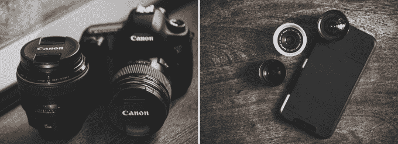

对于其他人来说，加快你的 Instagram 游戏。Moment 生产最好的智能手机相机镜头的声誉是当之无愧的。