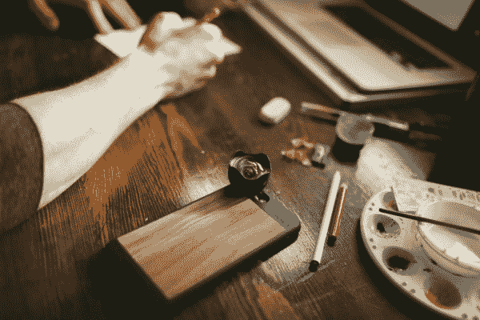

# 移动相机镜头公司 Moment 正在启动一些新硬件 

> 原文：<https://web.archive.org/web/https://techcrunch.com/2017/02/07/moment-new-hardware/>

我们已经有几年没有听说过为摄影爱好者制作一系列手机壳和镜头的 [Moment](https://web.archive.org/web/20221207145449/https://momentlens.co/) 了。今天，该公司宣布了其最新的硬件——一对 iPhone 保护套和一个广角镜头，它正在 Kickstarter 上[众筹。](https://web.archive.org/web/20221207145449/http://momnt.io/MomentKS)

Moment 于三年前由 [Kickstarter 发起的一项活动](https://web.archive.org/web/20221207145449/https://beta.techcrunch.com/2014/01/24/moments-mobile-camera-lenses-make-the-smartphone-the-new-interchangeable-lens-system/)发起，旨在资助创建几个可安装在手机上的可互换附加镜头。随后，苹果推出了一款手机应用和 iPhone 手机壳，帮助用户用手机拍摄更好的照片。

现在，该公司推出了新的硬件，将这些想法向前推进了一步，发布了新的 iPhone 外壳和电池外壳，可用作新镜头的支架，这也是众筹的一部分。

iPhone 7 和 iPhone 7 Plus 的 Moment photo case 美元)是其最新一代的保护硬件，允许用户添加相机带，并将其可互换镜头之一安装到手机上。

这一次，该公司发布了一个版本的外壳，其中也包括一个电池背。iPhone 7 和 iPhone 7 Plus 的 Moment 电池盒售价为 100 美元，为移动摄影师提供额外的动力。

iPhone 7 版本将提供 2500 毫安时的电池，而 iPhone 7 Plus 版本将增加 3500 毫安时的电池。这两款手机都有一个类似 DSLR 的拍照按钮，并配有高级控制功能，允许用户管理手机充电时间。它也适用于现有的闪电电缆和配件。

最后，该公司将推出新版本的广角镜头，售价 100 美元。新镜头比旧镜头略大，并且具有全玻璃非球面，以帮助用户拍摄更好的照片。

虽然 Moment 已经筹集了 450 万美元的资金，但该公司再次通过众筹活动推出其产品。“我们这样做是为了知道这是否是人们想要的，”巴罗斯告诉 TechCrunch。“你通常会在最初的 24 小时内知道它是否会起作用。”

然而，对于支持者来说，产品不交付的风险很小。首席执行官马克·巴罗斯表示，该公司正在与用于其旧硬件的相同制造商合作，因此在活动得到充分资助后，生产应该会顺利进行。

对于 Moment 来说，它开始制造镜头，并扩展到外壳，希望借移动摄影的浪潮进入新产品类别。巴罗斯指出，迄今为止，该公司一直专注于图像捕捉，但在编辑、共享和打印方面仍有机会。

与此同时，新的外壳、镜头和移动应用程序有望让 iPhone 摄影师们保持灵感。