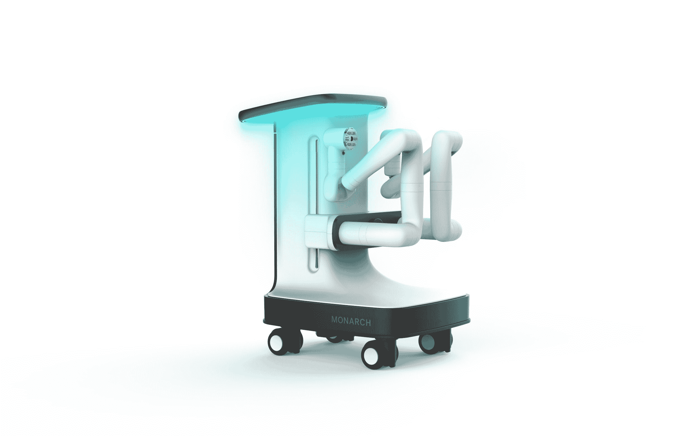
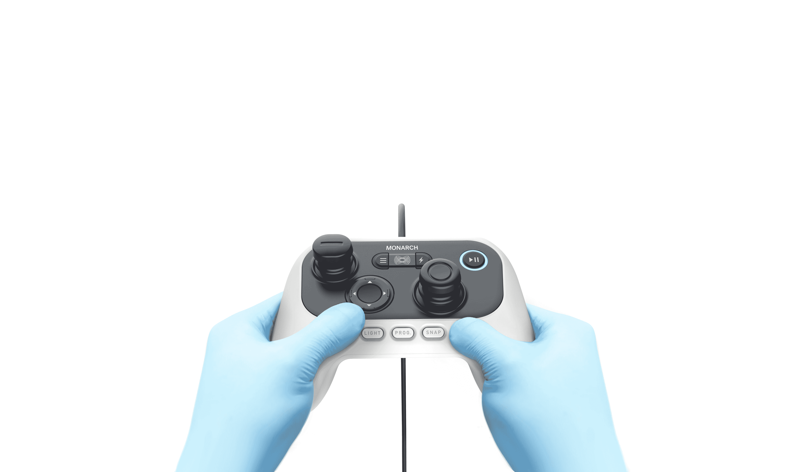

# Monarch 是手术机器人先驱 Frederic Moll TechCrunch 的一个新平台

> 原文：<https://web.archive.org/web/https://techcrunch.com/2018/03/24/monarch-is-a-new-platform-from-surgical-robot-pioneer-frederic-moll/>

尽管[筹集了大量资金](https://web.archive.org/web/20230120161110/https://techcrunch.com/2017/08/04/auris-surgical-robotics-founded-by-superstar-fred-moll-has-quietly-closed-on-a-ton-of-money/)并将达芬奇手术机器人[背后的关键人物之一列为创始人之一，但 Auris Health](https://web.archive.org/web/20230120161110/https://techcrunch.com/2016/05/04/robot-surgeon-outperforms-human-colleagues-doing-same-procedure/) (née Auris 手术机器人)在低调行事方面做得相当不错。然而，随着美国食品和药物管理局的最终批准，位于雷德伍德城的医疗创业公司已经准备好开始谈判了。

本周，Auris 发布了 Monarch Platform，该平台将达芬奇的手术方法替换为侵入性小得多的方法。该系统利用普通的内窥镜检查程序将柔性机器人插入人体内难以到达的地方。在该系统上接受过培训的医生使用视频游戏风格的控制器在 3D 模型的帮助下在内部导航。

Monarch 的第一个目标是肺癌，它是最致命的癌症之一。如果医生能够在疾病的早期阶段发现疾病，更多的死亡可以被阻止，但是肺部的复杂结构，加上当前的技术，使这个过程变得困难。据该公司称，“超过 90%被诊断患有肺癌的人无法存活，部分原因是发现时往往已是晚期。”

首席执行官 Frederic Moll 告诉 TechCrunch:“CT 扫描显示了肿块或病变。“它没有告诉你它是什么。然后你必须得到一片肺，如果是小的病变。这并不容易——这可能是一个相当痛苦的过程。所以你想以一种非常系统和微创的方式来做。目前，手工操作很困难，40%的情况下，没有诊断。这是多年来的一个问题，并且[抑制]了临床医生诊断和治疗早期癌症的能力。

Auris 成立于六年前，在此期间，该公司成功筹集了令人瞠目结舌的 5 亿美元，得到了 Mithril Capital Management、Lux Capital、Coatue Management 和 Highland Capital 的支持。该公司表示，大规模的风险投资和漫长的跑道是建立其强大平台的必要因素。

“我们非常幸运地拥有一个支持我们愿景并致力于我们长期发展的投资者群体，”CSO Josh DeFonzo 告诉 TechCrunch。“在 Auris 进行的投资将支持非常强大的产品管道的开发，以及我们技术的成功临床应用，以改善患者的结果。”

有了这笔资金和 FDA 对 Monarch 的批准，该公司有了一个积极的时间表。Moll 说 Auris 希望在今年年底前将该系统引入医院和门诊中心。一旦投入使用，Monarch 的疾病检测能力将最终超越肺癌。

“我们开发了一种平台技术，”莫尔说。"支气管镜检查是第一个应用，但是这个平台也可以做其他机器人内窥镜检查."