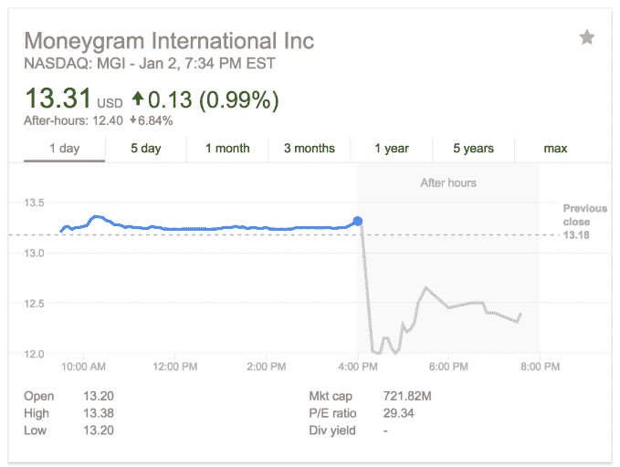

# 美国政府阻止速汇金以 12 亿美元出售给阿里巴巴旗下的蚂蚁金服

> 原文：<https://web.archive.org/web/http://techcrunch.com/2018/01/02/moneygram-ant-financial-alibaba-deal-collapses/>

# 美国政府阻止速汇金 12 亿美元出售给阿里巴巴旗下的蚂蚁金服

在美国政府阻止了这笔 12 亿美元的交易后，阿里巴巴旗下蚂蚁金服收购全球支付服务速汇金的计划被取消。

蚂蚁金服是阿里巴巴的子公司，控制着中国最大的移动钱包支付宝和其他金融服务，[于 2017 年 4 月宣布收购纳斯达克上市的速汇金](https://web.archive.org/web/20230314050223/https://techcrunch.com/2017/04/16/ant-financial-moneygram-1-2-billion/)，此前它击败了来自 Euronet 的竞争对手[。](https://web.archive.org/web/20230314050223/https://techcrunch.com/2017/03/14/euronet-alibaba-ant-financial-moneygram/)[蚂蚁最初在 2017 年 1 月竞购速汇金](https://web.archive.org/web/20230314050223/https://techcrunch.com/2017/01/27/alibaba-ant-financial-moneygram/)，以此作为将其跨境支付网络发展到美国以及包括印度和菲律宾在内的主要走廊的一种方式，但相反，它将“探索和开发倡议”与速汇金的业务合作。

“自近一年前我们首次宣布与蚂蚁金服的拟议交易以来，地缘政治环境发生了很大变化。速汇金首席执行官艾利克斯·霍姆斯在一份声明中说:“尽管我们尽了最大努力与美国政府合作，但现在很明显，cf ius[美国外国投资委员会]不会批准这项合并。”。

“与速汇金建立这种新的战略合作将为我们的生态系统增加一个具有全球汇款能力的合作伙伴，尽管蚂蚁金服不会与速汇金有直接的所有权关系，但我们期待与速汇金团队密切合作，使我们的平台更加易于使用——特别是对全球无银行服务和服务不足的社区而言——并为我们的客户创造更好的体验，”蚂蚁金服国际总裁道格·费金补充道。

根据协议条款，Ant 已经向 MoneyGram 支付了 3000 万美元，用于终止收购过程。

受此消息影响，MoneyGram 的股价下跌了约 10%，至 12.02 美元，在撰写本文时，其股价在盘后交易中回升至约 12.40 美元。

这笔交易的失败对蚂蚁来说是一个巨大的打击，蚂蚁在 2017 年的大部分时间里，通过一系列合作伙伴关系和投资，在中国以外发展其移动支付网络，并进入东南亚、印度、韩国、日本和亚洲其他地区。MoneyGram 不仅将美国加入了这一战略，还可能给蚂蚁带来一个跨境办事处的实体网络，并在全球交叉支付行业占据更大份额。但现在情况并非如此，看看蚂蚁将采取何种方式来填补与速汇金新的“战略商业合作”之外的空白，将是一件有趣的事情。蚂蚁被热传将进行大规模 IPO。

该交易的失败标志着中国主导的对美国科技公司的收购在美国总统特朗普任期内第二次失败。回到 9 月份，一家私人股本集团因潜在的安全风险而被阻止收购莱迪思半导体。在特朗普政府之前，过去 27 年里只有三笔交易被阻止。