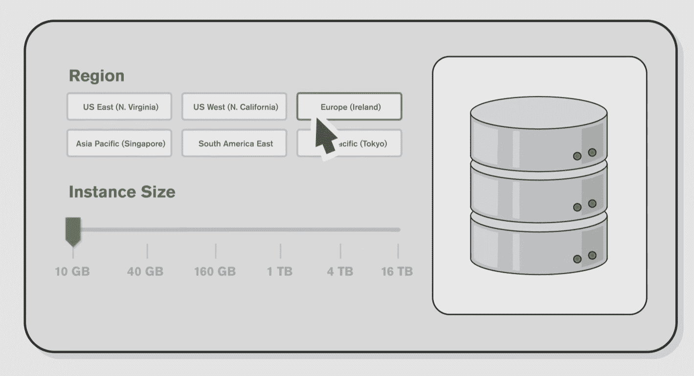

# MongoDB 发布其新的数据库即服务产品 Atlas 

> 原文：<https://web.archive.org/web/https://techcrunch.com/2016/06/28/mongodb-launches-atlas-its-new-database-as-a-service-offering/>

MongoDB 是同名开源数据库背后的公司，今天将推出 Atlas，这是它的第三项主要创收服务。

Atlas 是 MongoDB 的数据库即服务产品，为用户提供托管数据库服务。该服务将提供现收现付的价格，最初将允许用户在亚马逊网络服务(AWS)上部署，稍后将支持微软 Azure 和谷歌云平台。

MongoDB Atlas 补充了该公司为希望在本地运行服务的企业提供的[商业产品，以及为企业提供支持和访问该公司](https://web.archive.org/web/20230213054756/https://www.mongodb.com/products/mongodb-enterprise-advanced)[云管理器](https://web.archive.org/web/20230213054756/https://www.mongodb.com/cloud/)和其他工具的 [MongoDB Professional](https://web.archive.org/web/20230213054756/https://www.mongodb.com/products/mongodb-professional) 。Atlas 介于这两种服务之间。它允许任何想使用 MongoDB 的人在云中快速配置它，获得支持，并且只需支付每小时的费用。

MongoDB 的战略副总裁 Kelly Stirman 告诉我，他认为大多数开发人员喜欢 MongoDB，因为这让他们更有效率(尽管值得注意的是，当然也有很多开发人员不喜欢 MongoDB)。“MongoDB 非常适合开发应用程序，”他说。“但当涉及到在生产中部署应用程序时，这就是开发人员可能会遇到的困难。这样，我们就可以利用我们在生产中支持大型系统和部署的所有经验，以及我们开发的软件来帮助人们。作为用户，除了想在哪里部署和需要多大的数据库之外，你不需要知道太多。”

当然，通过 DynamoDB，亚马逊也提供了自己的 NoSQL 数据库。然而，Stirman 认为，公司最终通过使用这项服务将自己锁定在亚马逊的平台上。“我们的策略是让你独立于底层云提供商，让你找到拥有最佳 SLA 和区域支持的提供商——即使你改变了底层云提供商，你也可以继续使用 MongoDB，”他说。

该公司认为，Atlas 将为用户提供一个容错和自我修复的数据库平台。Atlas 将监测数据库并提供备份，数据总是在不同的可用区域复制。至于安全性，MongoDB 表示，它为你的所有数据提供端到端加密，并使用亚马逊自己的工具，如其虚拟私有云功能，以[保持数据库安全](https://web.archive.org/web/20230213054756/https://aws.amazon.com/vpc/)。

MongoDB 告诉我，价格将从“不到一杯咖啡”开始(当然，在第三次浪潮的时代，这是一个非常灵活的定义)，并将取决于您希望 MongoDB 为您提供的底层 AWS 服务器的大小。

除了新的 Atlas 服务，MongoDB 今天还宣布其 Apache Spark 连接器现已全面上市。有了这个，MongoDB 用户现在可以使用 Spark 的分析处理引擎来查询实时 MongoDB 数据。MongoDB 与 Spark 的创造者 Databricks 在这一集成上密切合作。