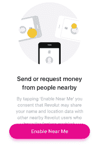

# 英国挑战者银行 Monzo 现在允许你向“附近的朋友”TechCrunch 付款

> 原文：<https://web.archive.org/web/https://techcrunch.com/2018/05/09/monzo-nearby-friends/>

# 英国挑战者银行 Monzo 现在允许你向“附近的朋友”付款

作为众多旨在[重塑经常账户银行业务](https://web.archive.org/web/20221209231114/https://techcrunch.com/2017/02/17/interview-monzo-co-founder-and-ceo-tom-blomfield/)的英国金融科技初创公司之一，Monzo 推出了一项新功能，让向朋友转账变得更加顺畅。被称为“附近的朋友”的新地理定位功能使用蓝牙让你看到附近任何使用 Monzo 的人，这样你就可以启动支付，而不需要他们的电话号码先出现在你的通讯录中。

Monzo 从一开始就增加其病毒式传播的方式之一是让朋友对朋友的支付变得容易，要么是向已经在初创公司开户的人支付，要么是通过 [Monzo.me 服务](https://web.archive.org/web/20221209231114/https://monzo.com/blog/2016/12/07/monzo-me/)，该服务为用户提供了与朋友分享的支付链接。正如 Monzo 联合创始人 Tom Blomfield [经常解释](https://web.archive.org/web/20221209231114/https://youtu.be/AuHsd-1_N_8?t=3m2s)的那样，这个想法是，与基本上没有网络效应(可能超出联合账户)的传统现有银行不同，challenger bank 旨在随着加入它的人越来越多而变得更加有用。

Revolut 也有一个类似的功能，叫做“我的附近”

“由于蓝牙的魔力，你可以看到附近任何使用 Monzo 的人。为了保护人们的隐私，你只能找到同时打开了该功能的人。Monzo 的 iOS 平台负责人 Andy Smart 在他的博客上写道:“只需轻点几下，你就可以给人们汇款，而不需要交换号码或做任何其他管理工作。”。

在引擎盖下，Monzo 的“附近的朋友”使用谷歌附近，谷歌的点对点网络 API，允许应用程序“轻松地实时发现、连接和交换附近的设备，无论网络连接如何”。具体来说，Monzo 说它的实现是这样工作的:

> 1.  当你打开附近的好友时，我们会向谷歌发送一个匿名令牌(一个随机的文本字符串)
> 2.  该令牌通过蓝牙广播给附近的设备
> 3.  同时，你的 Monzo 应用程序开始搜索你附近的其他设备
> 4.  当你的 Monzo 应用程序发现附近有设备时，它会收到该设备的令牌。使用 Monzo API，它将该令牌交换为您朋友的姓名和个人资料图片
> 5.  我们还会收到一个标识符，我们可以用它来确定向谁付款
> 
> 令牌不会在 Monzo 系统之外识别您的个人身份，这意味着我们不会在此过程中与第三方共享您的任何个人信息。我们发送给 Google 的令牌会在一小段时间后过期，这意味着您的个人数据无法识别。

与此同时，竞争对手 Revolut 最近推出了一个非常类似的功能，按照它的标准，它是相对安静的。名为“Near Me ”,我知道它最早将于明天在公司博客上正式宣布，这是价值 17 亿美元的银行初创公司发展速度的又一个明显迹象。

[https://web.archive.org/web/20221209231114if_/https://www.youtube.com/embed/frr83_ai9-Q?feature=oembed](https://web.archive.org/web/20221209231114if_/https://www.youtube.com/embed/frr83_ai9-Q?feature=oembed)

视频