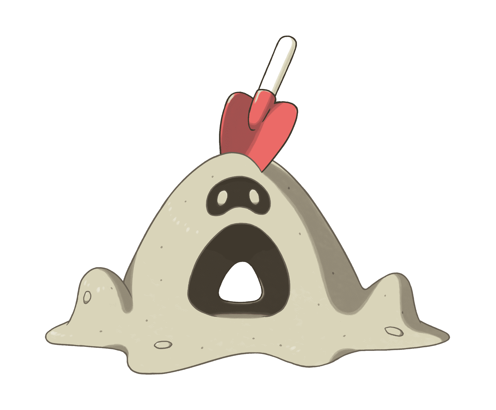
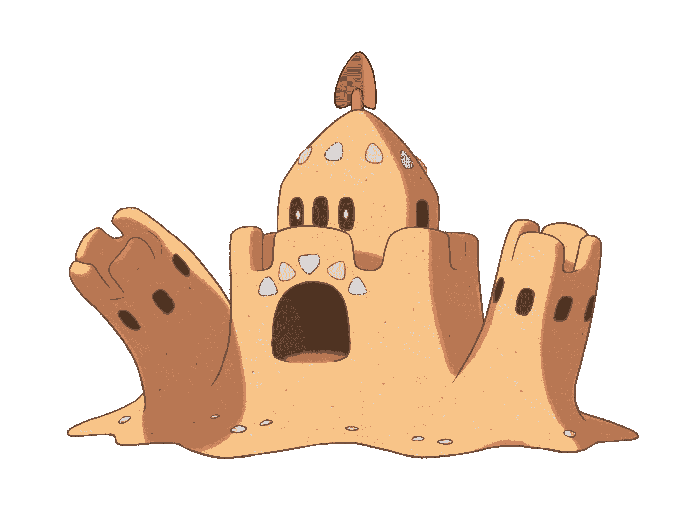

# 更多新的神奇宝贝为太阳和月亮揭晓，其中一个是一堆沙子 

> 原文：<https://web.archive.org/web/https://techcrunch.com/2016/08/19/more-new-pokemon-revealed-for-sun-and-moon-and-one-is-a-pile-of-sand/>

# 太阳和月亮又有了新的神奇宝贝，其中一个是一堆沙子

【YouTube https://www.youtube.com/watch?v=-1hsh267tUM]

神奇宝贝公司，现在是怎么回事。你为神奇宝贝太阳/月亮创造的一个新的便携式怪物实际上是一堆沙子，这怎么可能呢？？看:

你在对我做什么？你觉得这样可以吗？当受到水的攻击时，沙粒会变成这样:

那是个该死的沙堡，神奇宝贝！振作起来。

与此同时，还有其他新的引人注目的角色来到游戏中，所有这些都在正在进行的[神奇宝贝世界锦标赛](https://web.archive.org/web/20221208091934/http://www.pokemonchampionships.com/)中揭晓。上面让我们大吃一惊的是沙丘娃和帕洛桑德，两者都是鬼/地类型，还有好胜蟹，一只醉醺醺的拳击甲壳动物，和 Stufful，一只可爱的小熊猫类型的东西，几乎可以弥补这些沙子的东西。

[gallery ids="1372189，1372190"]

这些新的神奇宝贝加入了阿洛拉地区特有的其他新生物的行列，这是 11 月 18 日 3DS systems 系列中新的[太阳/月亮系列的背景。神奇宝贝交易卡游戏也获得了新的“GX”系列卡，这些卡为游戏增加了特殊的攻击，每场游戏可以使用一次，这些 GX 特有的神奇宝贝卡将与太阳/月亮系列的神奇宝贝 TCG 宇宙一起推出。](https://web.archive.org/web/20221208091934/https://beta.techcrunch.com/2016/08/11/new-pokemon-in-sun-and-moon-include-sad-fish-surfing-raichu/)

我仍然喜欢神奇宝贝，即使是沙堆也无法改变这一点。