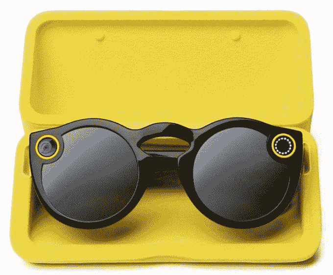

# Snapchat 眼镜的希望和难题 

> 原文：<https://web.archive.org/web/https://techcrunch.com/2016/09/24/more-than-just-specs/>

Snapchat 是唯一一家足够冷静的公司，有可能消除谷歌眼镜的污名。笨拙、无用和对隐私的威胁是许多人对你戴在脸上的电脑的看法。Snapchat 能展示出生产一种不会死在商店货架上或抽屉里的产品所需的精湛营销和顺畅执行吗？

为了快速叙述基本情况，昨晚泄露了 Snapchat 新摄像机太阳镜的视频。[商业](https://web.archive.org/web/20230203031315/http://www.businessinsider.com/snapchat-glasses-2016-9?op=1) [内部人士](https://web.archive.org/web/20230203031315/http://www.businessinsider.com/snapchat-spectacles-glasses-how-they-work-2016-9?op=0)报道了此事，因此该公司在计划于周一发布的[华尔街日报](https://web.archive.org/web/20230203031315/http://www.wsj.com/articles/snapchat-releases-first-hardware-product-spectacles-1474682719)上匆忙发布了这一消息。

Snapchat 将公司更名为 Snap Inc，并将于今年秋季限量推出售价 130 美元的眼镜。它们将是黑色、蓝绿色或珊瑚色的均码。“眼镜”可以让你轻按眼镜边缘，立即录制 10 秒钟的视频，轻按三次，最多录制 30 秒钟，前面有一盏灯提醒人们你正在录制。

该视频是用一个 115 度的圆形广角镜头拍摄的，可以在手机上以任何方向全屏观看。视频存储在设备上，可以通过 Wifi 或蓝牙无线下载到手机上，用户可以稍后通过 Snapchat 编辑和分享。Spectacles 的电池应该可以使用一天，而且你可以从便携式充电盒中获得最多四次完全充电。

但真正的问题是，当人们已经拥有一部拍照手机时，他们是否会想要或需要眼镜，Snap Inc 如何避免它们变得令人讨厌或令人毛骨悚然，以及它们可能如何改变初创公司的未来，以及我们如何捕捉社交媒体。

眼镜及其充电盒。通过商业内幕

在这里，我们将探索 Snap Inc .的眼镜面临的陷阱和潜在的荣耀。

## 头痛

我们需要第二台相机吗？每个人都已经在口袋里装了非常强大的相机。Specs 面临的最大挑战将是打破现状:用手机拍照和录像。用一只手将你的 iPhone 或 Android 举在你的面前，这种体验可能与眼镜相似到让它们变得没有必要。

如果手机上有 Snapchat，还需要眼镜吗？通过商业内幕

Snap Inc 将不得不证明这种 115 度圆形第一人称格式是多么与众不同和令人敬畏。这可能需要在更大范围的发布之前将规范交到一些有才华的创作者手中。

规格必须不仅仅是滑板和与孩子们玩耍的镜头。他们必须展示多功能性，可能需要一些专用的动画镜头、滤镜或其他图像修饰，以将他们与我们 iPhones 中的超级工程相机区分开来。

眼镜提出了一个更大的问题，即相机是否如此重要，以至于有时我们会想要一个专用的非专业拍摄设备，即使我们不得不记得随身携带它并给它充电。或者我们随身携带的智能手机摄像头的便利性和功能是否已经足够好了。

**手比头灵活**——试着在拥挤的音乐会上从眼睛的高度拍摄视频，而不是把手机举在空中，你会很快喜欢上把相机放在你灵活的手中，而不是绑在你的头上。获得最佳角度通常需要一些机动动作，有手臂的参与会容易得多。

除非 Snapchat 能够在自动稳定方面发挥作用，否则 Specs 的视频可能会出现抖动和不稳定。否则，他们制作的视频可能会令人眼花缭乱或过于兴奋而无法观看。

**体面**——谷歌眼镜首先落入了极客开发者和技术人员的手中，他们很快将这款设备与尴尬的社交行为和“我比你好，因为我来自未来”的态度联系起来。臭名昭著的 Scoble 淋浴玻璃照片仍然困扰着可穿戴行业。

扭转这种耻辱将需要 Snap Inc .仔细管理第一印象，使眼镜令人向往，而不是可悲的。不幸的是，Snap 首席执行官埃文·斯皮格尔戴着它们的“试图变得巧妙”的肖像已经建立了一种有点自命不凡的氛围。

在卡尔·拉格菲尔德为《华尔街日报》拍摄的这张照片中，Snap Inc .首席执行官埃文·斯皮格尔让眼镜看起来有点奢华

**私家眼睛，他们在看着你**–Snap 很聪明，当眼镜用大警示灯记录时，它变得很明显。但是在“你在录我吗！？!"[酒吧里的混战](https://web.archive.org/web/20230203031315/https://techcrunch.com/2014/02/27/how-not-to-be-a-glasshole-part-2/)以及商家贴出“禁止谷歌眼镜”的标语，人们肯定会有些不安。

我们已经习惯了有人必须举起他们的相机或手机对准我们，然后他们才能记录我们，这给了我们时间来改变我们的行为或转身离开。知道眼镜可以通过快速触摸开始拍摄，即使有警告灯，可能会让人们在佩戴眼镜的人周围感到不舒服。

Snap 必须找到一些方法，在有人越界引发争议之前，就如何使用规格传达礼貌的做法。

https://twitter.com/sippey/status/778073369660973057

## 希望

**直播生活，不要只是记录它**——更好的相机、网络连接和社交网络导致了生活直播的爆炸，由 Snapchat Stories 引领(并被 Instagram Stories 复制)。但它们对我们体验最美好时刻的方式构成了威胁。

今天，当一些特别的事情发生时，大多数人会拿出手机，而不是沉浸在那一刻。前排的粉丝通过在他们之间插入电话来破坏他们与他们的摇滚明星英雄联系的机会。然后，当人们向下凝视时，他们就脱离了行动，在分享之前用过滤器和标题编辑他们的内容。

眼镜让你享受生活，而不是盯着手机

Snapchat 最近推出的 [Memories](https://web.archive.org/web/20230203031315/https://techcrunch.com/2016/07/06/snapchat-memories/) 功能通过让你保存你记录的内容来对抗这个序列的第二部分，这样你就可以在你有空的时候编辑和分享。Spectacles 可以解决第一个问题，将手机的异物从捕获过程中移除。仍然有一个设备挡在路上，但至少它是半透明的，所以你可以在记录相同视图的同时直接看到世界。

Spectacles 可以实现这样一种隐喻，即创造一扇进入彼此生活的窗户，而不是在屏幕上观看我们自己的生活。

相机公司——制造相机本身，而不仅仅是软件，让 Snap Inc .更好地把握体验。它可能包括不适合手机的硬件。它可以更戏剧性地试验人们如何记录。此外，它还提供了更深层次的数据所有权，这些数据将被保存在 Snapchat 的内存中。

即使视频广告仍然是 Snap 的核心赚钱方式，视频广告之外的多样化也可以增强对这家初创公司预期 IPO 的信心。如果 Snapchat 能让 1%的日常用户购买，它就能赚到 2 亿美元。公司拥有的筹码越多，就越能掌控自己的命运。如果说脸书是新闻源，谷歌是搜索引擎，那么 Snapchat 希望成为摄像头。

**增强现实**——Spectacles v1 只记录你周围的世界，但未来的迭代可以增强它。最终，也许他们可以自动给每个人留胡子，在拥挤的房间里突出你的朋友，让你看其他人的眼镜内容，就像你通过他们的眼睛看到的一样，或者托管一个有无数应用程序的开发者平台。

Snapchat 的自拍镜头是第一次向大众提供增强现实，该公司已经为专家配备了[，他们可以构建下一波增强。也许他们将来会添加语音控制或其他物联网集成。](https://web.archive.org/web/20230203031315/https://techcrunch.com/2016/04/13/how-to-use-snapchat-3d-stickers/)

**我们从未见过的场景——**走红毯是什么感觉？我们已经看过很多跟随名人的镜头，但眼镜可能会让我们成为关注的焦点，粉丝和狗仔队围着我们奉承。我们可能会从歌手的角度去看演唱会，或者作为时装模特走上 t 台

虽然 Snapchat 一直是为青少年设计的，但父母可能会喜欢在录制时用双手抱着孩子的功能。GoPro 制造了防白痴的冒险相机，但 Snap 可以制造一个用于保存日常乐趣的相机。

## 吸引人的装置

眼镜的营销对 Snap Inc .来说是一个巨大的机会，但也充满了风险。最初的看法可能会决定规格，也可能会决定我们采用其他类型的头戴式计算机的快慢。

最明智的策略可能是模仿被 Snapchat 拒绝的收购者。脸书成为国际热门，部分原因是人们迫切希望加入这个被视为排外的精英俱乐部。

脸书推出的每一个阶段都使其在社会等级中向下延伸了一级。这样，下一批得到它的人总是崇拜上一批。哈佛，然后是美国精英学院，其他美国学院，国际学院，高中，最终是所有人。这与谷歌笨拙地推出谷歌眼镜(首先是怪异的开发者)和谷歌+(首先是地理和社会上不聚集的技术精英)正好相反。

Snapchat 可能最好先给有抱负的人物戴上眼镜——广受尊敬但时尚的名人。如果 Spectacles 的第一个内容包括经典电影首映式、史诗音乐会、喧闹的派对和令人惊叹的体育赛事中明星的视角，它可能会巩固你想成为的人穿着它们的想法。

类似地，Snapchat 可能只想通过某种受信任的影响者网络来分发原始的规范对。当它公开销售时，最好从文化之都开始，比如洛杉矶和纽约，在那里全世界都在寻找什么是酷。

眼镜需要让人感觉有抱负。通过商业内幕

眼镜是一种小玩意，人们不会根据它的规格来评判它，而是根据它是否能改变人类行为来评判。向我们的社会灌输新的行为方式永远比把处理能力装进芯片更难。覆盖谷歌眼镜灌输的厌恶感将需要斯皮格尔的所有技能。

我们可以假设，有一天，眼镜电脑将会缩小和增强到它们变得司空见惯的程度。但也许 Snap Inc .拥有时尚的声誉和大胆的雄心，可以让这一天更早到来。