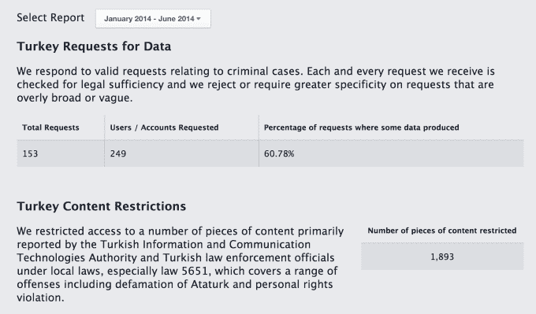

# 脸书遵照土耳其的要求审查亵渎神灵的网页，但不会发布

> 原文：<https://web.archive.org/web/http://techcrunch.com/2015/01/26/more-transparency-please/>

# 脸书遵照土耳其的要求审查亵渎神灵的网页，但不会出版

当谷歌和推特收到各国审查有争议内容或关闭其服务的法律威胁时，为了透明起见，他们经常在 ChillingEffects.org 发布这些信息。但是今天[当脸书遵照土耳其的法律命令](https://web.archive.org/web/20230129072722/http://www.nytimes.com/2015/01/27/world/europe/facebook-said-to-block-pages-on-muhammad-to-avoid-ban-in-turkey.html?_r=0)屏蔽土耳其用户的一个诽谤先知穆罕默德的页面时，它保持了这一要求的私密性。

马克·扎克伯格没有被封杀，而是说脸书有责任遵守审查制度，这样它才能继续运营，至少让一些公民有发言权。

自爱德华·斯诺登(Edward Snowden)爆料以来，科技公司与政府合作的透明度越来越大。大多数科技巨头现在都发布透明度报告，但被广泛禁止披露或具体说明他们收到了多少来自 NSA 的请求。

但当一些人收到来自国外的审查最后通牒或美国的 DMCA 版权取消通知时，他们会将它们公之于众。谷歌和推特都有大量他们分享的关于寒蝉效应的通知档案。但是脸书放弃了这种透明的做法。

取而代之的是，该公司已经用一个互动地图增强了它的[透明度报告，该地图显示了在不同国家(如土耳其)哪些类型的内容被屏蔽了。不过，这些杂志每六个月才出版一次。](https://web.archive.org/web/20230129072722/https://govtrequests.facebook.com/)

一些人声称脸书遵守审查制度是错误的，它应该接受禁令。脸书的增长和广告目标经常被援引为它顺从的假定理由。

然而，[马克·扎克伯格最近在一次公开提问中对审查问题](https://web.archive.org/web/20230129072722/https://techcrunch.com/2015/01/14/some-voice-is-better-than-no-voice/)发表了评论&说多一个国家不会增加多少额外的广告收入或增长。相反，他为自己的立场辩护说(转述):

> 我想不出历史上有多少这样的例子，一家公司在面对法律时没有关闭，而是被禁止帮助改变了法律。但继续运营可以在其他方面帮助这个国家，比如让人们与亲人联系、学习和找工作。因此，我认为我们最大的责任是继续运营。

扎克伯格的观点值得商榷。遵从审查制度无疑鼓励了这种行为，但对数百万人来说，一个基本的通信工具被关闭，也压制了各种形式的表达。脸书拒绝就这一具体问题发表评论。

无论如何，脸书显然可以保持目前的立场，同时变得更加透明，并及时公布其收到的要求。这将大大有助于说服人们，它只在法律规定的情况下进行审查，并尽一切努力进行反击，同时不切断公民的社交网络。