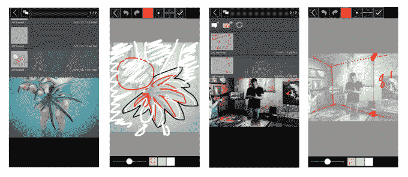

# Morpholio 的暴击使标记设计比以往任何时候都快 

> 原文：<https://web.archive.org/web/https://techcrunch.com/2015/06/01/morpholios-crit-makes-marking-up-designs-faster-than-ever/>

# Morpholio 的暴击使得标记设计比以前更快

[Crit](https://web.archive.org/web/20221007120408/https://itunes.apple.com/us/app/morpholio-crit-message-+-mark/id990345350?ls=1&mt=8) (如在评论中)是由 [Morpholio](https://web.archive.org/web/20221007120408/http://morpholioapps.com/) 开发的一款新的 iPhone 和 iPad 应用程序，它允许设计师、建筑师、摄影师和其他创意类型上传和标记图像，作为一种实时交流的形式。

例如，一名初级摄影师可以将他们刚刚拍摄的图像上传到应用程序中，并将其发送给创意总监，然后创意总监可以标记这些图像(用手指绘制的草图)，以传达照片中应该发生的变化。

Crit 最初是母公司 Morpholio 的服务套件的一个较小的内部功能。这个新版本将它分解到自己的应用程序中，还增加了许多旧版本所缺乏的绘图功能和高级评论功能。

昨晚我和 Morpholio 团队成员进行了一次快速演示，作为一名前设计师，我可以在这里看到一些实用性。用户界面很干净，相当直观，并且像宣传的那样工作。iPad 版本对持续的设计批评最有用，但 iPhone 也可以在紧要关头或旅行时使用——有选择真好。

从纯粹的生产力角度来看，安排与忙碌的艺术总监或创意总监开会来审查设计概念是相当困难的。像这样的工具——调动这种互动——可以让项目继续进行，而不是停滞不前。从这种互动中，你或许可以实时获得设计项目所需的方向性答案。

手写笔有助于做标记，但我想知道复杂的网页设计或精确的蓝图或线框在这个工具中表现如何。

尽管如此，即使是不精确的标记也不会比一个项目在等待批准或评论时萎靡不振更糟糕，所以我认为从这个角度来看这有点有趣。一个合法的设计标记工具。