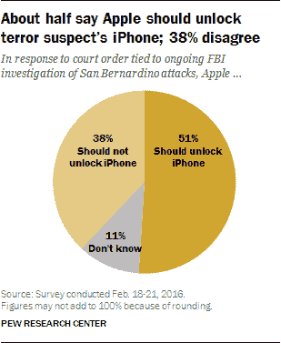
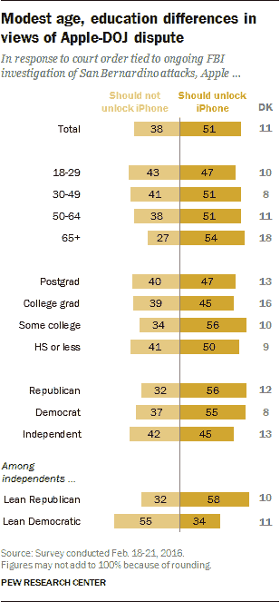

# 皮尤科技博客发现，大多数美国人支持联邦调查局而不是苹果

> 原文：<https://web.archive.org/web/https://techcrunch.com/2016/02/23/most-americans-support-justice-department-over-apple-finds-pew/>

# 皮尤发现，大多数美国人支持联邦调查局而不是苹果

皮尤研究中心[发布了](https://web.archive.org/web/20221025223530/http://www.people-press.org/2016/02/22/more-support-for-justice-department-than-for-apple-in-dispute-over-unlocking-iphone/)一份关于联邦调查局和苹果之间[纠纷的研究。51%的美国人认为苹果应该协助 FBI 解锁 iPhone 5c，而 38%的美国人支持苹果。](https://web.archive.org/web/20221025223530/https://beta.techcrunch.com/tag/apple-vs-fbi)

iPhone 曾经属于圣贝纳迪诺恐怖袭击案的一名嫌疑人。当联邦调查局要求通过后门获取这款手机上的数据时，苹果公司的蒂姆·库克[写了一封信](https://web.archive.org/web/20221025223530/https://beta.techcrunch.com/2016/02/17/tim-cook-apple-wont-create-backdoor-to-unlock-san-bernardino-attackers-iphone/)称苹果公司抗议这一命令。

“一旦创造出来，这项技术就可以在任何数量的设备上反复使用。在现实世界中，它相当于万能钥匙，能够打开数亿把锁，”蒂姆·库克在他的原信[中写道。](https://web.archive.org/web/20221025223530/http://www.apple.com/customer-letter/)

自那以后，许多人站在苹果一边，而其他人则试图让苹果服从。白宫[说](https://web.archive.org/web/20221025223530/https://beta.techcrunch.com/2016/02/17/white-house-plays-with-words-says-department-of-justice-isnt-asking-apple-to-create-a-backdoor/)这是“重要的国家优先事项”，司法部[提交了一份动议](https://web.archive.org/web/20221025223530/https://beta.techcrunch.com/2016/02/19/justice-department-strongly-disagrees-with-apple-files-motion-to-force-backdoor-request/)解释其动机，比尔盖茨[说](https://web.archive.org/web/20221025223530/https://beta.techcrunch.com/2016/02/22/bill-gates-says-apple-should-unlock-the-iphone/)苹果应该解锁 iPhone。唐纳德·特朗普[同意](https://web.archive.org/web/20221025223530/https://beta.techcrunch.com/2016/02/19/donald-trump-weighs-in/)。

另一边，[杰克·多西](https://web.archive.org/web/20221025223530/https://beta.techcrunch.com/2016/02/18/twitters-founder-facebook-pledge-support-for-apple-as-it-fights-court-order-to-unlock-iphone/)，[亚伦·李维](https://web.archive.org/web/20221025223530/https://beta.techcrunch.com/2016/02/19/boxs-levie-defends-apple-amid-fbi-controversy/)，[马克·扎克伯格](https://web.archive.org/web/20221025223530/https://beta.techcrunch.com/2016/02/22/at-mwc-facebooks-zuckerberg-talks-free-basics-lasers-and-encryption/)，[桑德尔·皮帅](https://web.archive.org/web/20221025223530/https://beta.techcrunch.com/2016/02/17/googles-ceo-says-enable-hacking-could-compromise-users-privacy/)和[马克·库班](https://web.archive.org/web/20221025223530/https://beta.techcrunch.com/2016/02/18/mark-cuban-commends-apple-proposes-new-law-for-tech-security/)在这种情况下支持苹果。

据皮尤称，你是共和党人还是民主党人并不重要，因为在这个问题上没有太多的党派分歧。但年龄越大，越有可能认同 FBI。18 至 29 岁的人中，47%的人认为苹果应该解锁 iPhone，43%的人不同意。年龄在 50 岁到 64 岁之间的人中，51%认为苹果应该解锁 iPhone——27%不同意。

因此，没有明显的多数人支持苹果或司法部。然而，这并不重要，因为苹果现在必须在周五之前遵守命令。幕后肯定有很多讨论，看看苹果开启这场辩论是正确的还是毫无意义的，这将会很有趣。

