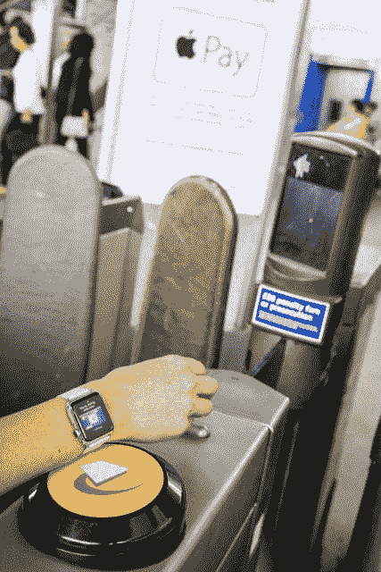

# 大多数英国 Apple Pay 零售商的上限为 20 英镑，但 Pret 和 Bill 的展示交易可以是无限的 

> 原文：<https://web.archive.org/web/https://techcrunch.com/2015/07/14/most-uk-apple-pay-retailers-cap-at-20-but-pret-and-bills-show-transactions-can-be-limitless/>

Apple Pay [今天早些时候正式抵达英国](https://web.archive.org/web/20221209071122/https://beta.techcrunch.com/2015/07/13/apple-pay-has-officially-launched-in-the-uk/)，随着它的到来，我们现在获得了关于移动支付服务将如何工作的更多细节。将接受苹果非接触式支付服务的 250，000 个物理位置中的大多数将在 20 英镑的交易上限下工作，因为[一些](https://web.archive.org/web/20221209071122/http://www.bbc.co.uk/news/business-33063748)在推出前已经[报告](https://web.archive.org/web/20221209071122/http://www.macrumors.com/2015/06/24/apple-pay-20-limit-uk/)，但事实证明这不是全部。至少有两家企业，餐饮连锁店 Pret a Manger 和 Bill's，正在接受无限交易。

是的，这意味着在今天的午餐时间，你可以在一次 Apple Pay 交易中购买你的小龙虾和火箭三明治、花椰菜/红薯藜麦火锅、烤甜菜和羊乳酪沙拉、两包爆米花、热汤、咖啡、矿泉水、胡萝卜蛋糕和酸奶。

(当然前提是你设置了[使用 Apple Pay](https://web.archive.org/web/20221209071122/http://support.apple.com/kb/HT6361) ，并且在 iPhone 6 或 iPhone 6 Plus 上使用 iOS 8.3 或者与 iPhone 5、iPhone 5c、iPhone 5s、iPhone 6 或 iPhone 6 Plus 配对的 Apple Watch，加载参与银行的支持卡。此外，也不能保证你在饱餐一顿后的整个下午都能保持清醒。)

更普遍的是，英国的银行和企业一直在努力将非接触式交易限制在 20 英镑(合 31 美元)左右，以最大限度地减少非接触式卡的欺诈行为，非接触式卡不需要任何 pin 码、签名或照片 ID 就可以让用户购买商品。这一限额将于 9 月份升至 30 英镑(46 美元)。

但不管是 20 岁还是 30 岁，这在很大程度上是一个自我强加的上限。Apple Pay 系统将卡与特定用户和他/她的 TouchID 认证设备联系起来，被视为比单独使用卡更安全的方法。Apple Pay 在美国没有交易限额，[正如苹果在这里解释的](https://web.archive.org/web/20221209071122/https://support.apple.com/en-us/HT204906)，如果商家愿意，在英国有办法延长或取消限额。

无限交易将被一些零售商接受，因为它有助于降低花费更多钱的门槛。iPhone 似乎推动了更多的应用商务，人们通常比使用 Android 花费更多:一个大问题是，无上限的 Apple Pay 交易是否会鼓励人们在实物支付中也这样做。

## 没有苹果支付爱(还没有)

尽管英国比美国小，但在 Apple Pay 推出时提供支持的 250，000 个地点高于去年秋天在美国推出时支持该服务的 [220，000 个地点](https://web.archive.org/web/20221209071122/http://blogs.wsj.com/personal-technology/2014/10/16/apple-pay-begins-monday-at-more-than-200000-retailers-in-the-u-s/)。

部分原因是基于 NFC 的终端已经使用了一段时间——早在 2012 年，为了配合伦敦奥运会，就出现了一次大的推动。

这也意味着你应该可以在任何具有非接触式支付能力的零售商处使用 Apple Pay 支付(在交易限额内)。

然而，苹果的合作伙伴名单中却没有一些著名的名字。

正如预期的那样，英国三大杂货连锁店——乐购、塞恩斯伯里和 ASDA——在推出 Apple Pay 时没有加入，而且似乎也没有任何改变这一点的计划。

特易购的发言人告诉我们，对于 Apple Pay 的未来计划，它没有任何计划，甚至没有官方声明。这家杂货巨头在选定的商店中确实有非接触式终端，这意味着理论上 Apple Pay 在一些地方可以使用。

塞恩斯伯里也向我们证实，它没有考虑 Apple Pay——但这也可能是因为它甚至还没有在其商店中实施任何类型的非接触式技术。“我们目前没有考虑使用 Apple Pay，”一位发言人说。“我们目前正在研究支持商场非接触式支付的技术。”

ASDA 可能是三个国家中最不令人惊讶的。这家连锁店属于沃尔玛，它也是 Apple Pay 列车上缺席的一个非常引人注目的乘客。

移动支付可能仍处于非常早期的阶段，但今天是一个很好的提醒，即从长远来看，谁将拥有这个空间的氛围是多么紧张。

从今天或本月晚些时候开始，Apple Pay 钱包将支持一长串银行的信用卡，其中一个非常引人注目的名字是巴克莱银行。

据报道，巴克莱没有参与 Apple Pay 的谈判，部分原因是它一直在通过与 VocaLink 的 Zapp 合作开发自己的非接触式支付技术。(塞恩斯伯里和 ASDA 也在和 Zapp 合作。)

巴克莱银行今天向我们证实，将继续与 Zapp 合作，但也明确表示，它很快也会在 Apple Pay 中得到支持。

“我们对 Apple Pay 的推出感到非常兴奋，并可以确认我们将在未来将巴克莱借记卡和巴克莱信用卡引入 Apple Pay，”巴克莱的一位发言人告诉 TechCrunch。

“我们的目标是为消费者和零售商提供尽可能广泛的支付和收款选择。我们将通过自己的举措以及与支付和/或技术领域其他创新者的合作，继续朝着这一目标努力。”

这与美国运通及其决定[开发自己的类似钱包的支付解决方案](https://web.archive.org/web/20221209071122/https://beta.techcrunch.com/2015/07/09/amex-negs-digital-wallets-to-build-its-own-checkout-pairs-with-stripe-to-spread-it-wide/)没有什么不同，该解决方案将与 Apple Pay 等服务一起为用户提供选择。

像巴克莱这样的大银行争先恐后地发表支持声明，突显出一些人会认为它的缺席表明该银行不如一些竞争对手那样有远见。这有可能导致[一些](https://web.archive.org/web/20221209071122/https://twitter.com/jamesglazebrook/status/617664138949578752)以此为理由[把钱存到别处](https://web.archive.org/web/20221209071122/https://twitter.com/jptmoore/status/620861967230763008)。

急于表示支持的不仅仅是巴克莱。Apple Pay 尚未与 PayPal 在实体零售领域合作，但两家公司正在合作，在应用程序中实现 Apple Pay 支付，就像在美国一样。

外卖订餐应用 hungryhouse、Just Park、YPlan、Bar Pass、Top10、Bizzby、Mr & Mrs Smith、StubHub 和 HotelTonight 都与 Braintree 合作，在移动应用中使用 Apple Pay 交易。

以下是截至今天接受 Apple Pay 的银行和实体企业的完整列表:

银行将包括

*   美国运通卡、万事达卡和欧洲维萨卡
*   在发布时，许多英国最受欢迎的银行都接受:
    *   纳特韦斯特
    *   全国建筑协会
    *   苏格兰皇家银行
    *   桑坦德
    *   阿尔斯特银行
    *   n-甲基-n-苄基亚硝胺
*   7 月下旬:
*   其他主要发行银行将于今年秋季跟进:
    *   苏格兰银行
    *   哈利法克斯
    *   劳埃德银行
    *   M&S 银行
    *   TSB 银行

商户包括以下几种:

*   比尔、英国博姿、英国石油、Costa Coffee、Co-op、英国肯德基、Le Pain Quotidien、Liberty、LIDL、马克&斯潘塞(M&S)、英国麦当劳、南多、邮局、Pret A Manger、SPAR、星巴克、赛百味、TfL、Wagamama 和 Waitrose 等
*   承诺在今年晚些时候支持 Apple Pay 的其他一些商家包括:
    *   Screwfix、Wilko、EAT、Costcutter、Five Guys、JD Sports、Dune、New Look 等等