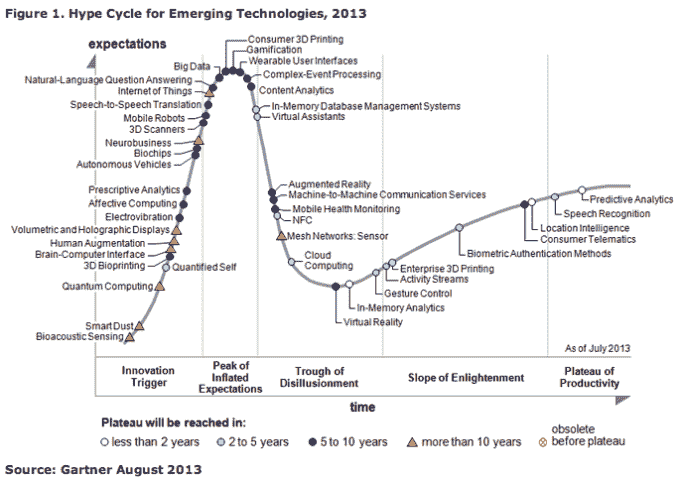

# Mota 99 美元 3D 打印机:好得难以置信 

> 原文：<https://web.archive.org/web/https://techcrunch.com/2014/07/29/mota-99-3d-printer-too-good-to-be-true/>

一台负担得起但高质量的消费 3D 打印机已经变得好得令人难以置信，没有人感到惊讶。

3D 打印机市场总体上处于一种准悬而未决的状态，已经超越了向愿意为实现梦想而支付大量美元的早期采用者证明自己的程度，但在实现大规模采用的快乐涅槃之前，仍有很长的路要走——特别是要挤压价格标签和平滑流程。

分析师 Gartner 将这一时刻描述为跌入地狱，即幻灭的低谷。事实上，其 2013 年炒作周期的图表显示，3D 打印机在膨胀的预期顶峰徘徊，即将经历一次大的俯冲…

因此，对于消费者 3D 打印机来说，这是最好的时代(兴趣最大)和最坏的时代(辜负期望)。

这也是一个强制实验的时代——3D 打印机制造商看到他们是否可以通过迫使价格下降到吸引客户所需的水平来捷径进入批量市场(Gartner 的“生产率高原”)，但不可避免地会在昂贵的组件成本上出现失误，或者因为他们偷工减料太多，产品最终成为垃圾或只能粗制滥造垃圾。

最近感受到现实刺痛的是 [Mota](https://web.archive.org/web/20221201202313/http://www.crunchbase.com/organization/mota) 。本月早些时候，该公司在 Kickstarter 上推出了一款“负担得起”的 3D 打印机，名为 [Mota 3D](https://web.archive.org/web/20221201202313/https://beta.techcrunch.com/2014/07/08/mota-3d/) 。为了引起人们对他们的盒子的足够兴趣，以获得规模经济，使生产更具成本效益，他们将几个单元的价格定为 99 美元。据推测，他们指望筹集数百万美元来使这个项目可行。(正如[微型机](https://web.archive.org/web/20221201202313/https://beta.techcrunch.com/2014/04/11/micro-passes-1-million/)所做的那样——尽管盒子的承诺要少得多。)

在推出 Mota 3D Kickstarter 活动几天后，该公司撤回了该项目——联合创始人凯文·法罗在给支持者的一封信中写道:“我希望有一种方法能够以令人难以置信的低价格提供真正高质量、高精度的 3D 打印机。这将带来这项技术如此需要的大众市场的采用。现实是，像任何技术一样，开发和制造成本都很高。”

“我们不想承诺无法交付的东西，或者质量低于优秀水平的东西，事实是，交付如此高标准的质量将需要额外费用，”他补充说。“我们从你们过去几天的评论中学到了很多。他们告诉我，我们需要回去，更加努力地工作，找到一种方法来进一步降低价格，并使技术更加开放。所以我们取消了这个项目，直到我们能够兑现这个承诺。”

Mota 在几天内筹集了近 65，000 美元，停止了这场运动，而不是拿了支持者的钱，交付不足，这是完全值得称赞的。或者根本无法发货，就像我们在众筹项目中经常看到的那样(尤其是硬件)。

在 3D 打印这样的新兴领域，严酷的现实和严峻的经济形势已经并将继续把许多宏伟的愿景变成如此多的碎塑料。

有趣的是，Mota 在开放的道路上举步维艰。支持者抱怨专有的墨盒设计，这种设计要求购买者不得不从该公司购买昂贵的灯丝，或者支付额外的一大笔现金来购买通用墨盒，他们可以与他们选择的灯丝配对，但这意味着整个打印机不再那么实惠。这个故事的寓意是:消费者想要所有的东西，他们想要买得起的东西。因此，在我们实现 3D 打印机涅槃之前，我们将在未来几年看到更多 Mota 类型的故障。