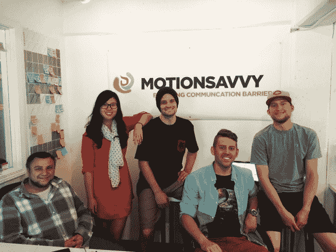
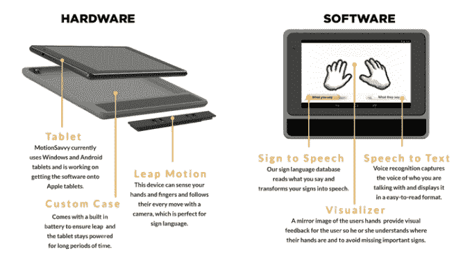

# MotionSavvy 是一款理解手语的平板电脑应用程序 

> 原文：<https://web.archive.org/web/https://techcrunch.com/2014/06/06/motionsavvy-is-a-tablet-app-that-understands-sign-language/>

生活中有很多事情是理所当然的，听力是大多数人都有的一种能力。

但是在[的团队却不了解](https://web.archive.org/web/20230210114013/http://www.motionsavvy.com/)。来自 Leap Motion accelerator AXLR8R 的 MotionSavvy 正在制作一个平板电脑外壳，它利用 Leap Motion 控制器的力量将美国手语翻译成英语，反之亦然。整个 [6 人团队](https://web.archive.org/web/20230210114013/http://www.motionsavvy.com/#team)都是聋子。

MotionSavvy 外壳嵌入了 Leap，MotionSavvy 软件利用了 Leap 的 3D 动作识别功能，可以检测到一个人何时使用 ASL，并将其转换为文本或语音。该软件还通过平板电脑的麦克风进行语音识别，允许听力正常的人用语音回应正在签名的人。然后，它将他们的声音转换成听力受损的接收者可以理解的文本。

创始人 Ryan Hait-Campbell，Wade Kellard，Jordan Stemper 和 Alex Opalka 在罗切斯特理工学院相遇，该学院包括一个聋人教育分支，并在一年多前建造了原型。最初的 MotionSavvy 在 ZVRS 比赛中获得了第三名，这使 Hait-Campbell 相信该产品最终会成为消费者的腿。

目前，这个原型只能理解大约 100 个单词，但 Ryan 和 Alex 希望最终众包“大量”必要的标志，使其成为一个有效的工具。仅美国手语就有成千上万的符号，以及各种不同的“口音”或说话方式。

> 这将给予聋人掌控自己生活的权力，过自己想要的生活的权力。瑞安·海特-坎贝尔

超过 800 名聋人已经报名参加了测试，海特-坎贝尔希望面向消费者的产品最终能在 2015 年 9 月上市。

他正在摆弄一个标价 600 美元的箱子，其中包括一台 Windows 平板电脑和每月 20 美元的软件订阅费。MotionSavvy 最终希望在 Android、iOS 和 Windows Phone 上开发应用程序，并让硬件与任何手机兼容。

Hait-Campbell 说:“这将让一个失聪的人感觉产品是他/她自己的延伸。”

Hait-Campbell 认为这一价格与普通口译员的价格相当，约为每小时 60-100 美元，但他不认为 MotionSavvy 会让口译员失业。事实上，Hait-Campbell 认为，MotionSavvy 将为美国手语翻译创造更多的就业机会，因为更多的聋人将申请更高级别的工作，因为与不懂美国手语的同事交流的能力增加了。

这对于国际用户来说尤其痛苦。[美国残疾人法案](https://web.archive.org/web/20230210114013/http://www.dol.gov/dol/topic/disability/ada.htm)要求美国工作场所和公共设施具有一定程度的无障碍性。许多国家没有这样的法案，因此失聪公民得不到他们需要的服务。

海特-坎贝尔解释说:“这将赋予聋人掌控自己生活的权力，过自己想要的生活的权力。”。“这一切都是通过能够交流来实现的。失聪非常类似于移居到外国，却永远学不会那个国家的语言(而且一辈子都在学)。”

MotionSavvy 正在筹集 150 万美元的种子资金，SOS Ventures ( [through the LEAP。AXLR8R](https://web.archive.org/web/20230210114013/https://techcrunch.com/2014/01/31/leap-axlr8r/) 是其目前唯一的投资者。尽管有巨大的需求，它仍然在这里接受测试注册。
