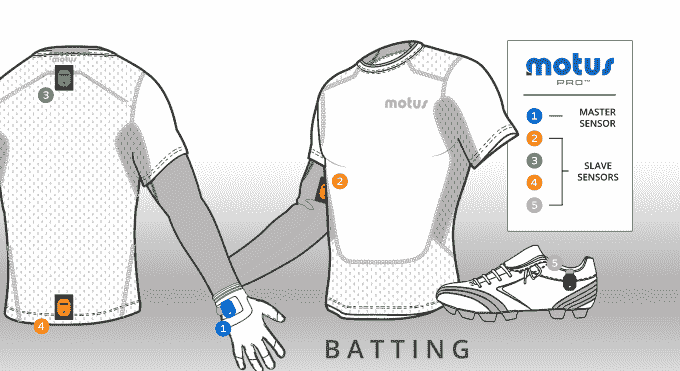

# Motus 可穿戴传感器将生物力学从实验室带入球场 

> 原文：<https://web.archive.org/web/https://techcrunch.com/2015/12/04/motus-wearable-sensors-bring-biomechanics-out-of-the-lab-and-into-the-ball-park/>

# Motus 可穿戴传感器将生物力学从实验室带入球场

棒球一直是一项由数字驱动的运动，随着现代统计的发展，情况更是如此。 [Motus](https://web.archive.org/web/20221209150049/http://motusglobal.com/) 开发了一种利用生物力学测量投手肘部压力或击球手挥杆变化的系统。今天，它推出了一种新的 5 传感器封装，将这种先进的技术从实验室带到了现场。

该公司计划在下周在纳什维尔举行的[美国职业棒球大联盟冬季会议](https://web.archive.org/web/20221209150049/http://www.milb.com/milb/events/wintermeetings.jsp)上发布这套传感器，Motus 将测量击球手挥杆或投手投掷动作的生物力学能力引入智能手机。在此之前，这项功能只提供给可以进入 Motus 实验室的玩家。

去年，Motus 推出了一种单传感器包，可以放入投手的手肘套中，并可以测量他投球时肘部的压力。Motus 的首席执行官兼联合创始人乔·诺兰(Joe Nolan)告诉 TechCrunch，这在今天尤为重要，因为投手比以往任何时候都更难投掷，而且有一种流行的汤米·约翰手术——修复投手投掷肘部尺骨副韧带(UCL)的手术。

Motus 的创始人想出了一种测量投球动作生物力学的方法。最初，它需要玩家来到实验室，使用一套复杂的工具和相机进行测量，但他们希望将这项技术带到实地。借助多个传感器，教练、训练员和医务人员可以定期与投手一起工作，并通过智能手机测量前臂、臀部和二头肌的速度来查看压力水平的差异，而无需最先进的实验室设备。

至于击球手，有了多传感器包，他们可以更经常地接受测量，当他们陷入低迷时，他们可以使用实际数据来查看他们的挥杆发生了变化。今天，玩家通过研究视频来做到这一点，但使用 Motus 系统，他们可能会有硬数字来测量更微妙的机械差异。

"过去几年，我一直在 Motus 的生物力学实验室工作，以便更好地了解我挥杆的力学原理。匹兹堡海盗队的中外场手安德鲁·麦卡琴在一份声明中说:“能够让我在笼子里和球场上收集这种信息的移动系统非常令人兴奋。”。

球员可以在他们的压缩衬衫、击球手套和鞋钉上安装传感器。该公司已经创建了这个足够灵活的包，以至于玩家在进行正常锻炼时不会注意到传感器。

该公司承认他们的传感器只是团队和球员将使用的许多工具之一，但它希望成为工具箱的一部分，并给团队一些真实的数字。

“这个工具的最终目标是确保这些运动员留在赛场上以最高水平表演，”诺兰说。最终，该公司希望为其他运动项目开发类似的系统。