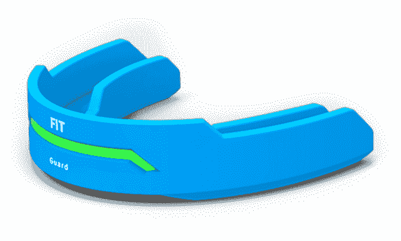

# 护齿套、磁铁和智能头盔正在为创伤性脑损伤踩刹车 

> 原文：<https://web.archive.org/web/http://techcrunch.com/2014/12/26/mouthguards-magnets-and-smart-helmets-are-putting-the-brakes-on-traumatic-brain-injuries/>

蒂申·唐克斯利撰稿人

More posts by this contributor

**编者按:** *Tishin Donkersley 是 AZ Tech Beat 的主编。*

在美国美丽的绿茵场上，大学和职业橄榄球运动员每周都面临着头盔与头盔碰撞造成的高达 100Gs 的快速减速。结果呢？脑震荡，有时是永久性脑损伤。

脑震荡后继续比赛的球员引发了一场关于球员安全和场外诊断缺乏的全国性讨论。NFL 一直是最大的目标。前职业球员提起[集体诉讼](https://web.archive.org/web/20230131003252/http://espn.go.com/espn/otl/story/_/id/11893400/nfl-concussion-settlement-gets-day-court)，指控该组织隐瞒脑震荡长期健康影响的知识，未能保护球员健康；截至发稿时，他们正在等待法官对 7.65 亿美元的和解裁决。

大学也因其可疑的判断而备受关注。9 月，密歇根大学足球教练布雷迪·霍克在脑震荡后离开了他的四分卫。一个悲剧事件围绕着俄亥俄州立大学足球运动员科斯塔·卡拉乔治，一个有体育相关脑震荡病史的防守队员，上个月被发现死于自伤。在他去世之前，卡拉乔治给他的妈妈发了一条短信，提到了他的脑震荡，并说:“如果我让你感到尴尬，我很抱歉。”这场悲剧仍在调查中，俄亥俄州验尸官下令对他的大脑进行检查，以发现创伤性脑损伤的迹象。

研究表明，60%的足球碰撞是头对头的，37%的头盔撞击发生在前面，36%发生在后面，其余的发生在旋转力的侧面。职业选手在一个赛季中平均会受到 900 到 1500 次头部撞击。

当头部受到鞭打或打击，导致我们通常漂浮在液体缓冲垫中的三磅重的大脑猛烈撞击头骨时，就会发生脑震荡。在球场上，当两个平均速度为 20 英里/小时的运动员相撞时，许多脑震荡发生在 100 克的力下，所有运动在很短的时间内(10-15 毫秒)停止，除了大脑，大脑一直在运动并吸收这种力。

根据医学专家的说法，头盔旨在降低严重的创伤性脑损伤和颅骨损伤的风险。虽然头盔可以降低一些脑震荡的风险，但它们不能也不能完全防止脑震荡。事实上，即使戴着头盔，即使是低冲击力的碰撞，运动员仍然有脑损伤的风险。

幸运的是，传感器和磁铁等技术正在被融入新的个人设备的设计中，旨在检测、分散、转移和吸收力，并进一步降低冲击运动中脑损伤的风险。

## **护齿套**

护齿套的确切起源不得而知，但 19 世纪 90 年代的早期设计源于拳击运动，严格用于保护运动员的牙齿。棉花、胶带或小木片被用来保护拳击手珍珠般的洁白牙齿。快速前进，运动牙齿咀嚼玩具已经发展成为一个橡胶煮沸和咬使用超过 29 项运动作为口腔保护和预防脑震荡。

现代的护齿套可以降低脑震荡的风险，但是技术越来越先进。最近的设计包括加速度计、陀螺仪和内置传感器，这些传感器可以收集关于场上碰撞力的实时数据，并立即向教练和医生发出潜在伤害的警报。

Force Impact Technologies 是由安东尼·冈萨雷斯(Anthony Gonzales)共同创立的，他是一名前橄榄球运动员，在一次多人碰撞中受到脑震荡。他们与联合创始人鲍勃·梅里曼(Bob Merriman)一起设计了 FITGuard，这是一款针对年轻运动员的头部受伤意识护齿器。

受到冲击时， [FITGuard](https://web.archive.org/web/20230131003252/https://www.fitguard.me/) 通过护齿套前面的 LED 灯发光来测量和直观显示所受的力。根据预先设定的阈值，灯光会根据力度改变颜色，表明可能有脑震荡。关于撞击的实时数据和警报——线性和角加速度以及撞击的持续时间——通过应用程序无线发送给边线工作人员。该公司还将球员的影响数据发送到一个中央数据库，用户或教练可以下载该数据库。

Force Impact Technologies 最近在 TechCrunch Disrupt 上展示了 FITGuard，预计将于 2015 年春季上市。

 [i1 Biometrics](https://web.archive.org/web/20230131003252/http://www.i1biometrics.com/product/) 正在研发它的矢量护齿器，它可以测量颅内撞击数据，并将信息实时发送到移动设备。

虽然这款护口器没有发光的格栅，但突出的部分是电路板的一部分，可以测量头部线性和旋转加速度的突然变化，这种变化可能会导致脑损伤，目前正在通过与路易斯安那州立大学的足球研究和工程合作进行测试。

## **头盔**

足球中最重要和最明显的保护装置是头盔，在这里我们看到了从传统的软皮革到带面罩的聚碳酸酯再到可以与移动设备通话的模型的演变。

今年早些时候，里德尔发布了 [INSITE](https://web.archive.org/web/20230131003252/http://www.riddell.com/innovation/insite/) ，这是一款装有五区感应垫的头盔，可以测量线性和旋转加速度以及撞击的位置和持续时间。一旦受到碰撞，头盔会自动向边线工作人员无线发送关于球员碰撞的通知。

虽然一些高科技解决方案正在帮助教练识别可能受伤的球员，但其他人正在努力减少这些受伤的程度。

## **磁铁**

如果你曾经把磁铁的两个负极压在一起，你会感觉到一种排斥力。 [Raymond Colello 博士，](https://web.archive.org/web/20230131003252/https://ess.echo360.vcu.edu:8443/ess/echo/presentation/ee5447a5-f760-4757-ad45-d2e5300139e2)弗吉尼亚州联邦大学医学院的一名教授，开发了一种替代现有头盔的改造方案，利用磁铁的自然力量分散撞击时的能量来保护头部。

科勒洛在观看丹佛野马队的比赛时产生了这个想法，在这场比赛中，外接员韦斯·韦尔克收到了他的第二次比赛结束脑震荡。比赛结束后，科勒洛去厨房拿了瓶啤酒，看到冰箱门上的磁铁，顿悟了:“如果磁铁的排斥力可以在冲击发生前就阻止它，会怎么样？”

科勒洛用信用卡支付了 1000 美元，买了一块市面上最强的磁铁。这种磁铁由稀土元素钕制成，可以举起 600 磅的重量，并在 1.5 英寸远的地方击退 130 磅的力量——Colello 发现这些特性非常适合短距离应用，如头盔碰撞时的头部保护。Colello 解释说，磁体可能会将重力的量减少近一半，并最终减轻磁场中的重力。

Colello 设计了薄而弯曲的磁铁，可以改装并放置在头盔聚碳酸酯外壳内的最高冲击区域，即前面和侧面。“我们正在设计磁铁，这样它就不会太显眼——我们可以翻新，达到最大效果，”他解释道。

Colello 表示，每个磁铁的重量约为三分之一到半磅，因此，预计每个头盔将使用一到三个磁铁，改造将在常规和智能头盔的规定范围内，如果需要，还会有一点回旋余地。

但这是一个孤注一掷的交易。为了从排斥效应中受益，场上的所有球员都需要使用头盔磁铁。

虽然体育运动中的个人设备趋势继续涉及技术和实时数据，但 Colello 表示，预防或减少脑震荡是一项持续的挑战，建立基线甚至更难。

“玩家越来越大，越来越强，打击越来越难。不管所有的设备和设计的变化，防止球场上的震荡是一个移动的目标；脑震荡还在继续增加，”他说。

医生倾向于同意。亚利桑那州凤凰城的[班纳脑震荡中心](https://web.archive.org/web/20230131003252/http://www.bannerhealth.com/_Banner+Concussion+Center/_Banner+Concussion+Center+Home+Page.htm)的医疗主任、医学博士 Steven M. Erickson 解释说:“所有一切技术永远不会结束，在那里，符合特定标准的每一次撞击都等同于脑震荡。每个人的大脑能承受的极限都不一样。问题是，导致脑震荡的不是力的数量，而是力的质量。”

## **测试和数据**

Colello 的头盔磁铁正在前往弗吉尼亚理工大学实验室，其“最终目标是将智能头盔系统与我们的磁铁结合使用，并随着游戏的进行(从玩家那里)获得实时数据。”

埃里克森解释说，虽然球员数据对测量力量影响很有用，但嵌入式技术可能会无意中提供一种虚假的安全感，从而产生更多的问题。“头盔不能防止脑震荡，只能防止大脑受到更严重的伤害，”他说。

对于青少年运动，埃里克森鼓励球员进行基线测试，最重要的是教育球员关于脑震荡症状，进行力量训练，并与教授正确“抬头”拦截技术的教练合作。

埃里克森说:“颈部力量对于防止脑震荡很重要，同时也要有懂得正确处理技术的人来指导，这样就可以用你的身体而不是你的头作为武器，最终减少头部受到的冲击。”

科勒洛解释说，每次脑震荡，球员遭受另一次脑震荡的可能性是两倍，遭受第三次脑震荡的可能性是六倍。

这些高科技进步不能防止脑震荡的发生，但它们是减少各级脑震荡球员数量的整体解决方案的一部分，并在他们对自己造成进一步甚至永久的伤害之前让他们离开球场。